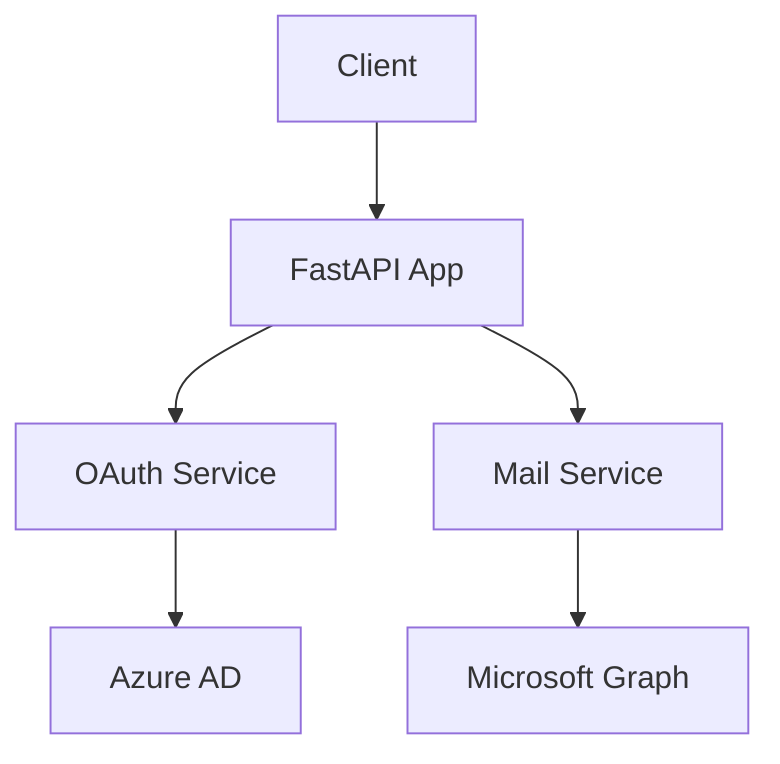
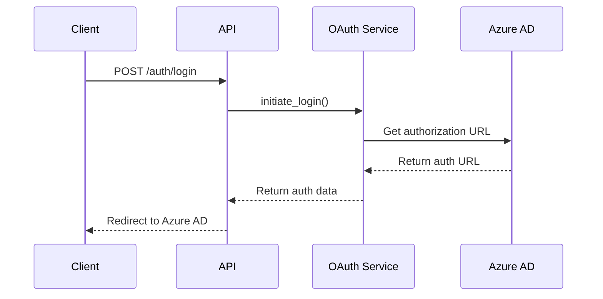
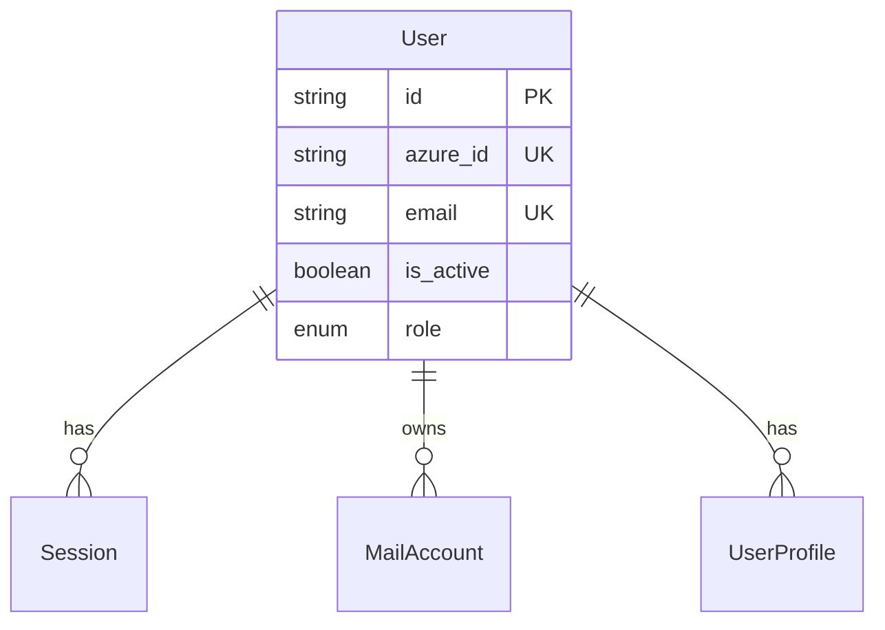

# Scribe Documentation Standards and Organization

This document defines the structure, standards, and organization for all documentation in the Scribe FastAPI project. It ensures consistency, maintainability, and ease of navigation across all documentation files.

## Table of Contents

1. [Documentation Structure](#documentation-structure)
2. [Documentation Standards](#documentation-standards)
3. [Diagram Guidelines](#diagram-guidelines)
4. [File Organization](#file-organization)
5. [Writing Guidelines](#writing-guidelines)
6. [Maintenance Procedures](#maintenance-procedures)

## Documentation Structure

The documentation is organized into the following main categories:

```
docs/
├── CLAUDE.md                   # This file - documentation standards
├── README.md                   # Documentation index and overview
├── architecture/               # System architecture documentation
│   ├── overview.md            # High-level system architecture
│   ├── components.md          # Detailed component descriptions
│   ├── data-flow.md           # Data flow diagrams for key processes
│   └── infrastructure.md      # Azure infrastructure and deployment
├── api/                       # API documentation
│   ├── overview.md            # API design principles and patterns
│   ├── authentication.md      # Auth endpoints with flow diagrams
│   ├── mail.md                # Mail service endpoints
│   ├── shared-mailbox.md      # Shared mailbox operations
│   ├── transcription.md       # Voice transcription endpoints
│   └── openapi.json           # Auto-generated OpenAPI specification
├── services/                  # Service layer documentation
│   ├── oauth-service.md       # OAuth authentication service
│   ├── mail-service.md        # Mail operations service
│   ├── shared-mailbox-service.md  # Shared mailbox management
│   ├── transcription-service.md   # Voice transcription service
│   └── voice-attachment-service.md # Voice attachment handling
├── database/                  # Database documentation
│   ├── schema.md              # Database schema with ER diagrams
│   ├── models.md              # SQLAlchemy model documentation
│   ├── repositories.md        # Repository pattern implementation
│   └── migrations.md          # Alembic migration guide
├── azure/                     # Azure integration documentation
│   ├── overview.md            # Azure services integration overview
│   ├── auth-service.md        # Azure AD authentication
│   ├── graph-service.md       # Microsoft Graph API operations
│   ├── mail-service.md        # Azure mail operations
│   ├── blob-service.md        # Azure Blob storage
│   └── ai-foundry.md          # Azure AI Foundry integration
├── guides/                    # Development and operation guides
│   ├── getting-started.md     # Quick start guide
│   ├── configuration.md       # Dynaconf configuration guide
│   ├── development.md         # Development workflow
│   ├── deployment.md          # Production deployment guide
│   ├── security.md            # Security best practices
│   └── monitoring.md          # Logging and monitoring
└── changelog/                 # Version history
    └── releases.md            # Release notes and version history
```

## Documentation Standards

### Visual-First Approach
Every major concept, workflow, or architecture component must include visual representations:

- **System Architecture**: Component diagrams showing service relationships
- **Authentication Flow**: Sequence diagrams showing OAuth flow
- **Data Flow**: Activity diagrams showing data processing
- **Database Design**: ER diagrams showing table relationships
- **API Workflows**: Sequence diagrams showing request/response patterns

### Code Examples
All documentation must include:

- **Real Examples**: Use actual code from the codebase with file references
- **Line References**: Format as `file_path:line_number` for easy navigation
- **Working Code**: All code samples must be tested and functional
- **Complete Examples**: Include full request/response cycles for APIs

### Consistency Requirements
- **Markdown Format**: All documentation uses GitHub-flavored Markdown
- **Header Structure**: Use consistent heading hierarchy (H1 for title, H2 for main sections)
- **Code Formatting**: Use appropriate language tags for syntax highlighting
- **Link Format**: Use descriptive link text, avoid "click here"

## Diagram Guidelines

### Diagram Format
All diagrams use **Mermaid** format for:
- **Portability**: Works in GitHub, IDEs, and documentation viewers
- **Version Control**: Text-based format tracks changes easily
- **Maintainability**: Easy to update and modify
- **Consistency**: Standardized appearance across all documentation

### Diagram Types

#### Component Diagrams


#### Sequence Diagrams


#### Entity Relationship Diagrams


### Diagram Standards
- **Clear Labels**: All nodes and edges must be clearly labeled
- **Consistent Styling**: Use consistent colors and shapes across documents
- **Logical Flow**: Show information flow from left to right, top to bottom
- **Appropriate Detail**: Include enough detail without cluttering

## File Organization

### Naming Conventions
- **Files**: Use `kebab-case.md` (e.g., `shared-mailbox-service.md`)
- **Directories**: Use `snake_case` (e.g., `database/`, `azure/`)
- **Images**: Use descriptive names with context (e.g., `auth-flow-sequence.png`)

### File Structure Template
Every documentation file should follow this structure:

```markdown
# Title

Brief description of what this document covers.

## Table of Contents
1. [Overview](#overview)
2. [Architecture](#architecture) 
3. [Implementation](#implementation)
4. [Examples](#examples)
5. [Reference](#reference)

## Overview
High-level explanation with diagrams.

## Architecture
Detailed technical explanation with diagrams.

## Implementation
Code examples with file references.

## Examples
Practical usage examples.

## Reference
Quick reference information.
```

## Writing Guidelines

### Audience
Write for developers who are:
- **Familiar with Python and FastAPI** but new to this codebase
- **Need to understand** the architecture and implementation patterns
- **Looking for** practical examples and troubleshooting information

### Tone and Style
- **Clear and Concise**: Avoid unnecessary jargon or verbose explanations
- **Practical Focus**: Emphasize how-to and implementation details
- **Example-Driven**: Show rather than just tell
- **Consistent Terminology**: Use the same terms throughout all documentation

### Content Requirements
Each document must include:

1. **Purpose Statement**: What problem does this solve?
2. **Visual Overview**: Diagram showing the concept
3. **Implementation Details**: How it works with code examples
4. **Usage Examples**: Practical examples with expected outputs
5. **Troubleshooting**: Common issues and solutions
6. **Related Documentation**: Links to relevant documents

## Maintenance Procedures

### Update Triggers
Documentation must be updated when:
- **New features** are added
- **API changes** are made
- **Configuration** requirements change
- **Dependencies** are updated
- **Security practices** are modified

### Review Process
1. **Technical Review**: Ensure accuracy and completeness
2. **Editorial Review**: Check for clarity and consistency
3. **Testing**: Verify all code examples work
4. **Link Validation**: Ensure all links are functional

### Version Control
- **Commit Messages**: Use descriptive messages for documentation changes
- **Branch Strategy**: Follow the same branching strategy as code
- **Change Log**: Document significant updates in changelog/releases.md

### Quality Checklist
Before publishing documentation, verify:
- [ ] All diagrams render correctly
- [ ] Code examples are tested and functional
- [ ] File references point to correct locations
- [ ] Links work and point to correct sections
- [ ] Spelling and grammar are correct
- [ ] Structure follows template guidelines
- [ ] Related documentation is cross-referenced

## Tools and Integrations

### Recommended Tools
- **Mermaid Live Editor**: For creating and testing diagrams
- **Markdown Preview**: For checking formatting
- **Link Checker**: For validating internal and external links
- **Spell Checker**: For content quality

### IDE Integration
Configure your development environment to:
- **Preview Markdown**: Show rendered documentation while editing
- **Syntax Highlighting**: Properly highlight code blocks
- **Link Navigation**: Jump to referenced files and line numbers

---

## Enforcement

This documentation standard is enforced through:
- **Code Reviews**: Documentation changes are reviewed like code changes
- **Automated Checks**: Link validation and format checking in CI/CD
- **Regular Audits**: Periodic reviews to ensure standards compliance
- **Team Training**: Onboarding includes documentation standards

**Last Updated**: August 2025  
**Version**: 1.0.0  
**Maintained By**: Development Team