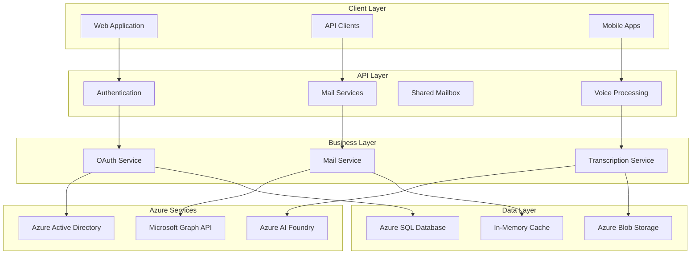

# Scribe Documentation

Welcome to the comprehensive documentation for the Scribe FastAPI application - a cloud-native mail management system with Azure integration and voice transcription capabilities.

## 📚 Documentation Overview

This documentation is organized to help you understand, develop, and deploy the Scribe application effectively. Whether you're a new developer joining the project or an experienced team member looking for specific information, you'll find detailed guides, API references, and architectural insights.

## 🗺️ Documentation Navigation

### 🏗️ Architecture & Design

Start here to understand the overall system design and architectural decisions:

- **[Architecture Overview](architecture/overview.md)** - High-level system architecture and design principles
- **[Components Detail](architecture/components.md)** - Detailed component descriptions and interactions  
- **[Data Flow](architecture/data-flow.md)** - How data flows through the system with sequence diagrams
- **[Infrastructure](architecture/infrastructure.md)** - Azure services integration and deployment architecture

### 🔐 Authentication & Security

Understanding the authentication system and security implementations:

- **[OAuth Service](services/oauth-service.md)** - Azure AD OAuth implementation with flow diagrams
- **[Authentication API](api/authentication.md)** - REST API endpoints for authentication
- **[Security Guide](guides/security.md)** - Security best practices and implementation

### 📧 Mail Services

Core mail functionality and Azure integration:

- **[Azure Mail Service](azure/mail-service.md)** - Microsoft Graph API integration for shared mailboxes
- **[Mail API](api/mail.md)** - Personal mailbox operations
- **[Shared Mailbox API](api/shared-mailbox.md)** - Shared mailbox management endpoints

### 🎙️ Voice Processing

Voice attachment handling and transcription services:

- **[Voice Attachment Service](services/voice-attachment-service.md)** - File upload and Azure Blob integration
- **[Transcription Service](services/transcription-service.md)** - Azure AI Foundry integration
- **[Excel Transcription Sync Service](services/excel-transcription-sync-service.md)** - OneDrive Excel synchronization
- **[Transcription API](api/transcription.md)** - Voice processing endpoints
- **[Excel Sync API](api/excel-sync.md)** - Excel synchronization endpoints

### 🗄️ Database & Data

Database design, models, and data access patterns:

- **[Database Models](database/models.md)** - Comprehensive SQLAlchemy model documentation
- **[Excel Sync Models](database/excel-sync-models.md)** - Excel synchronization tracking models
- **[Database Schema](database/schema.md)** - Entity relationships and schema design
- **[Repository Patterns](database/repositories.md)** - Data access layer implementation
- **[Migration Guide](database/migrations.md)** - Alembic migration management

### ☁️ Azure Integration

Detailed Azure services integration documentation:

- **[Azure Overview](azure/overview.md)** - Azure services architecture
- **[Azure Auth Service](azure/auth-service.md)** - Azure AD authentication service
- **[Azure Graph Service](azure/graph-service.md)** - Microsoft Graph API operations
- **[Azure OneDrive Excel Service](azure/onedrive-excel-service.md)** - OneDrive and Excel API integration
- **[Azure Blob Service](azure/blob-service.md)** - File storage integration
- **[Azure AI Foundry](azure/ai-foundry.md)** - AI transcription services

### 🔧 Development & Operations

Guides for development, deployment, and maintenance:

- **[Getting Started](guides/getting-started.md)** - Quick start guide for new developers
- **[Configuration Guide](guides/configuration.md)** - Dynaconf configuration management
- **[Development Workflow](guides/development.md)** - Development best practices and tools
- **[Deployment Guide](guides/deployment.md)** - Production deployment instructions
- **[Monitoring Guide](guides/monitoring.md)** - Logging, monitoring, and observability

## 🚀 Quick Start

New to the project? Follow these steps to get up and running:

### 1. Environment Setup
```bash
# Clone the repository
git clone https://github.com/your-org/scribe.git
cd scribe

# Install dependencies
pip install -r requirements.txt

# Configure environment
cp .secrets.example .secrets.toml
# Edit .secrets.toml with your Azure credentials
```

### 2. Database Setup
```bash
# Run migrations
alembic upgrade head

# Verify database connection
python -c "from app.db.Database import db_manager; print('Database OK')"
```

### 3. Start Development Server
```bash
# Start the FastAPI development server
fastapi dev app/main.py

# Access the application
# API: http://localhost:8000
# Docs: http://localhost:8000/docs
# Health: http://localhost:8000/health
```

### 4. Explore the API
Visit the interactive API documentation at `http://localhost:8000/docs` to explore all available endpoints.

## 🎯 Key Features

### 🔒 Enterprise Authentication
- **Azure AD Integration**: Single sign-on with OAuth 2.0
- **Role-Based Access Control**: User and superuser roles
- **Session Management**: Secure token handling with refresh capabilities
- **Audit Trail**: Comprehensive logging of all authentication events

### 📬 Mail Management
- **Personal Mailboxes**: Full access to user's personal mail
- **Shared Mailboxes**: Secure access to company shared mailboxes
- **Permission Control**: Fine-grained access control for shared resources
- **Real-time Sync**: Efficient caching with Microsoft Graph API

### 🎤 Voice Processing
- **File Upload**: Secure voice file storage in Azure Blob Storage
- **AI Transcription**: High-quality speech-to-text using Azure AI Foundry
- **Excel Synchronization**: Automatic sync of transcriptions to OneDrive Excel files
- **Segment Analysis**: Detailed transcription with timing and confidence scores
- **Error Handling**: Robust error handling with retry mechanisms

### 🏗️ Cloud-Native Architecture
- **Azure Functions Ready**: Optimized for serverless deployment
- **Scalable Design**: Stateless architecture with efficient caching
- **Monitoring Integration**: Built-in Application Insights support
- **Disaster Recovery**: Multi-region deployment capabilities

## 📊 System Architecture



## 🔧 Technology Stack

| Component | Technology | Purpose |
|-----------|------------|---------|
| **Web Framework** | FastAPI | High-performance async API framework |
| **Database** | Azure SQL Database | Primary data storage with 3NF design |
| **ORM** | SQLAlchemy | Database operations and migrations |
| **Authentication** | Azure AD + OAuth 2.0 | Enterprise identity management |
| **File Storage** | Azure Blob Storage | Voice file storage and management |
| **AI Services** | Azure AI Foundry | Speech-to-text transcription |
| **API Integration** | Microsoft Graph | Office 365 mail operations |
| **Configuration** | Dynaconf | Environment-based configuration |
| **Testing** | pytest | Comprehensive test framework |
| **Monitoring** | Azure Monitor | Application performance monitoring |

## 📖 API Reference

### Authentication Endpoints
- `GET /auth/login` - Initiate OAuth flow
- `GET /auth/callback` - Handle OAuth callback  
- `POST /auth/refresh` - Refresh access token
- `GET /auth/me` - Get current user info
- `POST /auth/logout` - Logout user

### Mail Endpoints
- `GET /mail/messages` - Get personal messages
- `GET /mail/folders` - Get mail folders
- `POST /mail/send` - Send message

### Shared Mailbox Endpoints
- `GET /shared-mailbox` - List accessible shared mailboxes
- `GET /shared-mailbox/{email}/messages` - Get shared mailbox messages
- `POST /shared-mailbox/{email}/send` - Send from shared mailbox

### Voice Processing Endpoints
- `POST /voice/upload` - Upload voice file
- `GET /voice/{id}/transcription` - Get transcription status
- `GET /voice/{id}/download` - Download voice file

### Excel Sync Endpoints
- `POST /transcriptions/excel/sync-month` - Sync monthly transcriptions to Excel
- `POST /transcriptions/excel/sync/{id}` - Sync single transcription to Excel
- `GET /transcriptions/excel/health` - Check Excel sync service health

## 🤝 Contributing

### Development Standards
The Scribe project follows strict coding standards defined in `CLAUDE.md`:
- **PascalCase** for application files (`AuthService.py`)
- **snake_case** for utility files and directories
- **Type hints** required for all functions
- **Docstrings** required for all public methods
- **Test coverage** minimum 80%

### Code Review Process
1. Create feature branch from `main`
2. Implement changes following coding standards
3. Add comprehensive tests
4. Update relevant documentation
5. Submit pull request with detailed description
6. Address review feedback
7. Merge after approval

### Documentation Updates
Documentation must be updated for:
- New features or endpoints
- Configuration changes
- Architectural modifications
- Security updates

## 📞 Support & Resources

### Getting Help
- **Documentation Issues**: Create issue in GitHub repository
- **Bug Reports**: Use bug report template
- **Feature Requests**: Use feature request template
- **Security Issues**: Follow security disclosure policy

### Additional Resources
- **API Documentation**: Interactive docs at `/docs` endpoint
- **OpenAPI Specification**: Available at `/openapi.json`
- **Health Check**: Monitor application status at `/health`
- **Metrics**: Application metrics via Azure Monitor

## 📈 Performance & Scaling

### Performance Characteristics
- **Sub-100ms**: Authentication token validation
- **Sub-500ms**: Mail message retrieval (cached)
- **2-5 seconds**: Voice transcription (small files)
- **99.9%**: Uptime SLA target

### Scaling Considerations
- **Horizontal Scaling**: Stateless design enables easy scaling
- **Caching Strategy**: Intelligent in-memory caching
- **Database Optimization**: Indexed queries and connection pooling
- **Azure Functions**: Automatic scaling based on demand

---

**Last Updated**: August 2025  
**Documentation Version**: 1.0.0  
**Application Version**: 1.0.0

For the most current information, always refer to the source code and the latest version of this documentation.