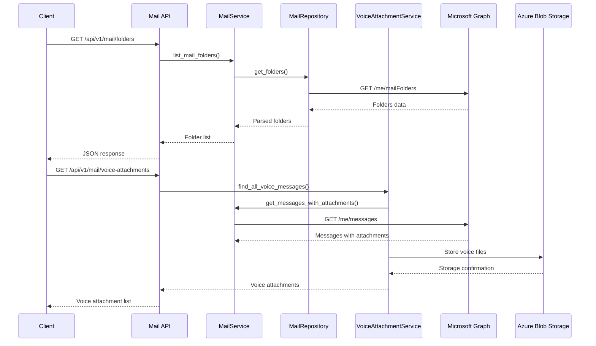

# Mail API Documentation

REST API endpoints for email operations using Microsoft Graph API integration. This module provides comprehensive email management functionality including folder operations, message handling, attachment processing, and specialized voice attachment management.

## Table of Contents

1. [Overview](#overview)
2. [Architecture](#architecture)
3. [Authentication](#authentication)
4. [Folder Operations](#folder-operations)
5. [Message Operations](#message-operations)
6. [Attachment Operations](#attachment-operations)
7. [Voice Attachment Operations](#voice-attachment-operations)
8. [Search Operations](#search-operations)
9. [Statistics and Analytics](#statistics-and-analytics)
10. [Error Handling](#error-handling)
11. [Examples](#examples)
12. [Reference](#reference)

## Overview

The Mail API provides access to email operations through Microsoft Graph API, supporting:

- **Folder Management**: List, create, and organize mail folders
- **Message Operations**: Retrieve, update, move, and search messages
- **Attachment Handling**: Download regular and voice attachments
- **Voice Attachment Processing**: Specialized voice message organization
- **Blob Storage Integration**: Persistent storage for voice attachments
- **Statistics and Analytics**: Comprehensive usage metrics

All endpoints require authentication and return structured JSON responses with consistent error handling.

## Architecture



## Authentication

All Mail API endpoints require authentication via Azure AD OAuth 2.0:

```http
Authorization: Bearer <access_token>
```

The access token must have the following Microsoft Graph permissions:
- `Mail.Read`: Read user mail
- `Mail.ReadWrite`: Read and write user mail
- `Mail.Send`: Send mail on behalf of user

## Folder Operations

### List Mail Folders

Retrieve all mail folders with hierarchy information.

```http
GET /api/v1/mail/folders
```

**Response Model**: `List[MailFolder]`

**Example Request**:
```bash
curl -X GET "https://api.scribe.com/api/v1/mail/folders" \
  -H "Authorization: Bearer <token>"
```

**Example Response**:
```json
[
  {
    "id": "AQMkADAwATM0MDAAMS1iNTcwLWI2NTEtMDACLTAwCgAuAAADsVyfxjDU406Ic4X7ill8xAEA",
    "displayName": "Inbox",
    "parentFolderId": null,
    "childFolderCount": 2,
    "unreadItemCount": 15,
    "totalItemCount": 127,
    "wellKnownName": "inbox"
  },
  {
    "id": "AQMkADAwATM0MDAAMS1iNTcwLWI2NTEtMDACLTAwCgAuAAADsVyfxjDU406Ic4X7ill8xAEB",
    "displayName": "Sent Items",
    "parentFolderId": null,
    "childFolderCount": 0,
    "unreadItemCount": 0,
    "totalItemCount": 43,
    "wellKnownName": "sentitems"
  }
]
```

**Implementation Reference**: `app/api/v1/endpoints/mail.py:46-67`

### Create Mail Folder

Create a new mail folder.

```http
POST /api/v1/mail/folders
```

**Request Model**: `CreateFolderRequest`
**Response Model**: `MailFolder`

**Request Body**:
```json
{
  "displayName": "Voice Messages",
  "parentFolderId": null
}
```

**Example Request**:
```bash
curl -X POST "https://api.scribe.com/api/v1/mail/folders" \
  -H "Authorization: Bearer <token>" \
  -H "Content-Type: application/json" \
  -d '{
    "displayName": "Voice Messages",
    "parentFolderId": null
  }'
```

**Implementation Reference**: `app/api/v1/endpoints/mail.py:70-98`

## Message Operations

### List Messages

Retrieve messages with optional filtering and pagination.

```http
GET /api/v1/mail/messages
```

**Query Parameters**:
- `folder_id` (optional): Folder ID to list messages from
- `has_attachments` (optional): Filter by attachment presence
- `top`: Number of messages to return (1-1000, default: 25)
- `skip`: Number of messages to skip (default: 0)

**Response Model**: `MessageListResponse`

**Example Request**:
```bash
curl -X GET "https://api.scribe.com/api/v1/mail/messages?folder_id=inbox&has_attachments=true&top=10" \
  -H "Authorization: Bearer <token>"
```

**Example Response**:
```json
{
  "messages": [
    {
      "id": "AAMkADAwATM0MDAAMS1iNTcwLWI2NTEtMDACLTAwCgBGAAAAAACxXJ_GMNTjTohzhfuKWXzEBwA",
      "subject": "Meeting recording attached",
      "sender": {
        "name": "John Doe",
        "address": "john.doe@company.com"
      },
      "receivedDateTime": "2023-08-15T14:30:00Z",
      "isRead": false,
      "hasAttachments": true,
      "attachmentCount": 1,
      "importance": "normal"
    }
  ],
  "totalCount": 127,
  "hasMore": true,
  "nextSkip": 35
}
```

**Implementation Reference**: `app/api/v1/endpoints/mail.py:101-143`

### Get Specific Message

Retrieve detailed information for a specific message.

```http
GET /api/v1/mail/messages/{message_id}
```

**Path Parameters**:
- `message_id`: Microsoft Graph message ID

**Response Model**: `Message`

**Example Request**:
```bash
curl -X GET "https://api.scribe.com/api/v1/mail/messages/AAMkADAwATM0MDAAMS1iNTcwLWI2NTEtMDACLTAwCgBGAAAAAACxXJ_GMNTjTohzhfuKWXzEBwA" \
  -H "Authorization: Bearer <token>"
```

**Implementation Reference**: `app/api/v1/endpoints/mail.py:146-173`

### Update Message

Update message properties such as read status and importance.

```http
PATCH /api/v1/mail/messages/{message_id}
```

**Request Model**: `UpdateMessageRequest`

**Request Body**:
```json
{
  "isRead": true,
  "importance": "high"
}
```

**Example Request**:
```bash
curl -X PATCH "https://api.scribe.com/api/v1/mail/messages/{message_id}" \
  -H "Authorization: Bearer <token>" \
  -H "Content-Type: application/json" \
  -d '{"isRead": true}'
```

**Implementation Reference**: `app/api/v1/endpoints/mail.py:298-344`

### Move Message

Move a message to a different folder.

```http
POST /api/v1/mail/messages/{message_id}/move
```

**Request Model**: `MoveMessageRequest`

**Request Body**:
```json
{
  "destinationId": "AQMkADAwATM0MDAAMS1iNTcwLWI2NTEtMDACLTAwCgAuAAADsVyfxjDU406Ic4X7ill8xAEB"
}
```

**Example Request**:
```bash
curl -X POST "https://api.scribe.com/api/v1/mail/messages/{message_id}/move" \
  -H "Authorization: Bearer <token>" \
  -H "Content-Type: application/json" \
  -d '{"destinationId": "folder_id_here"}'
```

**Implementation Reference**: `app/api/v1/endpoints/mail.py:263-295`

## Attachment Operations

### List Message Attachments

Get all attachments for a specific message.

```http
GET /api/v1/mail/messages/{message_id}/attachments
```

**Response Model**: `List[Attachment]`

**Example Response**:
```json
[
  {
    "id": "AAMkADAwATM0MDAAMS1iNTcwLWI2NTEtMDACLTAwCgBGAAAAAACxXJ_GMNTjTohzhfuKWXzEBwA=",
    "name": "meeting_recording.m4a",
    "contentType": "audio/m4a",
    "size": 2048576,
    "isInline": false,
    "lastModifiedDateTime": "2023-08-15T14:30:00Z"
  }
]
```

**Implementation Reference**: `app/api/v1/endpoints/mail.py:176-203`

### Download Attachment

Download attachment content as a streaming response.

```http
GET /api/v1/mail/messages/{message_id}/attachments/{attachment_id}/download
```

**Response**: Streaming binary content with appropriate MIME type

**Example Request**:
```bash
curl -X GET "https://api.scribe.com/api/v1/mail/messages/{message_id}/attachments/{attachment_id}/download" \
  -H "Authorization: Bearer <token>" \
  --output attachment.m4a
```

**Implementation Reference**: `app/api/v1/endpoints/mail.py:206-260`

## Voice Attachment Operations

### Get Voice Messages

Retrieve all messages containing voice attachments.

```http
GET /api/v1/mail/voice-messages
```

**Query Parameters**:
- `folder_id` (optional): Folder ID to search within
- `top`: Maximum messages to check (1-500, default: 100)

**Response Model**: `MessageListResponse`

**Implementation Reference**: `app/api/v1/endpoints/mail.py:378-407`

### Get Voice Attachments

Get all voice attachments across the mailbox.

```http
GET /api/v1/mail/voice-attachments
```

**Query Parameters**:
- `folder_id` (optional): Folder ID to search within
- `limit`: Maximum messages to check (1-500, default: 100)

**Response Model**: `List[VoiceAttachment]`

**Example Response**:
```json
[
  {
    "messageId": "AAMkADAwATM0MDAAMS1iNTcwLWI2NTEtMDACLTAwCgBGAAAAAACxXJ_GMNTjTohzhfuKWXzEBwA=",
    "attachmentId": "AAMkADAwATM0MDAAMS1iNTcwLWI2NTEtMDACLTAwCgBGAAAAAACxXJ_GMNTjTohzhfuKWXzEBwA=",
    "name": "voice_message.m4a",
    "contentType": "audio/m4a",
    "size": 1024576,
    "duration": 120,
    "transcriptionStatus": "pending",
    "createdAt": "2023-08-15T14:30:00Z"
  }
]
```

**Implementation Reference**: `app/api/v1/endpoints/mail.py:410-443`

### Organize Voice Messages

Auto-organize voice messages into a dedicated folder.

```http
POST /api/v1/mail/organize-voice
```

**Request Model**: `OrganizeVoiceRequest`
**Response Model**: `OrganizeVoiceResponse`

**Request Body**:
```json
{
  "targetFolderName": "Voice Messages"
}
```

**Example Response**:
```json
{
  "success": true,
  "folderId": "AQMkADAwATM0MDAAMS1iNTcwLWI2NTEtMDACLTAwCgAuAAADsVyfxjDU406Ic4X7ill8xAEB",
  "folderName": "Voice Messages",
  "messagesProcessed": 15,
  "messagesMoved": 12,
  "voiceAttachmentsFound": 18,
  "errors": []
}
```

**Implementation Reference**: `app/api/v1/endpoints/mail.py:446-471`

### Get Message Voice Attachments

Get voice attachments from a specific message.

```http
GET /api/v1/mail/messages/{message_id}/voice-attachments
```

**Response Model**: `List[VoiceAttachment]`

**Implementation Reference**: `app/api/v1/endpoints/mail.py:474-501`

### Get Voice Attachment Metadata

Get detailed metadata for a specific voice attachment.

```http
GET /api/v1/mail/voice-attachments/{message_id}/{attachment_id}/metadata
```

**Example Response**:
```json
{
  "messageId": "AAMkADAwATM0MDAAMS1iNTcwLWI2NTEtMDACLTAwCgBGAAAAAACxXJ_GMNTjTohzhfuKWXzEBwA=",
  "attachmentId": "AAMkADAwATM0MDAAMS1iNTcwLWI2NTEtMDACLTAwCgBGAAAAAACxXJ_GMNTjTohzhfuKWXzEBwA=",
  "name": "voice_message.m4a",
  "contentType": "audio/m4a",
  "size": 1024576,
  "duration": 120,
  "quality": "standard",
  "sampleRate": 44100,
  "channels": 1,
  "transcriptionStatus": "completed",
  "transcriptionText": "Hello, this is a test voice message..."
}
```

**Implementation Reference**: `app/api/v1/endpoints/mail.py:504-536`

### Download Voice Attachment

Download voice attachment content with audio-specific headers.

```http
GET /api/v1/mail/voice-attachments/{message_id}/{attachment_id}/download
```

**Response**: Streaming audio content with appropriate MIME type

**Implementation Reference**: `app/api/v1/endpoints/mail.py:539-585`

## Blob Storage Operations

### Store Voice Attachment

Download voice attachment from email and store in blob storage.

```http
POST /api/v1/mail/voice-attachments/store/{message_id}/{attachment_id}
```

**Example Response**:
```json
{
  "success": true,
  "message": "Voice attachment stored successfully",
  "blob_name": "user123_msg456_att789_20230815143000.m4a",
  "message_id": "msg456",
  "attachment_id": "att789"
}
```

**Implementation Reference**: `app/api/v1/endpoints/mail.py:646-688`

### List Stored Voice Attachments

List stored voice attachments for the current user with pagination.

```http
GET /api/v1/mail/voice-attachments/stored
```

**Query Parameters**:
- `limit`: Maximum results to return (1-200, default: 50)
- `offset`: Number of results to skip (default: 0)
- `content_type` (optional): Filter by content type
- `order_by`: Field to order by (default: "received_at")

**Example Response**:
```json
{
  "attachments": [
    {
      "blob_name": "user123_msg456_att789_20230815143000.m4a",
      "original_name": "voice_message.m4a",
      "content_type": "audio/m4a",
      "size": 1024576,
      "stored_at": "2023-08-15T14:30:00Z",
      "download_count": 3,
      "last_accessed": "2023-08-16T10:15:00Z"
    }
  ],
  "pagination": {
    "total_count": 25,
    "limit": 50,
    "offset": 0,
    "has_more": false
  }
}
```

**Implementation Reference**: `app/api/v1/endpoints/mail.py:691-738`

### Download from Blob Storage

Download voice attachment from blob storage with usage tracking.

```http
GET /api/v1/mail/voice-attachments/blob/{blob_name}
```

**Response**: Streaming audio content with download count header

**Response Headers**:
- `X-Download-Count`: Number of times downloaded

**Implementation Reference**: `app/api/v1/endpoints/mail.py:741-790`

### Delete Stored Voice Attachment

Delete stored voice attachment from blob storage.

```http
DELETE /api/v1/mail/voice-attachments/blob/{blob_name}
```

**Example Response**:
```json
{
  "success": true,
  "message": "Voice attachment user123_msg456_att789_20230815143000.m4a deleted successfully"
}
```

**Implementation Reference**: `app/api/v1/endpoints/mail.py:793-834`

## Search Operations

### Search Messages

Search messages with various filters and criteria.

```http
POST /api/v1/mail/search
```

**Request Model**: `SearchMessagesRequest`
**Response Model**: `MessageListResponse`

**Request Body**:
```json
{
  "query": "voice recording meeting",
  "folder_ids": ["inbox", "sent"],
  "has_attachments": true,
  "from_date": "2023-08-01T00:00:00Z",
  "to_date": "2023-08-31T23:59:59Z",
  "importance": "high",
  "is_read": false,
  "top": 20,
  "skip": 0
}
```

**Implementation Reference**: `app/api/v1/endpoints/mail.py:347-375`

## Statistics and Analytics

### Get Mail Statistics

Get comprehensive mail statistics for a folder or entire mailbox.

```http
GET /api/v1/mail/statistics
```

**Query Parameters**:
- `folder_id` (optional): Folder ID (if None, gets entire mailbox stats)

**Response Model**: `FolderStatistics`

**Example Response**:
```json
{
  "folder_id": "inbox",
  "folder_name": "Inbox",
  "total_messages": 1250,
  "unread_messages": 45,
  "messages_with_attachments": 230,
  "voice_messages": 18,
  "total_size_bytes": 524288000,
  "average_message_size": 419430,
  "oldest_message_date": "2023-01-15T09:30:00Z",
  "newest_message_date": "2023-08-15T16:45:00Z",
  "top_senders": [
    {"sender": "john.doe@company.com", "count": 45},
    {"sender": "jane.smith@company.com", "count": 32}
  ]
}
```

**Implementation Reference**: `app/api/v1/endpoints/mail.py:588-613`

### Get Voice Statistics

Get comprehensive voice attachment statistics.

```http
GET /api/v1/mail/voice-statistics
```

**Query Parameters**:
- `folder_id` (optional): Folder ID (if None, analyzes entire mailbox)

**Example Response**:
```json
{
  "total_voice_messages": 125,
  "total_voice_attachments": 180,
  "total_duration_seconds": 21600,
  "average_duration_seconds": 120,
  "total_size_bytes": 184320000,
  "average_size_bytes": 1024000,
  "content_type_breakdown": {
    "audio/m4a": 85,
    "audio/mp3": 60,
    "audio/wav": 35
  },
  "monthly_statistics": [
    {"month": "2023-07", "count": 45, "total_size": 46080000},
    {"month": "2023-08", "count": 80, "total_size": 81920000}
  ]
}
```

**Implementation Reference**: `app/api/v1/endpoints/mail.py:616-641`

### Get Storage Statistics

Get voice attachment storage statistics for the current user.

```http
GET /api/v1/mail/voice-attachments/storage-statistics
```

**Query Parameters**:
- `days_ago` (optional): Filter for recent data (1-365 days)

**Example Response**:
```json
{
  "user_id": "user123",
  "total_stored_attachments": 45,
  "total_storage_bytes": 94371840,
  "total_downloads": 127,
  "average_file_size": 2097152,
  "storage_by_content_type": {
    "audio/m4a": {"count": 28, "size": 58720256},
    "audio/mp3": {"count": 17, "size": 35651584}
  },
  "recent_activity": {
    "last_7_days": {"stored": 5, "downloaded": 12},
    "last_30_days": {"stored": 15, "downloaded": 43}
  }
}
```

**Implementation Reference**: `app/api/v1/endpoints/mail.py:837-867`

### Cleanup Expired Attachments

Clean up expired voice attachments (admin function).

```http
POST /api/v1/mail/voice-attachments/cleanup
```

**Query Parameters**:
- `max_age_days` (optional): Maximum age in days (1-365)
- `dry_run`: If true, only return count without deleting (default: true)

**Example Response**:
```json
{
  "dry_run": true,
  "max_age_days": 90,
  "expired_count": 12,
  "total_size_bytes": 25165824,
  "would_delete": [
    "user123_msg456_att789_20230515143000.m4a",
    "user123_msg457_att790_20230516094500.mp3"
  ]
}
```

**Implementation Reference**: `app/api/v1/endpoints/mail.py:870-917`

## Error Handling

All endpoints follow consistent error response patterns:

### HTTP Status Codes

- `200 OK`: Successful operation
- `400 Bad Request`: Validation error or invalid request
- `401 Unauthorized`: Authentication required or failed
- `403 Forbidden`: Insufficient permissions
- `404 Not Found`: Resource not found
- `500 Internal Server Error`: Unexpected server error

### Error Response Format

```json
{
  "detail": "Error description",
  "error_code": "VALIDATION_ERROR",
  "timestamp": "2023-08-15T14:30:00Z"
}
```

### Common Error Scenarios

1. **Authentication Errors**:
   ```json
   {
     "detail": "Token expired or invalid",
     "error_code": "AUTH_FAILED"
   }
   ```

2. **Validation Errors**:
   ```json
   {
     "detail": "Invalid folder_id format",
     "error_code": "VALIDATION_ERROR"
   }
   ```

3. **Resource Not Found**:
   ```json
   {
     "detail": "Message not found",
     "error_code": "RESOURCE_NOT_FOUND"
   }
   ```

## Examples

### Complete Workflow: Processing Voice Messages

```bash
# 1. Get all voice messages
curl -X GET "https://api.scribe.com/api/v1/mail/voice-messages?top=50" \
  -H "Authorization: Bearer <token>"

# 2. Create dedicated folder
curl -X POST "https://api.scribe.com/api/v1/mail/folders" \
  -H "Authorization: Bearer <token>" \
  -H "Content-Type: application/json" \
  -d '{"displayName": "Voice Messages"}'

# 3. Organize voice messages
curl -X POST "https://api.scribe.com/api/v1/mail/organize-voice" \
  -H "Authorization: Bearer <token>" \
  -H "Content-Type: application/json" \
  -d '{"targetFolderName": "Voice Messages"}'

# 4. Store important voice attachments
curl -X POST "https://api.scribe.com/api/v1/mail/voice-attachments/store/msg123/att456" \
  -H "Authorization: Bearer <token>"

# 5. Get storage statistics
curl -X GET "https://api.scribe.com/api/v1/mail/voice-attachments/storage-statistics" \
  -H "Authorization: Bearer <token>"
```

### Batch Processing Script

```python
import asyncio
import httpx

async def process_voice_messages():
    headers = {"Authorization": "Bearer <token>"}
    
    async with httpx.AsyncClient() as client:
        # Get voice messages
        response = await client.get(
            "https://api.scribe.com/api/v1/mail/voice-messages",
            headers=headers
        )
        voice_messages = response.json()["messages"]
        
        # Store each voice attachment
        for message in voice_messages:
            voice_attachments = await client.get(
                f"https://api.scribe.com/api/v1/mail/messages/{message['id']}/voice-attachments",
                headers=headers
            )
            
            for attachment in voice_attachments.json():
                await client.post(
                    f"https://api.scribe.com/api/v1/mail/voice-attachments/store/{message['id']}/{attachment['id']}",
                    headers=headers
                )
        
        # Get final statistics
        stats = await client.get(
            "https://api.scribe.com/api/v1/mail/voice-statistics",
            headers=headers
        )
        print(f"Processed {stats.json()['total_voice_attachments']} voice attachments")

# Run the batch processing
asyncio.run(process_voice_messages())
```

## Reference

### Model Schemas

**MailFolder**:
```python
{
  "id": "string",
  "displayName": "string",
  "parentFolderId": "string | null",
  "childFolderCount": "integer",
  "unreadItemCount": "integer",
  "totalItemCount": "integer",
  "wellKnownName": "string | null"
}
```

**Message**:
```python
{
  "id": "string",
  "subject": "string",
  "sender": {
    "name": "string",
    "address": "string"
  },
  "receivedDateTime": "string (ISO 8601)",
  "isRead": "boolean",
  "hasAttachments": "boolean",
  "attachmentCount": "integer",
  "importance": "string",
  "bodyPreview": "string"
}
```

**VoiceAttachment**:
```python
{
  "messageId": "string",
  "attachmentId": "string", 
  "name": "string",
  "contentType": "string",
  "size": "integer",
  "duration": "integer | null",
  "transcriptionStatus": "string",
  "transcriptionText": "string | null",
  "createdAt": "string (ISO 8601)"
}
```

### Service Dependencies

- **MailService**: `app/services/MailService.py` - Business logic for mail operations
- **VoiceAttachmentService**: `app/services/VoiceAttachmentService.py` - Voice-specific operations  
- **MailRepository**: `app/repositories/MailRepository.py` - Data access layer
- **Microsoft Graph API**: External service for mail operations
- **Azure Blob Storage**: Persistent storage for voice attachments

### Rate Limits

Microsoft Graph API rate limits apply:
- **Per app per mailbox**: 10,000 requests per 10 minutes
- **Per app tenant-wide**: 1,000,000 requests per 10 minutes

The API implements automatic retry with exponential backoff for rate limit scenarios.

### Performance Considerations

- **Pagination**: Use `top` and `skip` parameters for large result sets
- **Filtering**: Apply filters at the API level to reduce data transfer
- **Caching**: Folder and message metadata is cached for 5 minutes
- **Streaming**: Large attachments are streamed to minimize memory usage
- **Blob Storage**: Voice attachments are stored in blob storage for faster access

---

**Related Documentation**:
- [Authentication API](./authentication.md)
- [Shared Mailbox API](./shared-mailbox.md)
- [Mail Service Documentation](../services/mail-service.md)
- [Voice Attachment Service](../services/voice-attachment-service.md)
- [Azure Integration](../azure/overview.md)

**Last Updated**: August 2025
**API Version**: v1