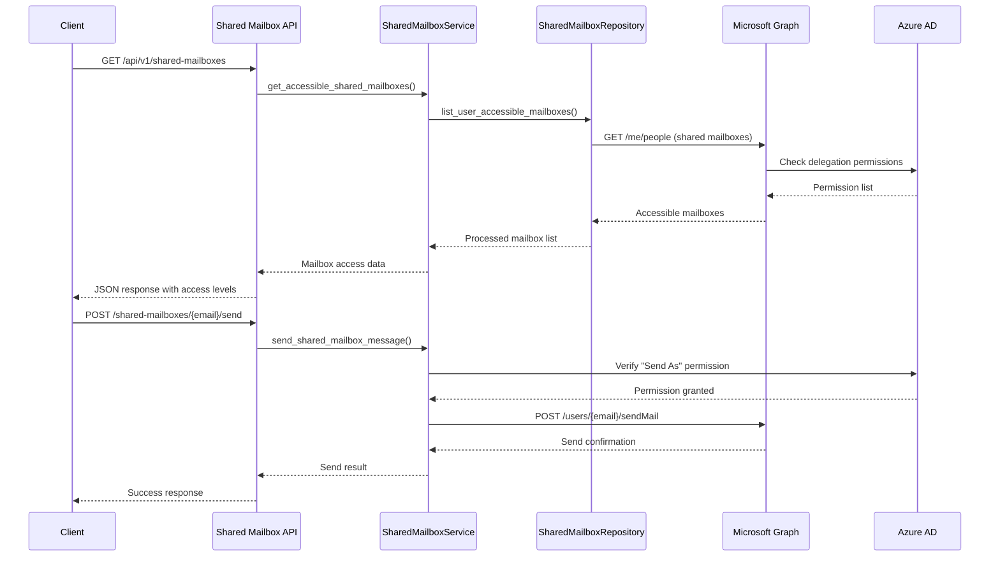

# Shared Mailbox API Documentation

REST API endpoints for shared mailbox operations using Microsoft Graph API integration. This module provides comprehensive shared mailbox management functionality including access control, message operations, cross-mailbox search, and usage analytics.

## Table of Contents

1. [Overview](#overview)
2. [Architecture](#architecture)
3. [Authentication & Authorization](#authentication--authorization)
4. [Mailbox Discovery](#mailbox-discovery)
5. [Folder Operations](#folder-operations)
6. [Message Operations](#message-operations)
7. [Cross-Mailbox Operations](#cross-mailbox-operations)
8. [Voice Message Management](#voice-message-management)
9. [Statistics and Analytics](#statistics-and-analytics)
10. [Error Handling](#error-handling)
11. [Examples](#examples)
12. [Reference](#reference)

## Overview

The Shared Mailbox API provides access to shared mailbox operations through Microsoft Graph API, supporting:

- **Mailbox Discovery**: Find and access shared mailboxes with proper permissions
- **Folder Management**: List, create, and organize shared mailbox folders
- **Message Operations**: Read, send, and manage messages in shared mailboxes
- **Cross-Mailbox Search**: Search across multiple shared mailboxes simultaneously
- **Voice Message Organization**: Specialized handling of voice messages in shared mailboxes
- **Permission Management**: Role-based access control and permission verification
- **Usage Analytics**: Comprehensive analytics and reporting across shared mailboxes

All endpoints require authentication and enforce granular permission checks based on the user's role and mailbox delegations.

## Architecture



## Authentication & Authorization

All Shared Mailbox API endpoints require authentication and specific Microsoft Graph permissions:

```http
Authorization: Bearer <access_token>
```

### Required Permissions

- **Mail.Read.Shared**: Read shared mailbox content
- **Mail.ReadWrite.Shared**: Read and write shared mailbox content
- **Mail.Send.Shared**: Send mail from shared mailboxes
- **Directory.Read.All**: Discover shared mailboxes
- **User.Read.All**: Read user permissions and delegations

### Permission Levels

Shared mailbox access is controlled by Azure AD delegations:

- **Full Access**: Complete mailbox management (read, write, delete, manage folders)
- **Send As**: Send emails as the shared mailbox
- **Send on Behalf**: Send emails on behalf of the shared mailbox
- **Read Only**: View messages and folders only

## Mailbox Discovery

### List Accessible Shared Mailboxes

Retrieve all shared mailboxes the current user has access to.

```http
GET /api/v1/shared-mailboxes
```

**Response Model**: `SharedMailboxListResponse`

**Example Request**:
```bash
curl -X GET "https://api.scribe.com/api/v1/shared-mailboxes" \
  -H "Authorization: Bearer <token>"
```

**Example Response**:
```json
{
  "value": [
    {
      "emailAddress": "support@company.com",
      "displayName": "Customer Support",
      "accessType": "fullAccess",
      "permissions": [
        "Mail.ReadWrite.Shared",
        "Mail.Send.Shared"
      ],
      "lastAccessed": "2023-08-15T14:30:00Z",
      "messageCount": 1250,
      "unreadCount": 45,
      "sizeInBytes": 52428800
    },
    {
      "emailAddress": "sales@company.com", 
      "displayName": "Sales Team",
      "accessType": "sendAs",
      "permissions": [
        "Mail.Read.Shared",
        "Mail.Send.Shared"
      ],
      "lastAccessed": "2023-08-14T09:15:00Z",
      "messageCount": 890,
      "unreadCount": 12,
      "sizeInBytes": 34603008
    }
  ],
  "totalCount": 2,
  "hasFullAccess": 1,
  "hasReadOnly": 0,
  "hasSendPermission": 2
}
```

**Implementation Reference**: `app/api/v1/endpoints/SharedMailbox.py:44-65`

### Get Shared Mailbox Details

Get detailed information about a specific shared mailbox including current user's permissions.

```http
GET /api/v1/shared-mailboxes/{email_address}
```

**Path Parameters**:
- `email_address`: Shared mailbox email address

**Response Model**: `SharedMailboxAccess`

**Example Request**:
```bash
curl -X GET "https://api.scribe.com/api/v1/shared-mailboxes/support@company.com" \
  -H "Authorization: Bearer <token>"
```

**Example Response**:
```json
{
  "emailAddress": "support@company.com",
  "displayName": "Customer Support",
  "accessType": "fullAccess",
  "effectivePermissions": {
    "canRead": true,
    "canWrite": true,
    "canDelete": true,
    "canCreateFolders": true,
    "canSendAs": true,
    "canSendOnBehalf": false
  },
  "delegationDetails": {
    "grantedBy": "admin@company.com",
    "grantedAt": "2023-07-01T10:00:00Z",
    "scope": "fullMailbox"
  },
  "quotaUsage": {
    "usedSizeBytes": 52428800,
    "maxSizeBytes": 107374182400,
    "percentageUsed": 0.05
  },
  "statistics": {
    "totalMessages": 1250,
    "unreadMessages": 45,
    "foldersCount": 15,
    "lastActivityDate": "2023-08-15T16:45:00Z"
  }
}
```

**Implementation Reference**: `app/api/v1/endpoints/SharedMailbox.py:68-99`

## Folder Operations

### List Shared Mailbox Folders

Get all folders from a shared mailbox with hierarchy information.

```http
GET /api/v1/shared-mailboxes/{email_address}/folders
```

**Response Model**: `List[MailFolder]`

**Example Request**:
```bash
curl -X GET "https://api.scribe.com/api/v1/shared-mailboxes/support@company.com/folders" \
  -H "Authorization: Bearer <token>"
```

**Example Response**:
```json
[
  {
    "id": "AQMkAGE5ZTYwM2YtZWVkOS00YzQzLWE1ODQtMzU2NDdkZmI1MDNmAC4AAAOkweEKZ",
    "displayName": "Inbox",
    "parentFolderId": null,
    "childFolderCount": 3,
    "unreadItemCount": 45,
    "totalItemCount": 856,
    "wellKnownName": "inbox"
  },
  {
    "id": "AQMkAGE5ZTYwM2YtZWVkOS00YzQzLWE1ODQtMzU2NDdkZmI1MDNmAC4AAAOkweEKY",
    "displayName": "Customer Issues",
    "parentFolderId": "AQMkAGE5ZTYwM2YtZWVkOS00YzQzLWE1ODQtMzU2NDdkZmI1MDNmAC4AAAOkweEKZ",
    "childFolderCount": 2,
    "unreadItemCount": 12,
    "totalItemCount": 145,
    "wellKnownName": null
  }
]
```

**Implementation Reference**: `app/api/v1/endpoints/SharedMailbox.py:102-133`

### Create Shared Mailbox Folder

Create a new folder in a shared mailbox.

```http
POST /api/v1/shared-mailboxes/{email_address}/folders?folder_name={name}&parent_id={parent}
```

**Query Parameters**:
- `folder_name`: Name for the new folder
- `parent_id` (optional): Parent folder ID

**Response Model**: `MailFolder`

**Example Request**:
```bash
curl -X POST "https://api.scribe.com/api/v1/shared-mailboxes/support@company.com/folders?folder_name=Voice%20Messages" \
  -H "Authorization: Bearer <token>"
```

**Implementation Reference**: `app/api/v1/endpoints/SharedMailbox.py:136-173`

## Message Operations

### List Shared Mailbox Messages

Retrieve messages from a shared mailbox with optional filtering and pagination.

```http
GET /api/v1/shared-mailboxes/{email_address}/messages
```

**Query Parameters**:
- `folder_id` (optional): Folder ID to list messages from
- `has_attachments` (optional): Filter by attachment presence
- `top`: Number of messages to return (1-1000, default: 25)
- `skip`: Number of messages to skip (default: 0)

**Response Model**: `MessageListResponse`

**Example Request**:
```bash
curl -X GET "https://api.scribe.com/api/v1/shared-mailboxes/support@company.com/messages?has_attachments=true&top=20" \
  -H "Authorization: Bearer <token>"
```

**Example Response**:
```json
{
  "messages": [
    {
      "id": "AAMkAGE5ZTYwM2YtZWVkOS00YzQzLWE1ODQtMzU2NDdkZmI1MDNmAEAADI_GMNTjTohhzhfuKWXzEBwA",
      "subject": "Customer inquiry with voice message",
      "sender": {
        "name": "John Customer",
        "address": "john@customer.com"
      },
      "receivedDateTime": "2023-08-15T14:30:00Z",
      "isRead": false,
      "hasAttachments": true,
      "attachmentCount": 1,
      "importance": "normal",
      "categories": ["customer-support"],
      "sharedMailboxInfo": {
        "receivedInMailbox": "support@company.com",
        "assignedTo": null,
        "priority": "medium"
      }
    }
  ],
  "totalCount": 856,
  "hasMore": true,
  "nextSkip": 45
}
```

**Implementation Reference**: `app/api/v1/endpoints/SharedMailbox.py:176-221`

### Send Message from Shared Mailbox

Send a message from a shared mailbox.

```http
POST /api/v1/shared-mailboxes/{email_address}/send
```

**Request Model**: `SendAsSharedRequest`

**Request Body**:
```json
{
  "subject": "Response to your inquiry",
  "body": {
    "contentType": "HTML",
    "content": "<p>Thank you for contacting our support team...</p>"
  },
  "toRecipients": [
    {
      "name": "John Customer",
      "address": "john@customer.com"
    }
  ],
  "ccRecipients": [],
  "bccRecipients": [],
  "attachments": [],
  "importance": "normal",
  "requestDeliveryReceipt": false,
  "requestReadReceipt": true,
  "replyTo": [
    {
      "name": "Customer Support",
      "address": "support@company.com"
    }
  ]
}
```

**Example Request**:
```bash
curl -X POST "https://api.scribe.com/api/v1/shared-mailboxes/support@company.com/send" \
  -H "Authorization: Bearer <token>" \
  -H "Content-Type: application/json" \
  -d '{
    "subject": "Response to your inquiry",
    "body": {
      "contentType": "TEXT",
      "content": "Thank you for contacting us. We will respond within 24 hours."
    },
    "toRecipients": [{"name": "John Customer", "address": "john@customer.com"}]
  }'
```

**Example Response**:
```json
{
  "success": true,
  "messageId": "AAMkAGE5ZTYwM2YtZWVkOS00YzQzLWE1ODQtMzU2NDdkZmI1MDNmAEAADI_GMNTjTohhzhfuKWXzEBwB",
  "sentDateTime": "2023-08-15T15:45:00Z",
  "from": {
    "name": "Customer Support",
    "address": "support@company.com"
  },
  "deliveryStatus": "sent"
}
```

**Implementation Reference**: `app/api/v1/endpoints/SharedMailbox.py:224-259`

### Organize Shared Mailbox Messages

Auto-organize messages in a shared mailbox (e.g., voice messages into a folder).

```http
POST /api/v1/shared-mailboxes/{email_address}/organize
```

**Request Model**: `OrganizeSharedMailboxRequest`

**Request Body**:
```json
{
  "targetFolderName": "Voice Messages",
  "createFolder": true,
  "messageType": "voice",
  "includeSubfolders": false,
  "preserveReadStatus": true,
  "criteria": {
    "hasAttachments": true,
    "attachmentTypes": ["audio/m4a", "audio/mp3", "audio/wav"],
    "subjectContains": ["voice", "recording", "voicemail"],
    "dateRange": {
      "from": "2023-08-01T00:00:00Z",
      "to": "2023-08-31T23:59:59Z"
    }
  }
}
```

**Response Model**: `OrganizeSharedMailboxResponse`

**Example Response**:
```json
{
  "success": true,
  "targetFolderId": "AQMkAGE5ZTYwM2YtZWVkOS00YzQzLWE1ODQtMzU2NDdkZmI1MDNmAC4AAAOkweEKX",
  "targetFolderName": "Voice Messages",
  "folderCreated": true,
  "messagesProcessed": 45,
  "messagesOrganized": 38,
  "messagesMoved": 38,
  "messagesSkipped": 7,
  "voiceAttachmentsFound": 42,
  "totalSizeProcessed": 125829120,
  "processingTime": "00:02:15",
  "errors": [],
  "summary": {
    "audioFormats": {
      "m4a": 25,
      "mp3": 13,
      "wav": 4
    },
    "averageFileSize": 2995456,
    "totalDuration": "2h 15m"
  }
}
```

**Implementation Reference**: `app/api/v1/endpoints/SharedMailbox.py:262-297`

## Cross-Mailbox Operations

### Search Across Shared Mailboxes

Search across multiple shared mailboxes simultaneously.

```http
POST /api/v1/shared-mailboxes/search
```

**Request Model**: `SharedMailboxSearchRequest`

**Request Body**:
```json
{
  "query": "urgent customer issue",
  "mailboxes": [
    "support@company.com",
    "sales@company.com"
  ],
  "folders": ["inbox", "priority"],
  "dateRange": {
    "from": "2023-08-01T00:00:00Z",
    "to": "2023-08-15T23:59:59Z"
  },
  "hasAttachments": true,
  "messageTypes": ["email", "voice"],
  "importance": "high",
  "maxResults": 100,
  "includeArchived": false
}
```

**Response Model**: `SharedMailboxSearchResponse`

**Example Response**:
```json
{
  "searchId": "search_12345_20230815",
  "query": "urgent customer issue",
  "totalResults": 15,
  "searchedMailboxes": 2,
  "processingTime": "00:00:03",
  "results": [
    {
      "mailbox": "support@company.com",
      "messageCount": 12,
      "messages": [
        {
          "id": "msg_001",
          "subject": "Urgent: Payment system issue",
          "relevanceScore": 0.95,
          "snippet": "Customer reporting urgent payment processing problem...",
          "matchedTerms": ["urgent", "issue"],
          "sender": {
            "name": "Important Customer",
            "address": "customer@bigcorp.com"
          },
          "receivedDateTime": "2023-08-15T10:30:00Z"
        }
      ]
    },
    {
      "mailbox": "sales@company.com", 
      "messageCount": 3,
      "messages": [...] 
    }
  ],
  "aggregations": {
    "byMailbox": {
      "support@company.com": 12,
      "sales@company.com": 3
    },
    "byImportance": {
      "high": 8,
      "normal": 7
    },
    "withAttachments": 5
  }
}
```

**Implementation Reference**: `app/api/v1/endpoints/SharedMailbox.py:300-328`

### Get Shared Mailbox Statistics

Get comprehensive statistics for a specific shared mailbox.

```http
GET /api/v1/shared-mailboxes/{email_address}/statistics
```

**Response Model**: `SharedMailboxStatistics`

**Example Response**:
```json
{
  "mailboxAddress": "support@company.com",
  "displayName": "Customer Support",
  "collectionDate": "2023-08-15T16:00:00Z",
  "totalMessages": 1250,
  "unreadMessages": 45,
  "flaggedMessages": 12,
  "messagesWithAttachments": 230,
  "voiceMessages": 18,
  "totalSizeBytes": 524288000,
  "averageMessageSize": 419430,
  "quotaUsage": {
    "usedBytes": 524288000,
    "maxBytes": 107374182400,
    "percentageUsed": 0.49
  },
  "activityMetrics": {
    "messagesLast24Hours": 25,
    "messagesLast7Days": 180,
    "messagesLast30Days": 450,
    "averageMessagesPerDay": 15,
    "peakActivityHour": 14,
    "quietestHour": 3
  },
  "folderBreakdown": [
    {
      "folderId": "inbox",
      "folderName": "Inbox", 
      "messageCount": 856,
      "unreadCount": 45,
      "sizeBytes": 358612992
    },
    {
      "folderId": "resolved",
      "folderName": "Resolved Issues",
      "messageCount": 280,
      "unreadCount": 0, 
      "sizeBytes": 117440512
    }
  ],
  "topSenders": [
    {
      "senderAddress": "frequent@customer.com",
      "senderName": "Frequent Customer",
      "messageCount": 45,
      "lastMessageDate": "2023-08-15T14:30:00Z"
    }
  ],
  "responseMetrics": {
    "averageResponseTime": "02:15:30",
    "messagesRespondedTo": 1100,
    "responseRate": 0.88,
    "averageResolutionTime": "24:30:00"
  }
}
```

**Implementation Reference**: `app/api/v1/endpoints/SharedMailbox.py:331-362`

## Voice Message Management

### Get Voice Messages Across Mailboxes

Get voice messages from multiple shared mailboxes.

```http
GET /api/v1/shared-mailboxes/voice-messages/cross-mailbox?mailbox_addresses=support@company.com&mailbox_addresses=sales@company.com&top=50
```

**Query Parameters**:
- `mailbox_addresses`: List of shared mailbox email addresses (can be repeated)
- `top`: Maximum messages to check per mailbox (1-200, default: 50)

**Example Request**:
```bash
curl -X GET "https://api.scribe.com/api/v1/shared-mailboxes/voice-messages/cross-mailbox?mailbox_addresses=support@company.com&mailbox_addresses=sales@company.com&top=50" \
  -H "Authorization: Bearer <token>"
```

**Example Response**:
```json
{
  "mailboxes": [
    {
      "mailbox": "support@company.com",
      "voiceMessages": [
        {
          "id": "msg_001",
          "subject": "Customer inquiry with voice message",
          "hasAttachments": true,
          "voiceAttachments": [
            {
              "id": "att_001",
              "name": "customer_inquiry.m4a",
              "contentType": "audio/m4a",
              "size": 2048576,
              "duration": 120
            }
          ],
          "receivedDateTime": "2023-08-15T14:30:00Z"
        }
      ],
      "count": 8
    },
    {
      "mailbox": "sales@company.com",
      "voiceMessages": [...],
      "count": 3
    }
  ],
  "totalVoiceMessages": 11,
  "searchedMailboxes": 2,
  "successfulMailboxes": 2
}
```

**Implementation Reference**: `app/api/v1/endpoints/SharedMailbox.py:365-427`

### Organize Voice Messages in Shared Mailbox

Auto-organize voice messages in a shared mailbox into a dedicated folder.

```http
POST /api/v1/shared-mailboxes/{email_address}/organize-voice?target_folder=Voice%20Messages&create_folder=true
```

**Query Parameters**:
- `target_folder`: Name of folder to organize voice messages into (default: "Voice Messages")
- `create_folder`: Whether to create the folder if it doesn't exist (default: true)

**Example Request**:
```bash
curl -X POST "https://api.scribe.com/api/v1/shared-mailboxes/support@company.com/organize-voice?target_folder=Customer%20Voice%20Messages" \
  -H "Authorization: Bearer <token>"
```

**Implementation Reference**: `app/api/v1/endpoints/SharedMailbox.py:430-476`

## Statistics and Analytics

### Get Shared Mailboxes Usage Analytics

Get comprehensive usage analytics across multiple shared mailboxes.

```http
GET /api/v1/shared-mailboxes/analytics/usage?days=30
```

**Query Parameters**:
- `mailbox_addresses` (optional): Specific mailboxes to analyze
- `days`: Number of days to analyze (1-365, default: 30)

**Example Request**:
```bash
curl -X GET "https://api.scribe.com/api/v1/shared-mailboxes/analytics/usage?days=30" \
  -H "Authorization: Bearer <token>"
```

**Example Response**:
```json
{
  "period": {
    "days": 30,
    "startDate": "2023-07-16T00:00:00Z",
    "endDate": "2023-08-15T23:59:59Z"
  },
  "mailboxes": {
    "total": 5,
    "analyzed": 5,
    "active": 4
  },
  "activity": {
    "totalMessages": 3750,
    "averageMessagesPerDay": 125,
    "peakActivityDay": "Monday",
    "quietestDay": "Sunday",
    "messageVolumeChange": "+12%",
    "responseTimeImprovement": "+8%"
  },
  "topMailboxes": [
    {
      "mailbox": "support@company.com",
      "messages": 1250,
      "unread": 45,
      "responseRate": 0.92,
      "averageResponseTime": "02:15:30"
    },
    {
      "mailbox": "sales@company.com",
      "messages": 890,
      "unread": 12,
      "responseRate": 0.88,
      "averageResponseTime": "01:45:20"
    }
  ],
  "trends": {
    "messageVolumeChange": "+12%",
    "attachmentVolumeChange": "+5%",
    "voiceMessagesChange": "+25%",
    "responseTimeChange": "-8%"
  },
  "performanceMetrics": {
    "averageResponseTime": "02:00:25",
    "firstResponseSLA": {
      "target": "02:00:00",
      "achieved": 0.85
    },
    "resolutionSLA": {
      "target": "24:00:00",
      "achieved": 0.78
    }
  }
}
```

**Implementation Reference**: `app/api/v1/endpoints/SharedMailbox.py:479-554`

## Error Handling

All endpoints follow consistent error response patterns with shared mailbox specific error codes:

### HTTP Status Codes

- `200 OK`: Successful operation
- `400 Bad Request`: Validation error or invalid request
- `401 Unauthorized`: Authentication required or failed
- `403 Forbidden`: Insufficient permissions for shared mailbox access
- `404 Not Found`: Shared mailbox or resource not found
- `429 Too Many Requests`: Rate limit exceeded
- `500 Internal Server Error`: Unexpected server error

### Shared Mailbox Specific Errors

1. **Access Denied Errors**:
   ```json
   {
     "detail": "Insufficient permissions to access shared mailbox support@company.com",
     "error_code": "SHARED_MAILBOX_ACCESS_DENIED",
     "required_permission": "Mail.ReadWrite.Shared",
     "current_permissions": ["Mail.Read.Shared"]
   }
   ```

2. **Delegation Errors**:
   ```json
   {
     "detail": "User does not have delegation to shared mailbox",
     "error_code": "DELEGATION_NOT_FOUND",
     "mailbox": "support@company.com",
     "available_delegations": []
   }
   ```

3. **Send Permission Errors**:
   ```json
   {
     "detail": "Send As permission required to send from shared mailbox",
     "error_code": "SEND_AS_PERMISSION_REQUIRED",
     "mailbox": "support@company.com",
     "has_send_on_behalf": true
   }
   ```

4. **Quota Exceeded Errors**:
   ```json
   {
     "detail": "Shared mailbox quota exceeded",
     "error_code": "MAILBOX_QUOTA_EXCEEDED",
     "quota_used": 107374182400,
     "quota_limit": 107374182400
   }
   ```

## Examples

### Complete Workflow: Managing Customer Support Mailbox

```bash
# 1. List all accessible shared mailboxes
curl -X GET "https://api.scribe.com/api/v1/shared-mailboxes" \
  -H "Authorization: Bearer <token>"

# 2. Get details for support mailbox
curl -X GET "https://api.scribe.com/api/v1/shared-mailboxes/support@company.com" \
  -H "Authorization: Bearer <token>"

# 3. List unread messages
curl -X GET "https://api.scribe.com/api/v1/shared-mailboxes/support@company.com/messages?top=50" \
  -H "Authorization: Bearer <token>"

# 4. Organize voice messages
curl -X POST "https://api.scribe.com/api/v1/shared-mailboxes/support@company.com/organize-voice" \
  -H "Authorization: Bearer <token>"

# 5. Send response to customer
curl -X POST "https://api.scribe.com/api/v1/shared-mailboxes/support@company.com/send" \
  -H "Authorization: Bearer <token>" \
  -H "Content-Type: application/json" \
  -d '{
    "subject": "Re: Your support inquiry",
    "body": {"contentType": "TEXT", "content": "Thank you for contacting us..."},
    "toRecipients": [{"address": "customer@example.com"}]
  }'

# 6. Get usage statistics
curl -X GET "https://api.scribe.com/api/v1/shared-mailboxes/support@company.com/statistics" \
  -H "Authorization: Bearer <token>"
```

### Batch Processing Multiple Shared Mailboxes

```python
import asyncio
import httpx

async def process_shared_mailboxes():
    headers = {"Authorization": "Bearer <token>"}
    
    async with httpx.AsyncClient() as client:
        # Get all accessible mailboxes
        response = await client.get(
            "https://api.scribe.com/api/v1/shared-mailboxes",
            headers=headers
        )
        mailboxes = response.json()["value"]
        
        # Process each mailbox
        for mailbox in mailboxes:
            email_address = mailbox["emailAddress"]
            
            # Organize voice messages
            await client.post(
                f"https://api.scribe.com/api/v1/shared-mailboxes/{email_address}/organize-voice",
                headers=headers
            )
            
            # Get statistics
            stats_response = await client.get(
                f"https://api.scribe.com/api/v1/shared-mailboxes/{email_address}/statistics",
                headers=headers
            )
            stats = stats_response.json()
            
            print(f"Processed {email_address}: {stats['totalMessages']} messages")
        
        # Get cross-mailbox analytics
        analytics_response = await client.get(
            "https://api.scribe.com/api/v1/shared-mailboxes/analytics/usage?days=30",
            headers=headers
        )
        
        print(f"Overall analytics: {analytics_response.json()}")

# Run the batch processing
asyncio.run(process_shared_mailboxes())
```

### Cross-Mailbox Voice Message Search

```python
async def find_voice_messages_across_mailboxes():
    headers = {"Authorization": "Bearer <token>"}
    
    # Mailboxes to search
    mailboxes = ["support@company.com", "sales@company.com", "reception@company.com"]
    
    async with httpx.AsyncClient() as client:
        # Search for voice messages across all mailboxes
        params = {"top": 100}
        for mailbox in mailboxes:
            params[f"mailbox_addresses"] = mailbox
            
        response = await client.get(
            "https://api.scribe.com/api/v1/shared-mailboxes/voice-messages/cross-mailbox",
            headers=headers,
            params=params
        )
        
        voice_data = response.json()
        print(f"Found {voice_data['totalVoiceMessages']} voice messages across {voice_data['successfulMailboxes']} mailboxes")
        
        # Organize voice messages in each mailbox
        for mailbox_data in voice_data["mailboxes"]:
            if mailbox_data["count"] > 0:
                await client.post(
                    f"https://api.scribe.com/api/v1/shared-mailboxes/{mailbox_data['mailbox']}/organize-voice",
                    headers=headers
                )
```

## Reference

### Model Schemas

**SharedMailboxAccess**:
```python
{
  "emailAddress": "string",
  "displayName": "string",
  "accessType": "fullAccess | sendAs | sendOnBehalf | readOnly",
  "effectivePermissions": {
    "canRead": "boolean",
    "canWrite": "boolean", 
    "canDelete": "boolean",
    "canCreateFolders": "boolean",
    "canSendAs": "boolean",
    "canSendOnBehalf": "boolean"
  },
  "delegationDetails": {
    "grantedBy": "string",
    "grantedAt": "string (ISO 8601)",
    "scope": "string"
  }
}
```

**SendAsSharedRequest**:
```python
{
  "subject": "string",
  "body": {
    "contentType": "TEXT | HTML",
    "content": "string"
  },
  "toRecipients": [
    {
      "name": "string",
      "address": "string"
    }
  ],
  "importance": "low | normal | high",
  "requestDeliveryReceipt": "boolean",
  "requestReadReceipt": "boolean"
}
```

**OrganizeSharedMailboxRequest**:
```python
{
  "targetFolderName": "string",
  "createFolder": "boolean",
  "messageType": "all | voice | attachment | specific",
  "includeSubfolders": "boolean",
  "preserveReadStatus": "boolean",
  "criteria": {
    "hasAttachments": "boolean",
    "attachmentTypes": ["string"],
    "subjectContains": ["string"],
    "dateRange": {
      "from": "string (ISO 8601)",
      "to": "string (ISO 8601)"
    }
  }
}
```

### Service Dependencies

- **SharedMailboxService**: `app/services/SharedMailboxService.py` - Business logic for shared mailbox operations
- **SharedMailboxRepository**: `app/repositories/SharedMailboxRepository.py` - Data access layer
- **Microsoft Graph API**: External service for shared mailbox operations
- **Azure Active Directory**: Permission and delegation management

### Rate Limits

Microsoft Graph API rate limits apply with specific considerations for shared mailboxes:
- **Per app per shared mailbox**: 10,000 requests per 10 minutes
- **Cross-mailbox operations**: Limited to 100 concurrent mailbox operations
- **Analytics queries**: Limited to 10 requests per minute

### Performance Considerations

- **Permission Caching**: User permissions are cached for 15 minutes
- **Mailbox Discovery**: Accessible mailboxes are cached for 30 minutes  
- **Cross-Mailbox Operations**: Use pagination and concurrent processing
- **Analytics Queries**: Pre-computed statistics updated every hour
- **Large Mailboxes**: Implement progressive loading for mailboxes >10GB

### Security Best Practices

1. **Principle of Least Privilege**: Only request necessary permissions
2. **Audit Logging**: All shared mailbox operations are logged
3. **Permission Verification**: Check permissions before each operation
4. **Secure Delegation**: Use Azure AD groups for shared mailbox access
5. **Regular Audits**: Review shared mailbox delegations monthly

---

**Related Documentation**:
- [Mail API](./mail.md)
- [Authentication API](./authentication.md) 
- [Shared Mailbox Service](../services/shared-mailbox-service.md)
- [Azure Graph Service](../azure/graph-service.md)
- [Permission Management](../guides/security.md)

**Last Updated**: August 2025
**API Version**: v1