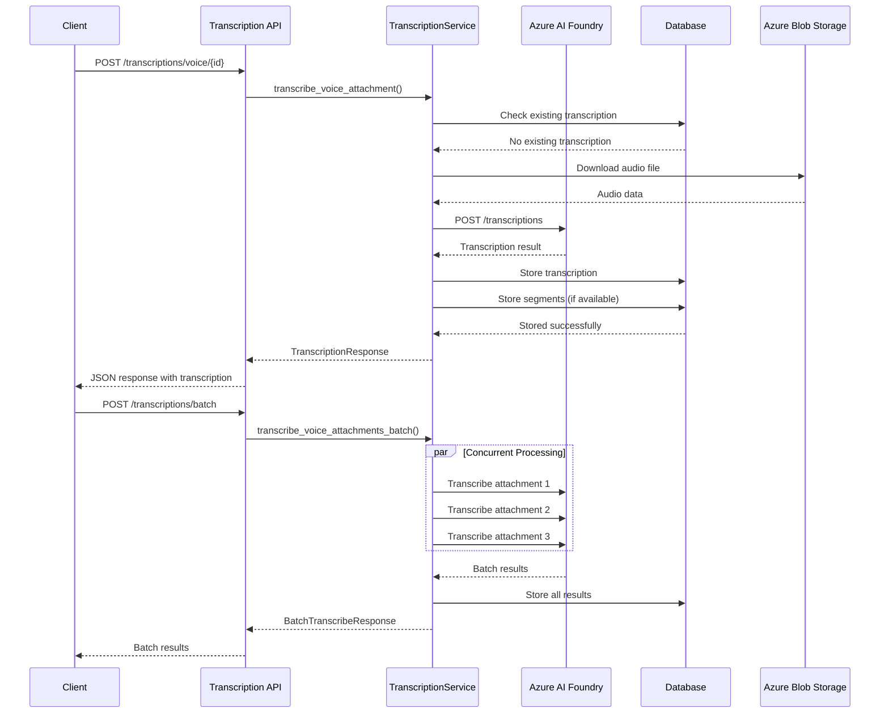

# Transcription API Documentation

REST API endpoints for voice transcription operations using Azure AI Foundry integration. This module provides comprehensive voice-to-text transcription functionality with support for multiple models, languages, batch processing, and detailed transcription management.

## Table of Contents

1. [Overview](#overview)
2. [Architecture](#architecture)
3. [Authentication](#authentication)
4. [Single Transcription Operations](#single-transcription-operations)
5. [Batch Transcription Operations](#batch-transcription-operations)
6. [Transcription Management](#transcription-management)
7. [Error Handling and Retry](#error-handling-and-retry)
8. [Statistics and Analytics](#statistics-and-analytics)
9. [Model and Health Management](#model-and-health-management)
10. [Error Handling](#error-handling)
11. [Examples](#examples)
12. [Reference](#reference)

## Overview

The Transcription API provides access to voice transcription operations through Azure AI Foundry, supporting:

- **Single Voice Transcription**: Transcribe individual voice attachments with configurable parameters
- **Batch Processing**: Concurrent transcription of multiple voice attachments
- **Language Support**: Multi-language transcription with automatic detection
- **Model Selection**: Multiple AI models for different accuracy/speed tradeoffs
- **Segment Analysis**: Detailed word-level and sentence-level timestamps
- **Error Management**: Comprehensive error tracking and retry mechanisms
- **Quality Control**: Confidence scoring and validation
- **Statistics**: Usage analytics and performance metrics

All endpoints require authentication and integrate with the database for persistent storage of transcription results.

## Architecture



## Authentication

All Transcription API endpoints require authentication via Azure AD OAuth 2.0:

```http
Authorization: Bearer <access_token>
```

The access token must have appropriate permissions for:
- Reading voice attachment data
- Accessing Azure AI Foundry services
- Database read/write operations

## Single Transcription Operations

### Transcribe Voice Attachment

Transcribe a specific voice attachment using Azure AI Foundry.

```http
POST /api/v1/transcriptions/voice/{voice_attachment_id}
```

**Path Parameters**:
- `voice_attachment_id`: ID of the voice attachment to transcribe

**Request Model**: `TranscribeVoiceRequest`

**Request Body**:
```json
{
  "model_deployment": "whisper-large-v2",
  "language": "en",
  "prompt": "This is a customer service call about billing issues.",
  "force_retranscribe": false
}
```

**Response Model**: `TranscriptionResponse`

**Example Request**:
```bash
curl -X POST "https://api.scribe.com/api/v1/transcriptions/voice/att_12345" \
  -H "Authorization: Bearer <token>" \
  -H "Content-Type: application/json" \
  -d '{
    "model_deployment": "whisper-large-v2",
    "language": "en",
    "force_retranscribe": false
  }'
```

**Example Response**:
```json
{
  "id": "trans_67890",
  "voice_attachment_id": "att_12345",
  "transcript_text": "Hello, I'm calling about my billing statement. There seems to be an error with last month's charges.",
  "language": "en",
  "confidence_score": 0.96,
  "transcription_status": "completed",
  "model_name": "whisper-large-v2",
  "response_format": "verbose_json",
  "has_word_timestamps": true,
  "has_segment_timestamps": true,
  "audio_duration_seconds": 45.2,
  "processing_time_ms": 3200,
  "created_at": "2023-08-15T14:30:00Z",
  "updated_at": "2023-08-15T14:30:03Z",
  "voice_attachment": {
    "id": "att_12345",
    "blob_name": "user123_msg456_att789_20230815143000.m4a",
    "original_filename": "customer_call.m4a",
    "content_type": "audio/m4a",
    "size_bytes": 2048576,
    "sender_email": "customer@example.com",
    "sender_name": "John Customer",
    "subject": "Billing Inquiry",
    "received_at": "2023-08-15T14:25:00Z"
  },
  "segments": [
    {
      "id": "seg_001",
      "segment_index": 0,
      "segment_type": "sentence",
      "start_time_seconds": 0.0,
      "end_time_seconds": 8.5,
      "duration_seconds": 8.5,
      "text": "Hello, I'm calling about my billing statement.",
      "confidence_score": 0.98,
      "avg_logprob": -0.15
    },
    {
      "id": "seg_002",
      "segment_index": 1,
      "segment_type": "sentence",
      "start_time_seconds": 8.5,
      "end_time_seconds": 16.2,
      "duration_seconds": 7.7,
      "text": "There seems to be an error with last month's charges.",
      "confidence_score": 0.94,
      "avg_logprob": -0.22
    }
  ]
}
```

**Implementation Reference**: `app/api/v1/endpoints/Transcription.py:124-164`

### Get Transcription by Voice Attachment

Retrieve existing transcription for a voice attachment.

```http
GET /api/v1/transcriptions/voice/{voice_attachment_id}
```

**Response Model**: `TranscriptionResponse`

**Example Request**:
```bash
curl -X GET "https://api.scribe.com/api/v1/transcriptions/voice/att_12345" \
  -H "Authorization: Bearer <token>"
```

**Implementation Reference**: `app/api/v1/endpoints/Transcription.py:167-206`

### Get Transcription by ID

Retrieve a specific transcription by its unique ID.

```http
GET /api/v1/transcriptions/{transcription_id}
```

**Path Parameters**:
- `transcription_id`: Unique transcription ID

**Response Model**: `TranscriptionResponse`

**Example Request**:
```bash
curl -X GET "https://api.scribe.com/api/v1/transcriptions/trans_67890" \
  -H "Authorization: Bearer <token>"
```

**Implementation Reference**: `app/api/v1/endpoints/Transcription.py:209-248`

## Batch Transcription Operations

### Batch Transcribe Voice Attachments

Transcribe multiple voice attachments concurrently for improved efficiency.

```http
POST /api/v1/transcriptions/batch
```

**Request Model**: `BatchTranscribeRequest`

**Request Body**:
```json
{
  "voice_attachment_ids": [
    "att_12345",
    "att_12346", 
    "att_12347",
    "att_12348"
  ],
  "model_deployment": "whisper-large-v2",
  "language": "en",
  "max_concurrent": 3,
  "force_retranscribe": false
}
```

**Response Model**: `BatchTranscribeResponse`

**Example Request**:
```bash
curl -X POST "https://api.scribe.com/api/v1/transcriptions/batch" \
  -H "Authorization: Bearer <token>" \
  -H "Content-Type: application/json" \
  -d '{
    "voice_attachment_ids": ["att_12345", "att_12346", "att_12347"],
    "model_deployment": "whisper-large-v2",
    "max_concurrent": 2
  }'
```

**Example Response**:
```json
{
  "results": {
    "att_12345": {
      "status": "completed",
      "transcription": {
        "id": "trans_67890",
        "transcript_text": "Hello, I'm calling about my billing statement...",
        "confidence_score": 0.96,
        "processing_time_ms": 3200
      }
    },
    "att_12346": {
      "status": "completed", 
      "transcription": {
        "id": "trans_67891",
        "transcript_text": "Thank you for your purchase...",
        "confidence_score": 0.92,
        "processing_time_ms": 2800
      }
    },
    "att_12347": {
      "status": "failed",
      "error": "Audio file format not supported"
    }
  },
  "successful_count": 2,
  "failed_count": 1,
  "total_count": 3
}
```

**Implementation Reference**: `app/api/v1/endpoints/Transcription.py:251-318`

## Transcription Management

### List User Transcriptions

Retrieve transcriptions for the current user with filtering and search capabilities.

```http
GET /api/v1/transcriptions
```

**Query Parameters**:
- `status`: Filter by transcription status (`completed`, `failed`, `processing`)
- `language`: Filter by language code
- `model`: Filter by model name
- `search`: Search in transcript text
- `limit`: Number of results (1-200, default: 50)
- `offset`: Number of results to skip (default: 0)
- `order_by`: Field to order by (default: "created_at")
- `order_direction`: Order direction (`asc` or `desc`, default: "desc")

**Response Model**: `TranscriptionListResponse`

**Example Request**:
```bash
curl -X GET "https://api.scribe.com/api/v1/transcriptions?status=completed&search=billing&limit=20" \
  -H "Authorization: Bearer <token>"
```

**Example Response**:
```json
{
  "transcriptions": [
    {
      "id": "trans_67890",
      "voice_attachment_id": "att_12345",
      "transcript_text": "Hello, I'm calling about my billing statement...",
      "language": "en",
      "confidence_score": 0.96,
      "transcription_status": "completed",
      "model_name": "whisper-large-v2",
      "created_at": "2023-08-15T14:30:00Z"
    }
  ],
  "total_count": 45,
  "page_size": 20,
  "page_offset": 0
}
```

**Implementation Reference**: `app/api/v1/endpoints/Transcription.py:321-369`

### Delete Transcription

Delete a specific transcription and its associated data.

```http
DELETE /api/v1/transcriptions/{transcription_id}
```

**Example Request**:
```bash
curl -X DELETE "https://api.scribe.com/api/v1/transcriptions/trans_67890" \
  -H "Authorization: Bearer <token>"
```

**Example Response**:
```json
{
  "message": "Transcription trans_67890 deleted successfully"
}
```

**Implementation Reference**: `app/api/v1/endpoints/Transcription.py:372-411`

## Error Handling and Retry

### Get Transcription Errors

Retrieve transcription errors for troubleshooting and monitoring.

```http
GET /api/v1/transcriptions/errors/list
```

**Query Parameters**:
- `resolved`: Filter by resolution status (`true`, `false`)
- `limit`: Number of results (1-200, default: 50)
- `offset`: Number of results to skip (default: 0)

**Example Request**:
```bash
curl -X GET "https://api.scribe.com/api/v1/transcriptions/errors/list?resolved=false&limit=10" \
  -H "Authorization: Bearer <token>"
```

**Example Response**:
```json
{
  "errors": [
    {
      "id": "error_001",
      "voice_attachment_id": "att_12350",
      "error_type": "audio_format_unsupported",
      "error_code": "UNSUPPORTED_FORMAT",
      "error_message": "Audio format 'audio/amr' is not supported by the current model",
      "model_name": "whisper-large-v2",
      "audio_format": "audio/amr",
      "is_resolved": false,
      "retry_count": 2,
      "created_at": "2023-08-15T15:30:00Z"
    },
    {
      "id": "error_002",
      "voice_attachment_id": "att_12351", 
      "error_type": "quota_exceeded",
      "error_code": "QUOTA_LIMIT",
      "error_message": "Daily transcription quota exceeded",
      "model_name": "whisper-large-v2",
      "audio_format": "audio/m4a",
      "is_resolved": false,
      "retry_count": 0,
      "created_at": "2023-08-15T16:00:00Z"
    }
  ],
  "total_count": 8,
  "page_size": 10,
  "page_offset": 0
}
```

**Implementation Reference**: `app/api/v1/endpoints/Transcription.py:445-495`

### Resolve Transcription Error

Mark a transcription error as resolved with optional notes.

```http
POST /api/v1/transcriptions/errors/{error_id}/resolve
```

**Request Model**: `ResolveErrorRequest`

**Request Body**:
```json
{
  "resolution_notes": "Audio file was converted to supported format and retranscribed successfully"
}
```

**Example Request**:
```bash
curl -X POST "https://api.scribe.com/api/v1/transcriptions/errors/error_001/resolve" \
  -H "Authorization: Bearer <token>" \
  -H "Content-Type: application/json" \
  -d '{
    "resolution_notes": "Audio file converted and retranscribed"
  }'
```

**Example Response**:
```json
{
  "message": "Transcription error error_001 resolved successfully"
}
```

**Implementation Reference**: `app/api/v1/endpoints/Transcription.py:498-537`

### Retry Failed Transcription

Retry transcription for a failed voice attachment with optional parameter changes.

```http
POST /api/v1/transcriptions/voice/{voice_attachment_id}/retry
```

**Request Body**:
```json
{
  "model_deployment": "whisper-base",
  "language": "en"
}
```

**Response Model**: `TranscriptionResponse`

**Example Request**:
```bash
curl -X POST "https://api.scribe.com/api/v1/transcriptions/voice/att_12350/retry" \
  -H "Authorization: Bearer <token>" \
  -H "Content-Type: application/json" \
  -d '{
    "model_deployment": "whisper-base"
  }'
```

**Implementation Reference**: `app/api/v1/endpoints/Transcription.py:540-577`

## Statistics and Analytics

### Get Transcription Statistics

Retrieve comprehensive statistics for the current user's transcriptions.

```http
GET /api/v1/transcriptions/statistics/summary
```

**Query Parameters**:
- `days_ago`: Filter data from N days ago (1-365)

**Example Request**:
```bash
curl -X GET "https://api.scribe.com/api/v1/transcriptions/statistics/summary?days_ago=30" \
  -H "Authorization: Bearer <token>"
```

**Example Response**:
```json
{
  "user_id": "user_12345",
  "period": {
    "days_analyzed": 30,
    "start_date": "2023-07-16T00:00:00Z",
    "end_date": "2023-08-15T23:59:59Z"
  },
  "transcription_counts": {
    "total_transcriptions": 125,
    "completed": 118,
    "failed": 5,
    "processing": 2,
    "success_rate": 0.944
  },
  "processing_metrics": {
    "total_audio_duration_seconds": 18000,
    "total_processing_time_ms": 890000,
    "average_processing_time_ms": 7120,
    "fastest_transcription_ms": 1200,
    "slowest_transcription_ms": 15600
  },
  "language_breakdown": {
    "en": 95,
    "es": 18,
    "fr": 12
  },
  "model_usage": {
    "whisper-large-v2": 85,
    "whisper-base": 40
  },
  "quality_metrics": {
    "average_confidence_score": 0.89,
    "high_confidence_count": 95,
    "medium_confidence_count": 23,
    "low_confidence_count": 7
  },
  "error_analysis": {
    "total_errors": 5,
    "audio_format_errors": 2,
    "quota_errors": 2,
    "network_errors": 1,
    "resolved_errors": 3,
    "pending_errors": 2
  },
  "usage_trends": {
    "daily_average": 4.2,
    "peak_day": "2023-08-10",
    "peak_day_count": 15,
    "busiest_hour": 14,
    "quietest_hour": 3
  }
}
```

**Implementation Reference**: `app/api/v1/endpoints/Transcription.py:414-442`

## Model and Health Management

### Get Supported Models

Retrieve the list of available transcription models and their capabilities.

```http
GET /api/v1/transcriptions/models/supported
```

**Example Request**:
```bash
curl -X GET "https://api.scribe.com/api/v1/transcriptions/models/supported" \
  -H "Authorization: Bearer <token>"
```

**Example Response**:
```json
{
  "models": [
    {
      "name": "whisper-large-v2",
      "display_name": "Whisper Large v2",
      "description": "Most accurate model with highest quality transcription",
      "languages": ["en", "es", "fr", "de", "it", "pt", "nl", "pl", "tr", "ru", "ja", "ko", "zh"],
      "max_audio_length_seconds": 1800,
      "average_processing_time": "fast",
      "accuracy_level": "highest",
      "supports_timestamps": true,
      "supports_word_timestamps": true,
      "deployment_id": "whisper-large-v2-deployment"
    },
    {
      "name": "whisper-base",
      "display_name": "Whisper Base",
      "description": "Balanced model with good accuracy and speed",
      "languages": ["en", "es", "fr", "de", "it", "pt", "nl"],
      "max_audio_length_seconds": 900,
      "average_processing_time": "very-fast",
      "accuracy_level": "good",
      "supports_timestamps": true,
      "supports_word_timestamps": false,
      "deployment_id": "whisper-base-deployment"
    }
  ]
}
```

**Implementation Reference**: `app/api/v1/endpoints/Transcription.py:580-600`

### Health Check

Check the status and availability of the transcription service.

```http
GET /api/v1/transcriptions/health/status
```

**Example Request**:
```bash
curl -X GET "https://api.scribe.com/api/v1/transcriptions/health/status" \
  -H "Authorization: Bearer <token>"
```

**Example Response**:
```json
{
  "service": "TranscriptionService",
  "status": "healthy",
  "timestamp": "2023-08-15T16:30:00Z",
  "dependencies": {
    "azure_ai_foundry": {
      "status": "healthy",
      "response_time_ms": 150,
      "last_check": "2023-08-15T16:29:45Z"
    },
    "azure_blob_storage": {
      "status": "healthy",
      "response_time_ms": 85,
      "last_check": "2023-08-15T16:29:50Z"
    },
    "database": {
      "status": "healthy",
      "response_time_ms": 12,
      "last_check": "2023-08-15T16:29:55Z"
    }
  },
  "metrics": {
    "current_queue_length": 2,
    "average_processing_time_ms": 7200,
    "success_rate_24h": 0.956,
    "error_rate_24h": 0.044
  },
  "rate_limits": {
    "requests_per_minute": 60,
    "current_usage": 12,
    "quota_remaining": 48
  }
}
```

**Implementation Reference**: `app/api/v1/endpoints/Transcription.py:603-624`

## Error Handling

All endpoints follow consistent error response patterns with transcription-specific error codes:

### HTTP Status Codes

- `200 OK`: Successful operation
- `202 Accepted`: Transcription request accepted and processing
- `400 Bad Request`: Validation error or unsupported format
- `401 Unauthorized`: Authentication required or failed
- `404 Not Found`: Transcription or voice attachment not found
- `413 Payload Too Large`: Audio file exceeds size limit
- `429 Too Many Requests`: Rate limit or quota exceeded
- `500 Internal Server Error`: Unexpected server error

### Transcription-Specific Errors

1. **Audio Format Errors**:
   ```json
   {
     "detail": "Audio format 'audio/amr' is not supported",
     "error_code": "UNSUPPORTED_AUDIO_FORMAT",
     "supported_formats": ["audio/m4a", "audio/mp3", "audio/wav", "audio/flac"]
   }
   ```

2. **Quota Exceeded Errors**:
   ```json
   {
     "detail": "Daily transcription quota exceeded",
     "error_code": "QUOTA_EXCEEDED",
     "quota_limit": 1000,
     "quota_used": 1000,
     "quota_resets_at": "2023-08-16T00:00:00Z"
   }
   ```

3. **Processing Errors**:
   ```json
   {
     "detail": "Audio file appears to be corrupted or empty",
     "error_code": "AUDIO_PROCESSING_ERROR",
     "audio_duration": 0,
     "file_size": 1024
   }
   ```

4. **Model Availability Errors**:
   ```json
   {
     "detail": "Requested model 'whisper-large-v3' is not available",
     "error_code": "MODEL_UNAVAILABLE",
     "available_models": ["whisper-large-v2", "whisper-base"]
   }
   ```

## Examples

### Complete Workflow: Voice Message Transcription

```bash
# 1. Check service health
curl -X GET "https://api.scribe.com/api/v1/transcriptions/health/status" \
  -H "Authorization: Bearer <token>"

# 2. Get supported models
curl -X GET "https://api.scribe.com/api/v1/transcriptions/models/supported" \
  -H "Authorization: Bearer <token>"

# 3. Transcribe a voice attachment
curl -X POST "https://api.scribe.com/api/v1/transcriptions/voice/att_12345" \
  -H "Authorization: Bearer <token>" \
  -H "Content-Type: application/json" \
  -d '{
    "model_deployment": "whisper-large-v2",
    "language": "en"
  }'

# 4. Check transcription result
curl -X GET "https://api.scribe.com/api/v1/transcriptions/voice/att_12345" \
  -H "Authorization: Bearer <token>"

# 5. Get user statistics
curl -X GET "https://api.scribe.com/api/v1/transcriptions/statistics/summary?days_ago=7" \
  -H "Authorization: Bearer <token>"
```

### Batch Processing with Error Handling

```python
import asyncio
import httpx

async def batch_transcribe_with_retry():
    headers = {"Authorization": "Bearer <token>"}
    voice_attachment_ids = ["att_001", "att_002", "att_003", "att_004", "att_005"]
    
    async with httpx.AsyncClient() as client:
        # Initial batch transcription
        batch_request = {
            "voice_attachment_ids": voice_attachment_ids,
            "model_deployment": "whisper-large-v2",
            "max_concurrent": 3
        }
        
        response = await client.post(
            "https://api.scribe.com/api/v1/transcriptions/batch",
            headers=headers,
            json=batch_request
        )
        
        batch_result = response.json()
        print(f"Batch completed: {batch_result['successful_count']} successful, {batch_result['failed_count']} failed")
        
        # Retry failed transcriptions
        failed_attachments = [
            attachment_id for attachment_id, result in batch_result["results"].items()
            if result["status"] == "failed"
        ]
        
        for failed_id in failed_attachments:
            print(f"Retrying transcription for {failed_id}")
            retry_response = await client.post(
                f"https://api.scribe.com/api/v1/transcriptions/voice/{failed_id}/retry",
                headers=headers,
                json={"model_deployment": "whisper-base"}  # Try different model
            )
            
            if retry_response.status_code == 200:
                print(f"Retry successful for {failed_id}")
            else:
                print(f"Retry failed for {failed_id}: {retry_response.text}")
        
        # Get updated statistics
        stats_response = await client.get(
            "https://api.scribe.com/api/v1/transcriptions/statistics/summary",
            headers=headers
        )
        
        stats = stats_response.json()
        print(f"Success rate: {stats['transcription_counts']['success_rate']:.2%}")

# Run the batch processing
asyncio.run(batch_transcribe_with_retry())
```

### Search and Filter Transcriptions

```python
async def search_transcriptions():
    headers = {"Authorization": "Bearer <token>"}
    
    async with httpx.AsyncClient() as client:
        # Search for billing-related transcriptions
        search_params = {
            "search": "billing payment invoice",
            "status": "completed",
            "language": "en", 
            "limit": 50,
            "order_by": "confidence_score",
            "order_direction": "desc"
        }
        
        response = await client.get(
            "https://api.scribe.com/api/v1/transcriptions",
            headers=headers,
            params=search_params
        )
        
        transcriptions = response.json()
        
        print(f"Found {transcriptions['total_count']} billing-related transcriptions")
        
        # Analyze high-confidence transcriptions
        high_confidence = [
            t for t in transcriptions["transcriptions"]
            if t["confidence_score"] > 0.9
        ]
        
        print(f"High confidence transcriptions: {len(high_confidence)}")
        
        # Export results
        for transcription in high_confidence[:10]:  # Top 10
            print(f"ID: {transcription['id']}")
            print(f"Text: {transcription['transcript_text'][:100]}...")
            print(f"Confidence: {transcription['confidence_score']}")
            print("---")

asyncio.run(search_transcriptions())
```

## Reference

### Model Schemas

**TranscribeVoiceRequest**:
```python
{
  "model_deployment": "string | null",
  "language": "string | null",  # ISO-639-1 format
  "prompt": "string | null",    # Optional guidance prompt
  "force_retranscribe": "boolean"  # Force new transcription
}
```

**TranscriptionResponse**:
```python
{
  "id": "string",
  "voice_attachment_id": "string",
  "transcript_text": "string",
  "language": "string | null",
  "confidence_score": "float | null",
  "transcription_status": "string",
  "model_name": "string",
  "response_format": "string", 
  "has_word_timestamps": "boolean",
  "has_segment_timestamps": "boolean",
  "audio_duration_seconds": "float | null",
  "processing_time_ms": "integer | null",
  "created_at": "string (ISO 8601)",
  "updated_at": "string (ISO 8601)",
  "voice_attachment": "object | null",
  "segments": "array | null"
}
```

**BatchTranscribeRequest**:
```python
{
  "voice_attachment_ids": ["string"],  # 1-20 IDs
  "model_deployment": "string | null",
  "language": "string | null",
  "max_concurrent": "integer",  # 1-10
  "force_retranscribe": "boolean"
}
```

### Service Dependencies

- **TranscriptionService**: `app/services/TranscriptionService.py` - Business logic for transcription operations
- **Azure AI Foundry**: External AI service for speech-to-text processing
- **Azure Blob Storage**: Storage for audio files and transcription data
- **Database**: Persistent storage for transcription metadata and results

### Rate Limits and Quotas

**API Rate Limits**:
- **Transcription requests**: 60 requests per minute per user
- **Batch requests**: 10 requests per minute per user
- **Statistics queries**: 20 requests per minute per user

**Azure AI Foundry Limits**:
- **Daily quota**: 1000 transcriptions per user (configurable)
- **Concurrent requests**: Maximum 10 concurrent transcriptions
- **Audio file size**: Maximum 25MB per file
- **Audio duration**: Maximum 30 minutes per file

### Performance Considerations

- **Model Selection**: Balance accuracy vs. speed based on use case
- **Batch Processing**: Use batch endpoints for multiple transcriptions
- **Caching**: Transcription results are cached indefinitely
- **Async Processing**: All transcription operations are asynchronous
- **Concurrent Limits**: Respect max_concurrent parameters to avoid timeouts

### Supported Audio Formats

- **Primary formats**: MP3, M4A, WAV, FLAC
- **Secondary formats**: OGG, WEBM, MP4 (audio track)
- **Unsupported**: AMR, 3GP, WMA, RA

### Language Support

**Tier 1 (Full Support)**:
- English (en), Spanish (es), French (fr), German (de), Italian (it)

**Tier 2 (Good Support)**:
- Portuguese (pt), Dutch (nl), Polish (pl), Russian (ru), Japanese (ja)

**Tier 3 (Basic Support)**:
- Chinese (zh), Korean (ko), Turkish (tr), Arabic (ar), Hindi (hi)

---

**Related Documentation**:
- [Mail API](./mail.md)
- [Voice Attachment Service](../services/voice-attachment-service.md)
- [Transcription Service](../services/transcription-service.md)
- [Azure AI Foundry Integration](../azure/ai-foundry.md)
- [Database Schema](../database/schema.md)

**Last Updated**: August 2025
**API Version**: v1