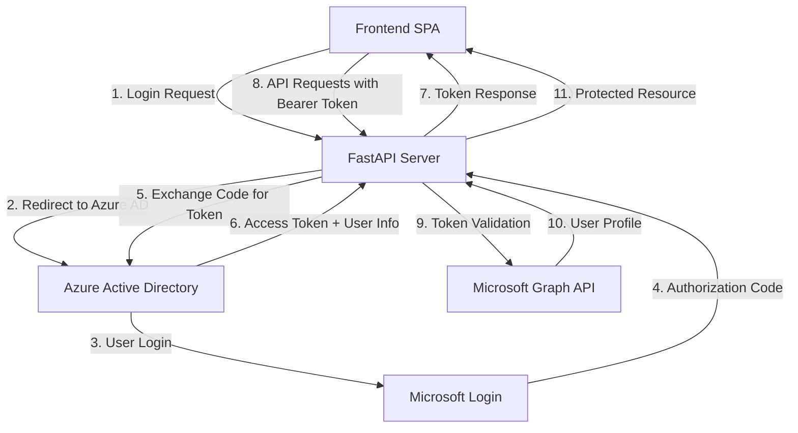

# Authentication Architecture Design

This document outlines the authentication architecture for the Scribe application, detailing the design decisions, implementation patterns, and security considerations.

## Overview

The Scribe application implements OAuth 2.0 authentication using Azure Active Directory (Azure AD) as the identity provider. The architecture follows modern security patterns with separation of concerns, stateless authentication, and comprehensive error handling.

## Architecture Components



## Component Details

### 1. Frontend Layer (`static/index.html`)

**Responsibilities:**
- Initiate OAuth flow
- Handle OAuth callback
- Store and manage tokens
- Make authenticated API requests
- Handle authentication state

**Key Features:**
- Single Page Application (SPA) pattern
- Responsive design with modern UI
- Real-time authentication status
- Error handling and user feedback
- Token lifecycle management

### 2. API Gateway Layer (`app/api/v1/endpoints/auth.py`)

**Responsibilities:**
- Expose authentication endpoints
- Handle HTTP requests/responses
- Input validation and sanitization
- Error handling and response formatting
- Request logging and monitoring

**Endpoints:**
- `GET /auth/login` - Initiate OAuth flow
- `GET /auth/callback` - Handle OAuth callback
- `POST /auth/refresh` - Refresh expired tokens
- `GET /auth/me` - Get current user info
- `GET /auth/status` - Check authentication status
- `POST /auth/logout` - Terminate session

### 3. Service Layer (`app/services/oauth_service.py`)

**Responsibilities:**
- Business logic for authentication
- OAuth flow orchestration
- Session management
- Token lifecycle management
- User profile processing

**Key Features:**
- Stateless design with CSRF protection
- Session cleanup and timeout handling
- Comprehensive error handling
- Logging and audit trails

### 4. Azure AD Client (`app/core/azure_auth.py`)

**Responsibilities:**
- Interface with Azure AD and Microsoft Graph
- Token exchange and validation
- User profile retrieval
- MSAL (Microsoft Authentication Library) integration

**Key Features:**
- PKCE (Proof Key for Code Exchange) support
- Authorization code flow implementation
- Token caching and refresh logic
- Microsoft Graph API integration

### 5. Configuration Management (`app/core/config.py`)

**Responsibilities:**
- Centralized configuration management
- Environment-specific settings
- Security parameter validation
- Secrets management integration

## Security Architecture

### 1. OAuth 2.0 Flow Implementation

**Authorization Code Flow with PKCE:**
1. Client generates code verifier and challenge
2. User redirected to Azure AD with challenge
3. User authenticates with Azure AD
4. Azure AD returns authorization code
5. Client exchanges code + verifier for tokens
6. Access token used for API authentication

### 2. Token Management

**Access Tokens:**
- JWT format with RS256 signing
- Short-lived (1 hour expiration)
- Contains user claims and permissions
- Validated on each request

**Refresh Tokens:**
- Opaque tokens for token renewal
- Longer-lived (90 days default)
- Secure storage required
- Single-use with rotation

### 3. Security Controls

**CSRF Protection:**
- State parameter validation
- Secure random state generation
- Session-based state storage

**Token Security:**
- Secure token storage recommendations
- Token expiration handling
- Automatic refresh mechanisms
- Secure transmission (HTTPS only)

**Input Validation:**
- Request parameter sanitization
- OAuth callback validation
- Error message sanitization
- Rate limiting implementation

## Design Patterns

### 1. Repository Pattern

```python
class AzureAuthClient:
    """Encapsulates Azure AD integration logic"""
    
class OAuthService:
    """Business logic layer for authentication"""
    
class AuthEndpoints:
    """HTTP interface for authentication operations"""
```

### 2. Dependency Injection

```python
def get_oauth_service() -> OAuthService:
    return OAuthService(azure_auth_client)

@router.post("/callback")
async def handle_callback(
    oauth_service: OAuthService = Depends(get_oauth_service)
):
    return await oauth_service.handle_callback(...)
```

### 3. Error Handling Strategy

```python
# Custom exception hierarchy
class ScribeBaseException(Exception): ...
class AuthenticationError(ScribeBaseException): ...
class ValidationError(ScribeBaseException): ...

# Centralized error handling
@app.exception_handler(AuthenticationError)
async def auth_exception_handler(request, exc):
    return JSONResponse(
        status_code=401,
        content=ErrorResponse(
            error="Authentication Error",
            message=exc.message,
            error_code=exc.error_code
        ).dict()
    )
```

## Data Flow

### 1. Authentication Flow

```
User → Frontend → API Gateway → OAuth Service → Azure AD Client → Azure AD
                      ↓              ↓              ↓
                 HTTP Response ← Business Logic ← Token Response
```

### 2. API Request Flow

```
Frontend → API Gateway → Dependencies → Protected Endpoint
    ↓          ↓              ↓              ↓
Bearer Token → Validation → User Context → Business Logic
```

## Configuration Architecture

### 1. Environment-Based Configuration

```python
class Settings(BaseSettings):
    # Application settings
    app_name: str = "Scribe API"
    debug: bool = False
    
    # Azure AD settings
    azure_client_id: str
    azure_client_secret: str
    azure_tenant_id: str
    azure_redirect_uri: str
    
    class Config:
        env_file = ".env"
        case_sensitive = False
```

### 2. Security Configuration

```python
# Production security settings
AZURE_SCOPES = ["User.Read", "Mail.Read"]
TOKEN_EXPIRY_MINUTES = 60
REFRESH_TOKEN_EXPIRY_DAYS = 90
SESSION_TIMEOUT_MINUTES = 10
```

## Error Handling Architecture

### 1. Error Classification

**Authentication Errors (401):**
- Invalid credentials
- Expired tokens
- Malformed tokens
- Unauthorized access

**Authorization Errors (403):**
- Insufficient permissions
- Resource access denied
- Account disabled

**Validation Errors (400):**
- Invalid request format
- Missing parameters
- CSRF token mismatch

### 2. Error Response Format

```json
{
  "error": "Authentication Error",
  "message": "Access token has expired",
  "error_code": "AUTH_002",
  "details": {
    "operation": "token_validation",
    "expires_at": "2025-08-22T06:52:23Z"
  },
  "timestamp": "2025-08-22T05:52:23.120Z"
}
```

## Monitoring and Observability

### 1. Logging Strategy

**Authentication Events:**
- Login attempts (success/failure)
- Token exchanges
- Permission checks
- Session management

**Security Events:**
- Failed authentication attempts
- Invalid token usage
- CSRF attack attempts
- Suspicious activity patterns

### 2. Metrics and Monitoring

**Performance Metrics:**
- Authentication response times
- Token refresh rates
- API endpoint performance
- Error rates by category

**Security Metrics:**
- Failed login attempts
- Token validation failures
- Rate limiting triggers
- Geographic access patterns

## Scalability Considerations

### 1. Stateless Design

- No server-side session storage
- JWT token validation
- Distributed deployment ready
- Load balancer compatible

### 2. Caching Strategy

```python
# Token validation caching
@lru_cache(maxsize=1000)
def validate_token_signature(token: str) -> bool:
    # Cache JWT signature validation
    pass

# User profile caching
async def get_user_profile(access_token: str) -> UserInfo:
    # Cache user profile data
    pass
```

### 3. Performance Optimization

- Connection pooling for external APIs
- Async/await for I/O operations
- Response compression
- CDN integration for static assets

## Future Enhancements

### 1. Multi-Factor Authentication

- Integration with Azure AD MFA
- Conditional access policies
- Risk-based authentication

### 2. Advanced Security Features

- Certificate-based authentication
- Hardware security key support
- Biometric authentication

### 3. Identity Federation

- Support for multiple identity providers
- SAML 2.0 integration
- Social media login options

### 4. Enhanced Monitoring

- Real-time security dashboards
- Automated threat detection
- Compliance reporting

## Compliance and Governance

### 1. Data Protection

- GDPR compliance for EU users
- Data minimization principles
- Right to deletion support
- Audit trail maintenance

### 2. Security Standards

- OWASP Top 10 compliance
- OAuth 2.0 best practices
- OpenID Connect standards
- Industry security frameworks

### 3. Access Control

- Role-based access control (RBAC)
- Principle of least privilege
- Regular access reviews
- Automated deprovisioning

## Deployment Architecture

### 1. Environment Separation

```
Development → Staging → Production
     ↓           ↓          ↓
   Local      Testing   Live Users
   Azure AD   Azure AD  Azure AD
```

### 2. Infrastructure as Code

```yaml
# Azure AD App Registration
resource "azuread_application" "scribe_app" {
  display_name = "Scribe Voice Email Processor"
  
  web {
    redirect_uris = [
      "https://scribe-api.example.com/api/v1/auth/callback"
    ]
  }
  
  required_resource_access {
    resource_app_id = "00000003-0000-0000-c000-000000000000"
    
    resource_access {
      id   = "e1fe6dd8-ba31-4d61-89e7-88639da4683d"
      type = "Scope"
    }
  }
}
```

This architecture provides a robust, secure, and scalable authentication system that follows industry best practices while maintaining flexibility for future enhancements.