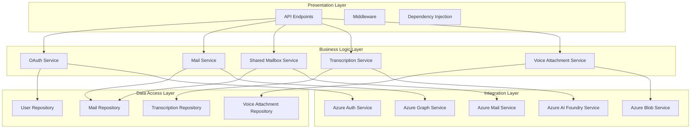
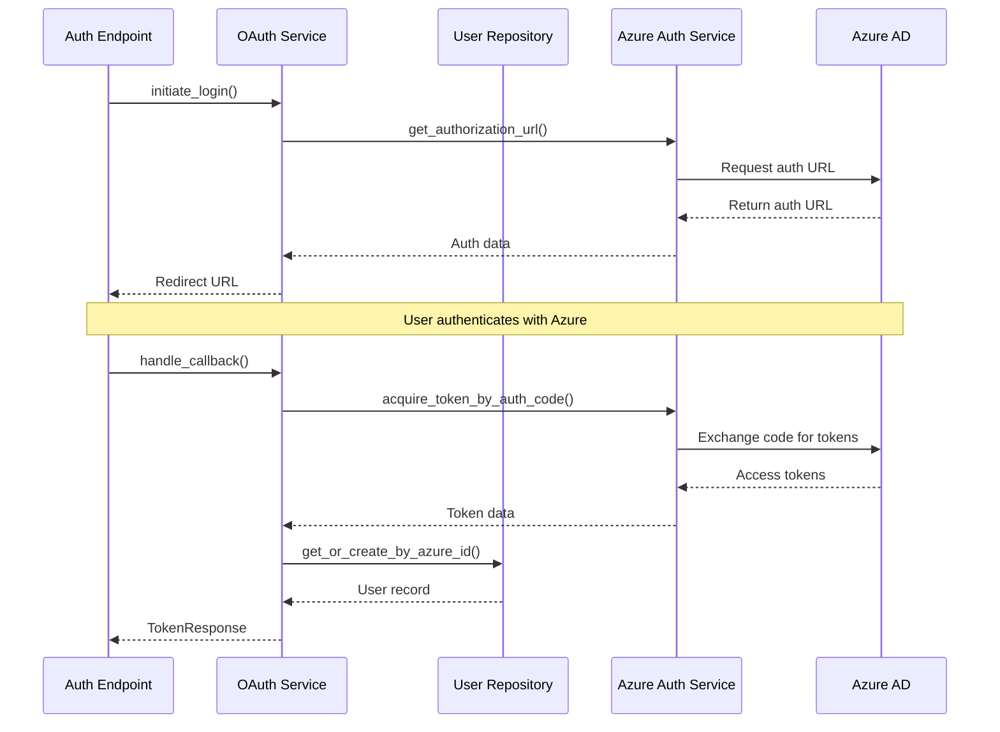
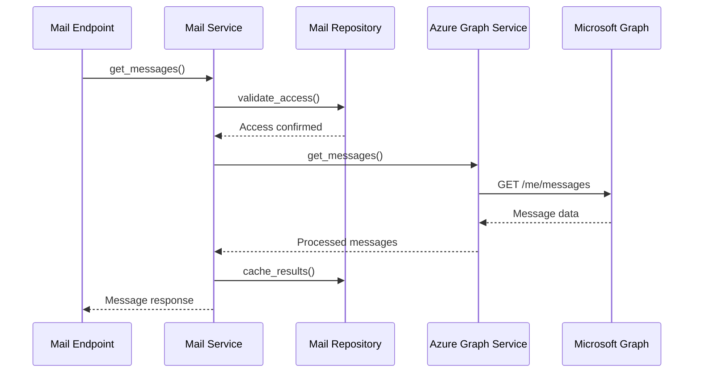

# Scribe Components Architecture

This document provides detailed descriptions of each component in the Scribe system, their responsibilities, interactions, and implementation details.

## Table of Contents

1. [Component Overview](#component-overview)
2. [Application Layer](#application-layer)
3. [Service Layer](#service-layer)
4. [Data Access Layer](#data-access-layer)
5. [Azure Integration Layer](#azure-integration-layer)
6. [Component Interactions](#component-interactions)
7. [Design Patterns](#design-patterns)

## Component Overview

The Scribe application follows a layered architecture with clear separation of concerns:



## Application Layer

### FastAPI Application (`app/main.py`)

**Responsibility**: Application entry point and configuration

**Key Features**:
- CORS middleware configuration for cross-origin requests
- Request logging middleware for API monitoring
- Global exception handlers for standardized error responses
- Health check and welcome endpoints
- Database initialization and cleanup

**Implementation Details**:
```python
# File: app/main.py:79-84
app = FastAPI(
    title=settings.app_name,
    description="A FastAPI application with strict coding standards", 
    version=settings.app_version,
    debug=settings.debug
)
```

**Key Methods**:
- `startup_event()`: Initialize database and log startup metrics
- `shutdown_event()`: Clean up database connections
- Exception handlers for all custom exception types

### API Router (`app/api/v1/router.py`)

**Responsibility**: Route aggregation and API versioning

**Key Features**:
- Centralized router configuration
- API versioning support
- Modular endpoint organization

**Included Routers**:
- Authentication endpoints (`auth.router`)
- Mail endpoints (`mail.router`) 
- Shared mailbox endpoints (`SharedMailbox.router`)
- Transcription endpoints (`Transcription.router`)

### Middleware Components

**Request Logging Middleware**:
```python
# File: app/main.py:118-133
@app.middleware("http")
async def log_requests(request: Request, call_next):
    start_time = time.time()
    response = await call_next(request)
    process_time = time.time() - start_time
    
    log_api_request(
        method=request.method,
        path=str(request.url.path),
        status_code=response.status_code,
        response_time=process_time,
        client_ip=request.client.host if request.client else "unknown"
    )
    return response
```

## Service Layer

### OAuth Service (`app/services/OAuthService.py`)

**Responsibility**: Azure AD authentication flow management

**Key Features**:
- OAuth 2.0 authorization flow
- Token exchange and validation
- User session management
- CSRF protection with state parameters
- Token refresh operations

**Core Methods**:
- `initiate_login()`: Start OAuth flow with state generation
- `handle_callback()`: Process OAuth callback and exchange tokens
- `refresh_user_token()`: Refresh expired access tokens
- `get_current_user()`: Retrieve user information from token
- `logout()`: Clean up user sessions

**State Management**:
```python
# File: app/services/OAuthService.py:42-43
def __init__(self, user_repository: Optional[UserRepository] = None):
    self._active_sessions: Dict[str, Dict[str, Any]] = {}
    self.user_repository = user_repository
```

### Mail Service (`app/services/MailService.py`)

**Responsibility**: Personal mailbox operations

**Key Features**:
- Personal mail folder access
- Message operations (read, move, delete)
- Mail search and filtering
- Attachment handling
- Integration with Microsoft Graph API

### Shared Mailbox Service (`app/services/SharedMailboxService.py`)

**Responsibility**: Shared mailbox management and operations  

**Key Features**:
- Shared mailbox discovery
- Permission validation
- Shared mailbox message operations
- Folder management
- Access control enforcement

### Transcription Service (`app/services/TranscriptionService.py`)

**Responsibility**: Voice attachment transcription processing

**Key Features**:
- Voice file processing coordination
- Azure AI Foundry integration
- Transcription result storage
- Error handling and retry logic
- Status tracking and notifications

### Voice Attachment Service (`app/services/VoiceAttachmentService.py`)

**Responsibility**: Voice attachment file management

**Key Features**:
- Voice file upload and storage
- Metadata extraction
- Download tracking
- Azure Blob Storage integration
- File lifecycle management

## Data Access Layer

### Base Repository (`app/repositories/BaseRepository.py`)

**Responsibility**: Common database operations

**Generic CRUD Operations**:
```python
class BaseRepository(ABC, Generic[T]):
    @abstractmethod
    async def create(self, entity: T) -> T: pass
    
    @abstractmethod 
    async def get_by_id(self, id: str) -> Optional[T]: pass
    
    @abstractmethod
    async def update(self, entity: T) -> T: pass
    
    @abstractmethod
    async def delete(self, id: str) -> bool: pass
```

### User Repository (`app/repositories/UserRepository.py`)

**Responsibility**: User and session data management

**Key Features**:
- User CRUD operations
- Azure ID to local user mapping
- Session management
- User profile operations
- Role-based access queries

**Core Methods**:
- `get_or_create_by_azure_id()`: User provisioning from Azure AD
- `create_session()`: New session creation
- `update_session()`: Token refresh handling
- `cleanup_expired_sessions()`: Session maintenance

### Mail Repository (`app/repositories/MailRepository.py`)

**Responsibility**: Mail-related data persistence

**Key Features**:
- Mail folder synchronization
- Mail account management
- Access permissions storage
- Mail operation auditing

### Transcription Repository (`app/repositories/TranscriptionRepository.py`)

**Responsibility**: Voice transcription data management

**Key Features**:
- Transcription record management
- Segment and error tracking
- Status updates
- Query operations for transcriptions

## Azure Integration Layer

### Azure Auth Service (`app/azure/AzureAuthService.py`)

**Responsibility**: Azure AD OAuth operations

**Key Features**:
- Authorization URL generation
- Token exchange operations
- Token validation
- User profile retrieval from Graph API

**OAuth Flow**:
```python
def get_authorization_url(self, state: Optional[str] = None) -> Dict[str, str]:
    # Generates Azure AD authorization URL with PKCE
    
def acquire_token_by_auth_code(self, callback_url: str) -> Dict[str, Any]:
    # Exchanges authorization code for access tokens
```

### Azure Graph Service (`app/azure/AzureGraphService.py`)

**Responsibility**: Microsoft Graph API base operations

**Key Features**:
- Graph API client configuration
- Base HTTP operations
- Error handling and retry logic
- Token management for API calls

### Azure Mail Service (`app/azure/AzureMailService.py`)

**Responsibility**: Graph API mail operations

**Key Features**:
- Shared mailbox operations
- Mail folder management  
- Message CRUD operations
- Permission handling
- Bulk operations support

### Azure Blob Service (`app/azure/AzureBlobService.py`)

**Responsibility**: Azure Blob Storage operations

**Key Features**:
- Voice file upload/download
- Blob metadata management
- Access control and SAS tokens
- Container management

### Azure AI Foundry Service (`app/azure/AzureAIFoundryService.py`)

**Responsibility**: AI transcription services

**Key Features**:
- Speech-to-text processing
- Audio format handling
- Transcription result parsing
- Error handling and retries

## Component Interactions

### Authentication Flow


### Mail Operations Flow


## Design Patterns

### 1. Repository Pattern
Separates business logic from data access:
- Abstract base repository with generic operations
- Concrete repositories for specific entities
- Dependency injection for testability

### 2. Service Layer Pattern
Encapsulates business logic:
- Services coordinate between repositories and external APIs
- Services handle business rules and validation
- Clear separation between API and business logic

### 3. Dependency Injection
Enables loose coupling and testability:
```python
# File: app/dependencies/Auth.py
def get_oauth_service(
    user_repository: UserRepository = Depends(get_user_repository)
) -> OAuthService:
    return OAuthService(user_repository=user_repository)
```

### 4. Factory Pattern
Used for creating Azure service clients:
- Centralized client configuration
- Environment-specific implementations
- Resource management

### 5. Observer Pattern
For audit logging and monitoring:
- Database changes trigger audit events
- API operations logged for monitoring
- Error events trigger notifications

---

**File References:**
- Base Repository: `app/repositories/BaseRepository.py:1-50`
- OAuth Service: `app/services/OAuthService.py:33-415` 
- Azure Auth Service: `app/azure/AzureAuthService.py:1-200`
- Dependency Injection: `app/dependencies/Auth.py:1-100`

**Related Documentation:**
- [Architecture Overview](overview.md)
- [Data Flow Diagrams](data-flow.md)
- [Service Documentation](../services/)
- [Database Models](../database/models.md)