# Data Flow Architecture

This document describes how data flows through the Scribe system for various operations, including detailed sequence diagrams and process flows.

## Table of Contents

1. [Authentication Data Flow](#authentication-data-flow)
2. [Mail Operations Data Flow](#mail-operations-data-flow)
3. [Shared Mailbox Data Flow](#shared-mailbox-data-flow)
4. [Voice Processing Data Flow](#voice-processing-data-flow)
5. [Caching Data Flow](#caching-data-flow)
6. [Error Handling Flow](#error-handling-flow)

## Authentication Data Flow

### OAuth Login Flow

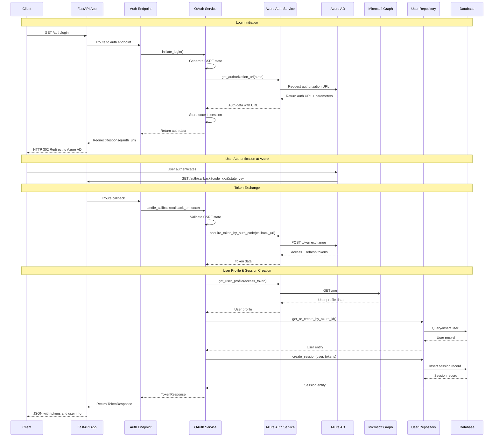

### Token Refresh Flow

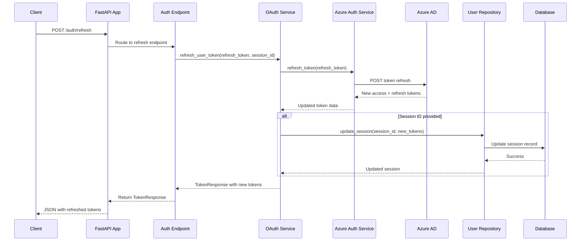

## Mail Operations Data Flow

### Personal Mail Access Flow

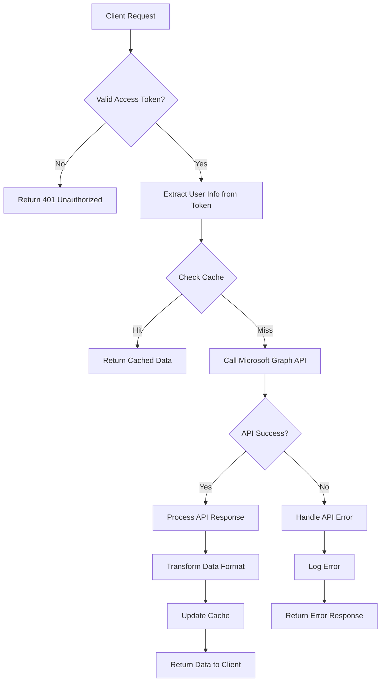

### Mail Message Retrieval Sequence

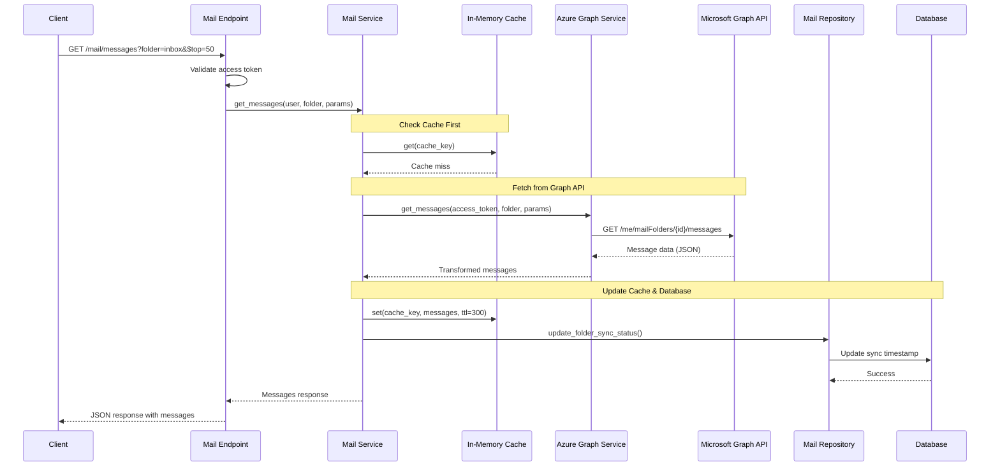

## Shared Mailbox Data Flow

### Shared Mailbox Discovery Flow

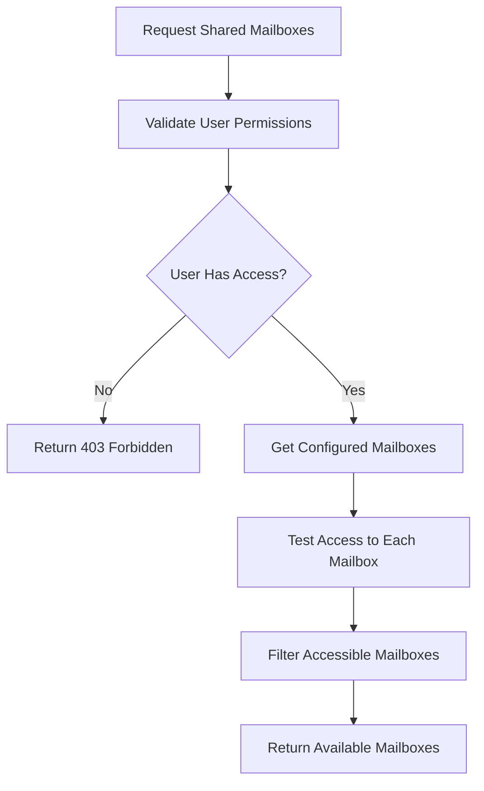

### Shared Mailbox Message Access

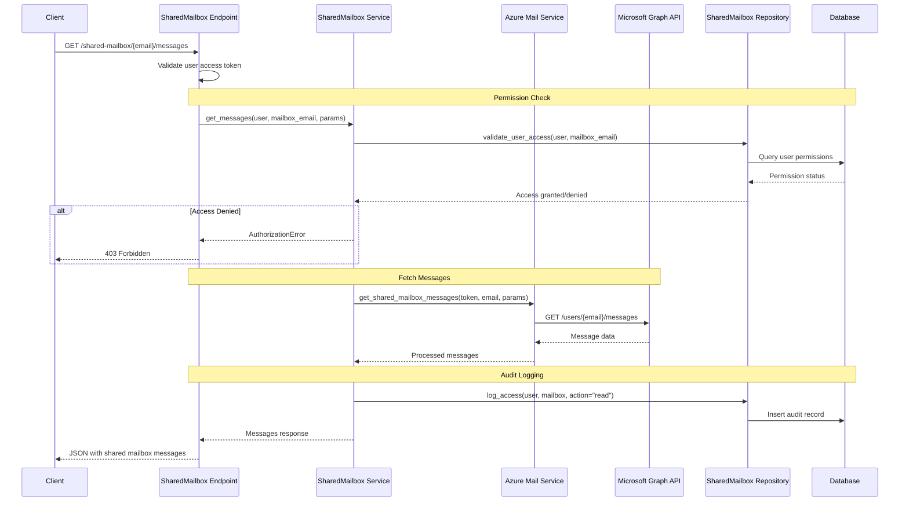

## Voice Processing Data Flow

### Voice Attachment Upload and Processing

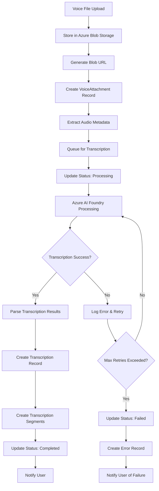

### Voice Processing Sequence

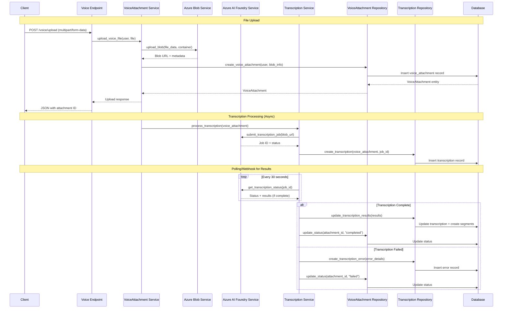

## Caching Data Flow

### In-Memory Cache Strategy

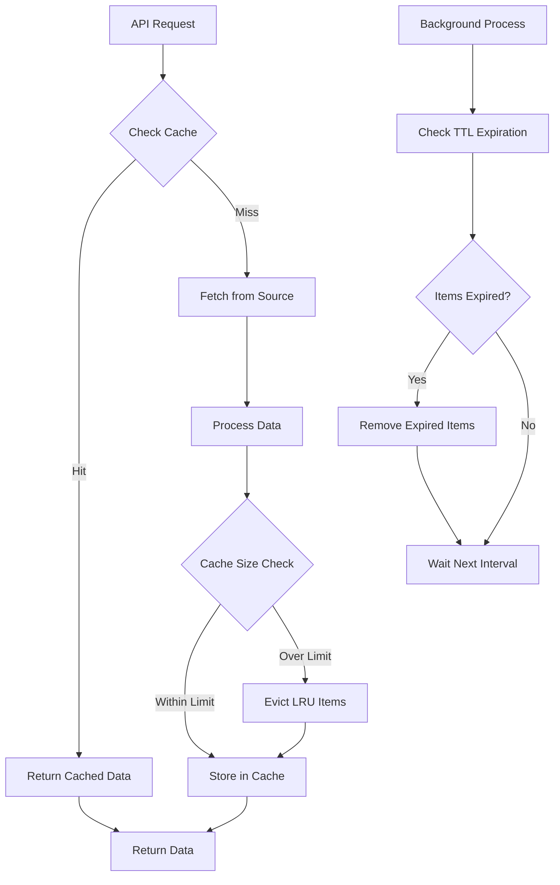

### Cache Operations Sequence

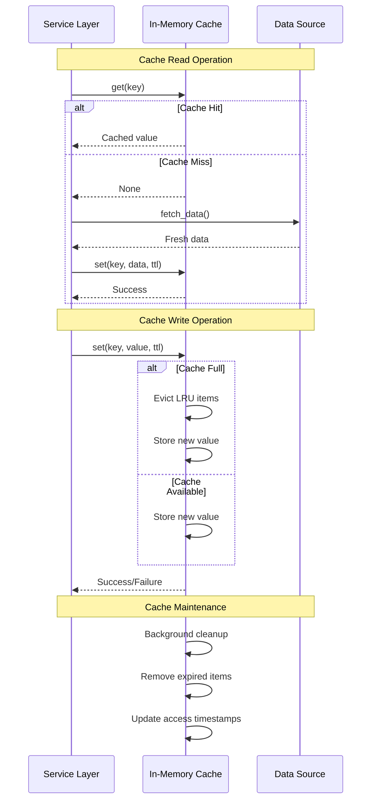

## Error Handling Flow

### Global Error Handling

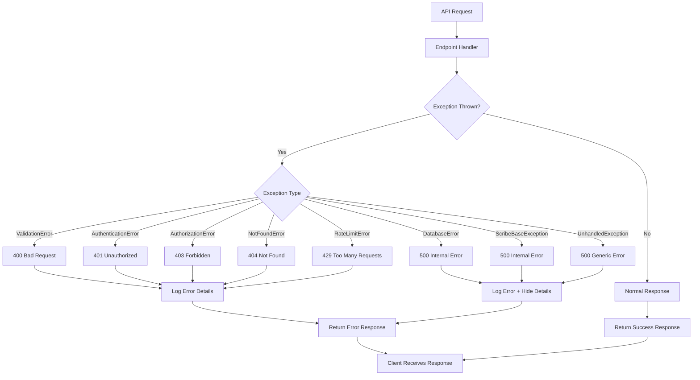

---

**File References:**
- OAuth Service Flow: `app/services/OAuthService.py:45-204`
- Mail Service Operations: `app/services/MailService.py:1-300`
- Cache Implementation: `app/core/Cache.py:1-200`
- Error Handlers: `app/main.py:155-258`

**Related Documentation:**
- [Architecture Overview](overview.md)
- [Components Detail](components.md)
- [API Documentation](../api/)
- [Service Documentation](../services/)