# Infrastructure Architecture

This document describes the infrastructure components, deployment architecture, and Azure services integration for the Scribe application.

## Table of Contents

1. [Infrastructure Overview](#infrastructure-overview)
2. [Azure Services Architecture](#azure-services-architecture)
3. [Deployment Models](#deployment-models)
4. [Network Architecture](#network-architecture)
5. [Data Storage Architecture](#data-storage-architecture)
6. [Security Infrastructure](#security-infrastructure)
7. [Monitoring and Observability](#monitoring-and-observability)
8. [Disaster Recovery](#disaster-recovery)

## Infrastructure Overview

Scribe is designed as a cloud-native application optimized for Azure infrastructure, supporting both traditional VM deployment and serverless Azure Functions deployment.

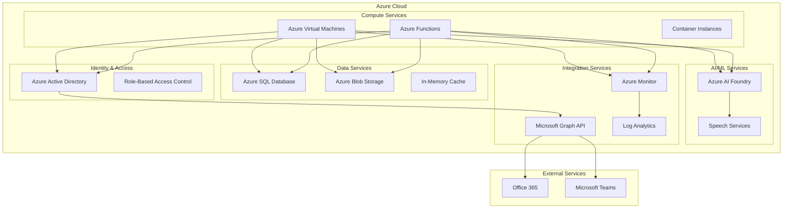

## Azure Services Architecture

### Core Azure Services

#### Azure Active Directory (AAD)
**Purpose**: Identity and access management
**Configuration**:
- App registrations for OAuth 2.0
- User and group management
- Conditional access policies
- Multi-factor authentication

**Integration Points**:
```python
# File: app/core/config.py (settings configuration)
azure_tenant_id = "your-tenant-id"
azure_client_id = "your-client-id" 
azure_client_secret = "your-client-secret"  # From Key Vault
azure_redirect_uri = "https://your-app.com/auth/callback"
```

#### Azure SQL Database
**Purpose**: Primary data storage with normalized schema
**Configuration**:
- Standard S2 tier (50 DTU minimum for development)
- Always Encrypted for sensitive data
- Row-Level Security (RLS) enabled
- Automated backups with 7-day retention

**Schema Design**:
```sql
-- Normalized tables following 3NF
CREATE TABLE users (
    id UNIQUEIDENTIFIER DEFAULT NEWID() PRIMARY KEY,
    azure_id NVARCHAR(100) NOT NULL UNIQUE,
    email NVARCHAR(255) NOT NULL UNIQUE,
    is_active BIT DEFAULT 1,
    role NVARCHAR(20) DEFAULT 'user',
    created_at DATETIME2 DEFAULT GETUTCDATE(),
    updated_at DATETIME2 DEFAULT GETUTCDATE()
);
```

#### Azure Blob Storage
**Purpose**: Voice attachment and file storage
**Configuration**:
- Hot tier for active files
- Cool tier for archived files
- Lifecycle management for automatic tiering
- SAS tokens for secure access

**Container Structure**:
```
scribe-storage/
├── voice-attachments/
│   ├── {user-id}/
│   │   ├── {attachment-id}.wav
│   │   └── {attachment-id}.mp3
└── transcriptions/
    └── {user-id}/
        └── {transcription-id}.json
```

### AI and Integration Services

#### Azure AI Foundry
**Purpose**: Voice transcription and AI processing
**Features**:
- Speech-to-text conversion
- Multiple audio format support
- Real-time and batch processing
- Custom vocabulary support

#### Microsoft Graph API
**Purpose**: Office 365 integration
**Scopes Required**:
- `https://graph.microsoft.com/Mail.Read`
- `https://graph.microsoft.com/Mail.ReadWrite`
- `https://graph.microsoft.com/Mail.Send`
- `https://graph.microsoft.com/User.Read`

## Deployment Models

### Azure Functions Deployment (Recommended)

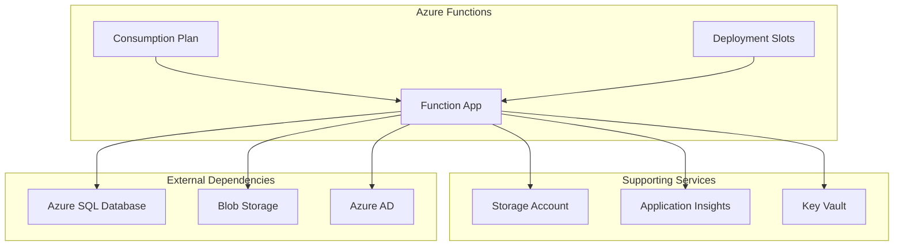

**Advantages**:
- Automatic scaling based on demand
- Pay-per-execution pricing model
- Built-in monitoring and diagnostics
- Integrated with Azure ecosystem
- No server management overhead

**Configuration**:
```python
# File: requirements.txt (Azure Functions specific)
azure-functions==1.18.0
azure-functions-worker==1.0.15
azure-identity==1.15.0
azure-keyvault-secrets==4.7.0
```

### Virtual Machine Deployment

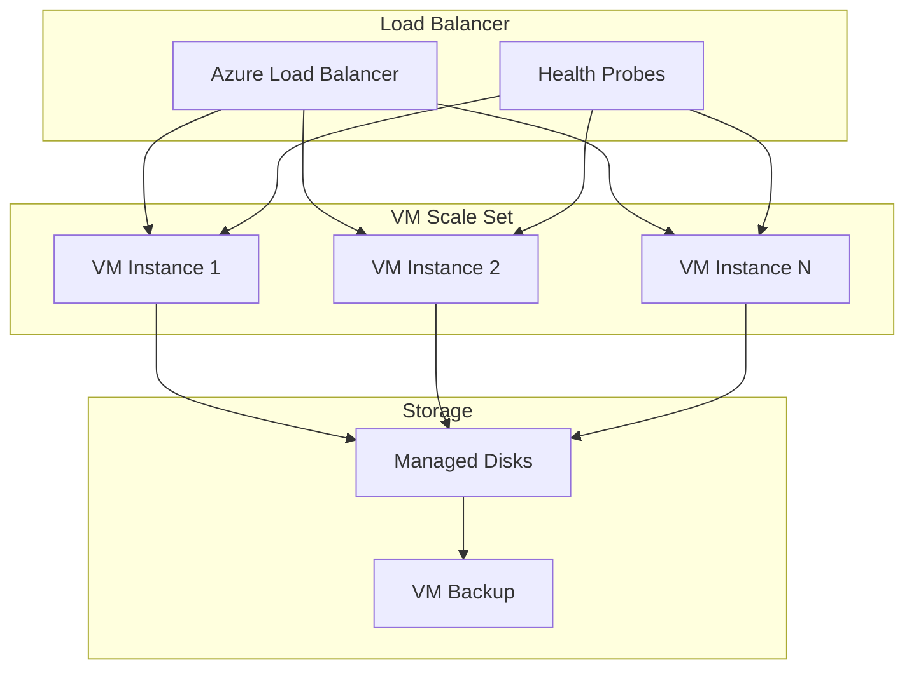

**Use Cases**:
- High-traffic scenarios requiring dedicated resources
- Custom runtime requirements
- Legacy integration needs
- Specific compliance requirements

### Container Deployment

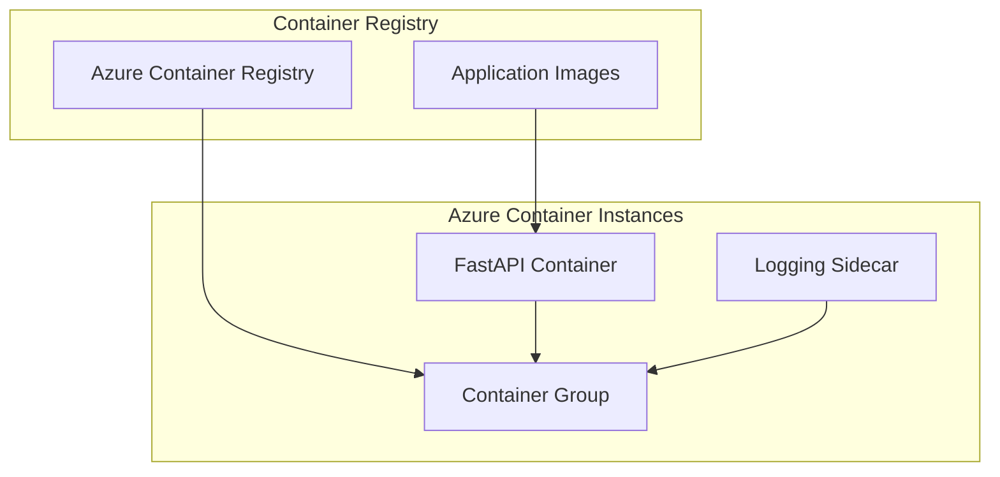

**Docker Configuration**:
```dockerfile
# Dockerfile
FROM python:3.11-slim

WORKDIR /app
COPY requirements.txt .
RUN pip install -r requirements.txt

COPY app/ ./app/
EXPOSE 8000

CMD ["uvicorn", "app.main:app", "--host", "0.0.0.0", "--port", "8000"]
```

## Network Architecture

### Network Security Groups

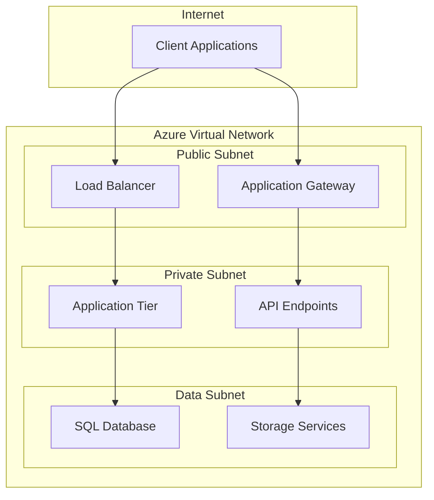

**Security Rules**:
- Inbound HTTPS (443) from Internet to Load Balancer
- Inbound HTTP (80) redirects to HTTPS
- Internal communication on required ports only
- Outbound access to Azure services and Graph API

### Private Endpoints

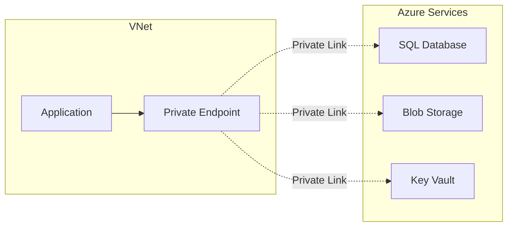

## Data Storage Architecture

### Database Design

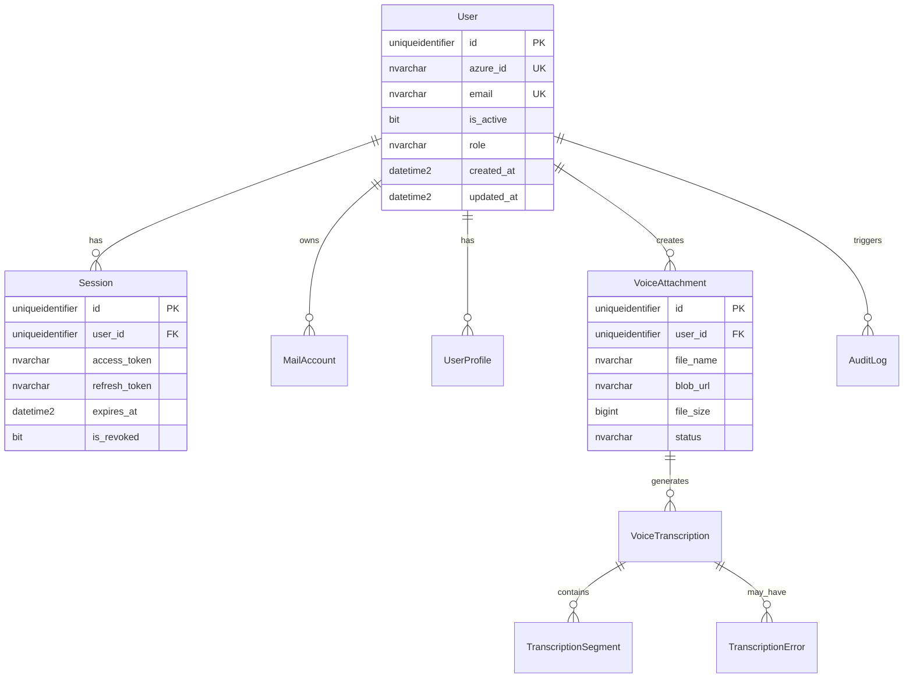

### Storage Strategy

#### Hot Data (Frequent Access)
- **User sessions**: In-memory cache + database
- **Recent mail data**: 5-minute TTL cache
- **Active transcriptions**: Database with status tracking

#### Warm Data (Regular Access)
- **User profiles**: Database with 1-hour cache TTL
- **Mail folder structure**: Database + blob storage
- **Completed transcriptions**: Database + blob results

#### Cold Data (Archive)
- **Old voice files**: Cool blob storage tier
- **Historical audit logs**: Log Analytics long-term retention
- **Archived transcriptions**: Archive blob storage tier

## Security Infrastructure

### Identity and Access Management

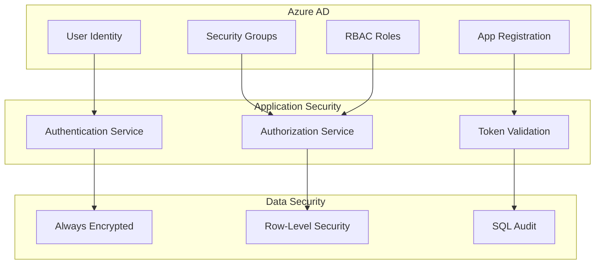

### Key Management

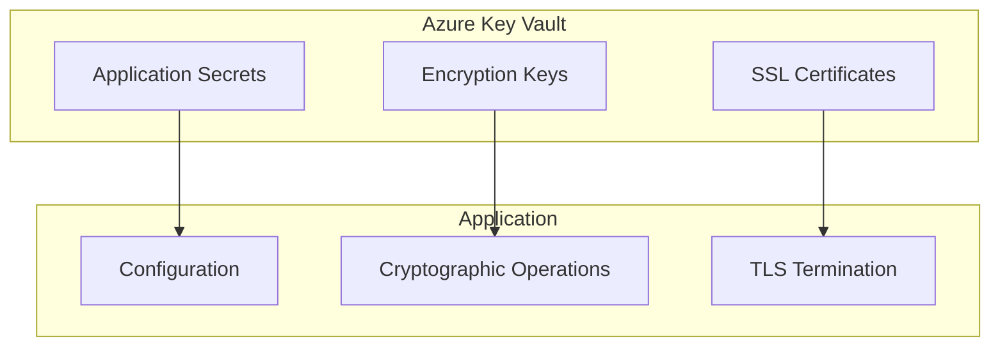

**Key Vault Configuration**:
```python
# File: app/core/config.py
from azure.keyvault.secrets import SecretClient
from azure.identity import DefaultAzureCredential

credential = DefaultAzureCredential()
client = SecretClient(vault_url="https://scribe-vault.vault.azure.net/", credential=credential)

# Retrieve secrets at startup
secret_key = client.get_secret("secret-key").value
database_password = client.get_secret("database-password").value
```

## Monitoring and Observability

### Application Performance Monitoring

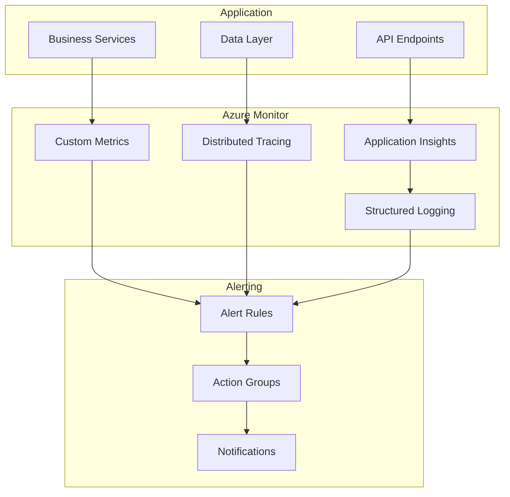

**Telemetry Configuration**:
```python
# File: app/core/Logging.py
from azure.monitor.opentelemetry import configure_azure_monitor
from opentelemetry import trace, metrics

configure_azure_monitor(
    connection_string="InstrumentationKey=your-key;IngestionEndpoint=https://...",
    enable_live_metrics=True,
    enable_logging=True,
    enable_tracing=True,
    enable_metrics=True
)
```

### Health Check Architecture

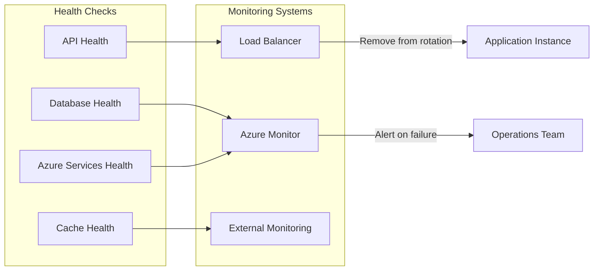

## Disaster Recovery

### Backup Strategy

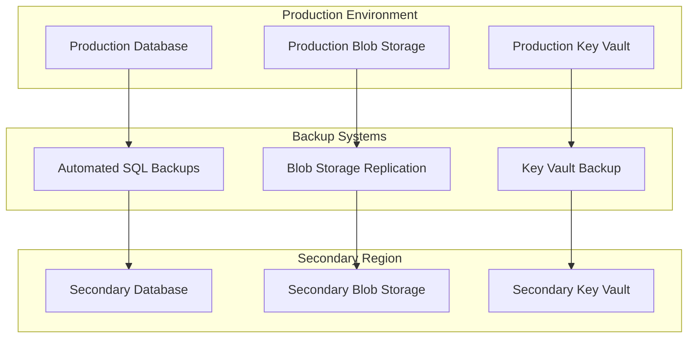

### Recovery Procedures

**RTO (Recovery Time Objective)**: 4 hours
**RPO (Recovery Point Objective)**: 1 hour

**Recovery Steps**:
1. **Database Recovery**: Restore from automated backup or geo-replica
2. **Blob Storage**: Switch to secondary region if needed
3. **Application Deployment**: Redeploy to secondary region
4. **DNS Failover**: Update DNS to point to secondary region
5. **Validation**: Run health checks and smoke tests

---

**Configuration References:**
- Azure Settings: `settings.toml:20-40`
- Database Connection: `app/db/Database.py:25-60`
- Key Vault Integration: `app/core/config.py:15-30`
- Monitoring Setup: `app/core/Logging.py:1-50`

**Related Documentation:**
- [Configuration Guide](../guides/configuration.md)
- [Deployment Guide](../guides/deployment.md)
- [Security Guide](../guides/security.md)
- [Monitoring Guide](../guides/monitoring.md)