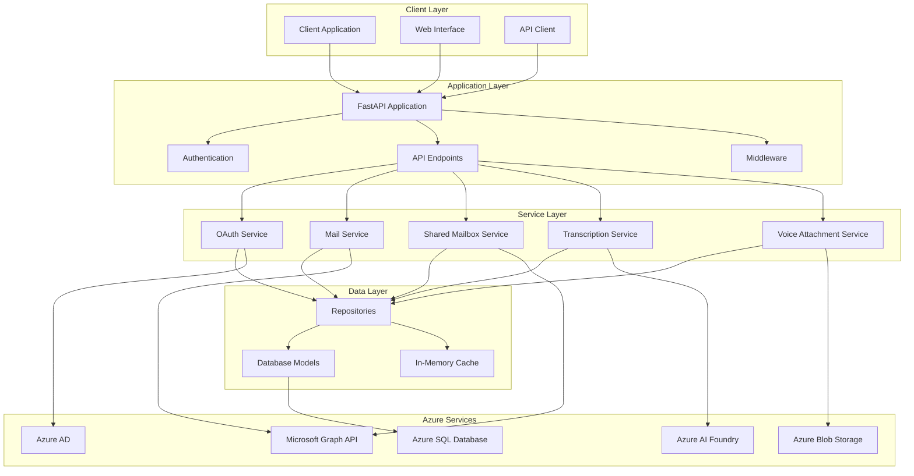
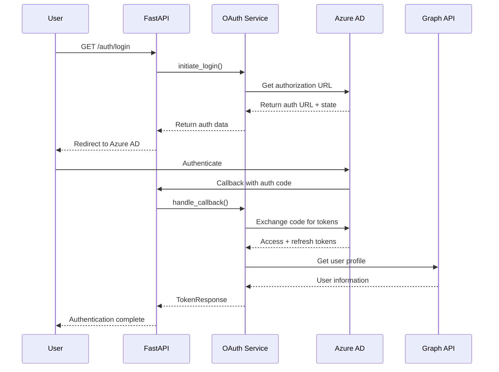
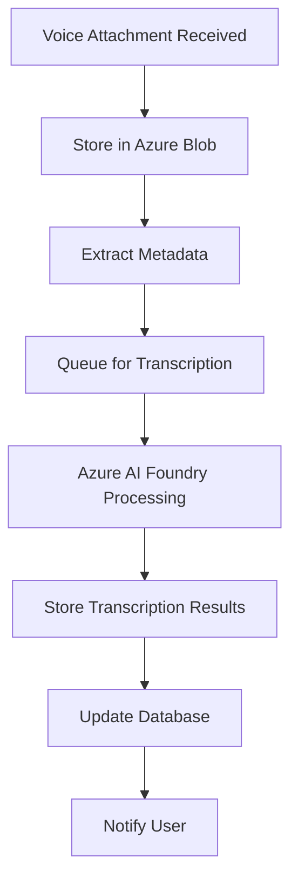

# Scribe System Architecture Overview

The Scribe application is a FastAPI-based mail management system that integrates with Microsoft Azure services to provide shared mailbox access and voice transcription capabilities.

## Table of Contents

1. [System Overview](#system-overview)
2. [High-Level Architecture](#high-level-architecture)
3. [Core Components](#core-components)
4. [Technology Stack](#technology-stack)
5. [Integration Points](#integration-points)
6. [Data Flow](#data-flow)
7. [Security Architecture](#security-architecture)

## System Overview

Scribe is designed as a modern, cloud-native application that enables employees to:
- Access shared mailboxes through Azure AD authentication
- Process voice attachments with transcription services
- Manage mail operations with proper permission controls
- Monitor and audit mail activities

### Key Design Principles
- **Cloud-Native**: Built for Azure Functions and cloud deployment
- **Security-First**: Azure AD integration with RBAC
- **Scalable**: Stateless design with in-memory caching
- **Maintainable**: Clean architecture with separation of concerns

## High-Level Architecture



## Core Components

### 1. FastAPI Application (`app/main.py`)
Central application entry point that configures:
- **CORS middleware** for cross-origin requests
- **Request logging** for API monitoring
- **Exception handlers** for standardized error responses
- **Router integration** for API versioning

### 2. API Layer (`app/api/`)
RESTful API endpoints organized by feature:
- **Authentication** (`/auth`) - OAuth flow management
- **Mail** (`/mail`) - Personal mailbox operations
- **Shared Mailbox** (`/shared-mailbox`) - Shared mailbox access
- **Transcription** (`/transcription`) - Voice processing

### 3. Service Layer (`app/services/`)
Business logic implementation:
- **OAuthService** - Azure AD authentication flow
- **MailService** - Mail operations and Graph API integration
- **SharedMailboxService** - Shared mailbox management
- **TranscriptionService** - Voice transcription processing
- **VoiceAttachmentService** - Voice file handling

### 4. Data Access Layer (`app/repositories/`)
Database operations using Repository pattern:
- **BaseRepository** - Common CRUD operations
- **UserRepository** - User and session management
- **MailRepository** - Mail data persistence
- **TranscriptionRepository** - Voice transcription data

### 5. Azure Integration (`app/azure/`)
Azure service integrations:
- **AzureAuthService** - Azure AD OAuth operations
- **AzureGraphService** - Microsoft Graph API base client
- **AzureMailService** - Graph API mail operations
- **AzureBlobService** - Blob storage for voice files
- **AzureAIFoundryService** - AI transcription services

## Technology Stack

### Backend Framework
- **FastAPI**: Modern Python web framework
- **Python 3.11+**: Latest Python features and performance
- **SQLAlchemy**: ORM for database operations
- **Alembic**: Database migration management
- **Dynaconf**: Configuration management

### Database
- **Azure SQL Database**: Primary data store
- **Third Normal Form (3NF)**: Normalized database design
- **Row-Level Security (RLS)**: Data isolation per tenant

### Azure Services
- **Azure AD**: Identity and access management
- **Microsoft Graph API**: Office 365 integration
- **Azure Blob Storage**: File storage for voice attachments
- **Azure AI Foundry**: Speech-to-text transcription
- **Azure Functions**: Serverless deployment option

### Development Tools
- **pytest**: Testing framework
- **Black**: Code formatting
- **isort**: Import sorting
- **mypy**: Static type checking

## Integration Points

### 1. Azure AD Integration


### 2. Mail Service Integration
```mermaid
graph LR
    subgraph "Scribe Application"
        MS[Mail Service]
        SMS[Shared Mailbox Service]
    end
    
    subgraph "Microsoft Graph API"
        ME[/me/messages]
        USERS[/users/{email}/messages]
        FOLDERS[/users/{email}/mailFolders]
    end
    
    MS --> ME
    SMS --> USERS
    SMS --> FOLDERS
```

### 3. Voice Processing Pipeline


## Data Flow

### Authentication Data Flow
1. **User Authentication**: OAuth flow with Azure AD
2. **Token Management**: Access and refresh token storage
3. **User Profile**: Sync from Azure AD to local database
4. **Session Management**: Track active user sessions

### Mail Processing Data Flow
1. **Authorization**: Validate user access to mailbox
2. **Graph API Query**: Retrieve mail data from Microsoft Graph
3. **Data Processing**: Transform and filter mail data
4. **Caching**: Store frequently accessed data in memory
5. **Response**: Return processed data to client

### Voice Processing Data Flow
1. **File Upload**: Store voice file in Azure Blob Storage
2. **Metadata Extraction**: Extract file information
3. **Transcription**: Process audio with Azure AI Foundry
4. **Result Storage**: Store transcription in database
5. **Status Updates**: Notify about processing completion

## Security Architecture

### Authentication & Authorization
- **OAuth 2.0**: Industry-standard authentication
- **JWT Tokens**: Stateless authentication tokens
- **Role-Based Access Control (RBAC)**: User and superuser roles
- **Session Management**: Secure session tracking

### Data Protection
- **Azure AD Integration**: Centralized identity management
- **TLS/SSL**: Encrypted data transmission
- **Database Security**: RLS and connection security
- **Secret Management**: Dynaconf with environment variables

### API Security
- **CORS Configuration**: Controlled cross-origin access
- **Rate Limiting**: Prevent API abuse
- **Request Validation**: Input sanitization and validation
- **Error Handling**: Secure error responses without data leakage

---

**File References:**
- FastAPI App: `app/main.py:1-402`
- OAuth Service: `app/services/OAuthService.py:1-415`
- Azure Integration: `app/azure/AzureAuthService.py`, `app/azure/AzureGraphService.py`
- Database Models: `app/db/models/`

**Related Documentation:**
- [Components Detail](components.md)
- [Data Flow Diagrams](data-flow.md)
- [Infrastructure Guide](infrastructure.md)
- [Security Guide](../guides/security.md)