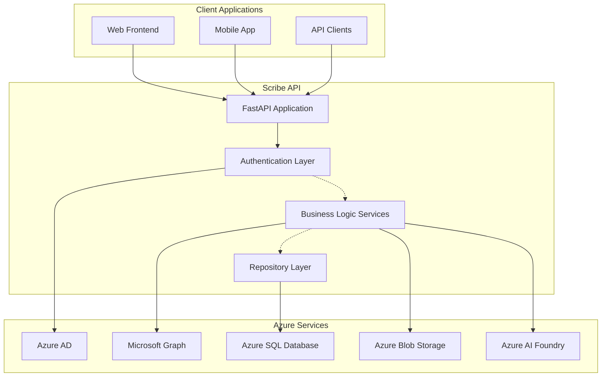

# Azure Services Integration

This directory contains documentation for all Azure services integrated with the Scribe application.

## Azure Services Overview

The Scribe application leverages several Azure services to provide a comprehensive email management and voice transcription solution:

### 🔐 Azure Active Directory (Azure AD)
- **Purpose**: Authentication and authorization
- **Features**: OAuth 2.0, user management, token-based authentication
- **Integration**: FastAPI OAuth dependencies, automatic token refresh

### 📧 Microsoft Graph API
- **Purpose**: Email and mailbox operations
- **Features**: Mail reading, folder management, shared mailbox access
- **Integration**: Azure Graph service layer, repository pattern

### 💾 Azure SQL Database
- **Purpose**: Application data storage
- **Features**: Row-level security, multi-tenant support, automated backups
- **Integration**: SQLAlchemy async ORM, Alembic migrations

### 🗄️ Azure Blob Storage
- **Purpose**: Voice attachment storage
- **Features**: Secure file storage, SAS token access, automatic cleanup
- **Integration**: Blob service layer, metadata tracking

### 🎙️ Azure AI Foundry
- **Purpose**: Voice transcription and AI processing
- **Features**: Speech-to-text, multiple models, timestamp generation
- **Integration**: OpenAI API, comprehensive error handling

## Service Architecture



## Documentation Structure

### Service-Specific Documentation

- **[Azure AI Foundry Transcription](ai-foundry-transcription.md)**: Complete guide to voice transcription implementation
- **[Azure Active Directory Integration](azure-ad-integration.md)**: Authentication and authorization setup *(coming soon)*
- **[Microsoft Graph Integration](microsoft-graph-integration.md)**: Email and mailbox operations *(coming soon)*
- **[Azure Blob Storage](azure-blob-storage.md)**: File storage and management *(coming soon)*
- **[Azure SQL Database](azure-sql-database.md)**: Database configuration and optimization *(coming soon)*

### Cross-Service Topics

- **[Security and Permissions](security-permissions.md)**: Cross-service security configuration *(coming soon)*
- **[Monitoring and Logging](monitoring-logging.md)**: Azure monitoring setup *(coming soon)*
- **[Cost Optimization](cost-optimization.md)**: Azure cost management strategies *(coming soon)*
- **[Disaster Recovery](disaster-recovery.md)**: Backup and recovery procedures *(coming soon)*

## Quick Start

### Prerequisites

1. **Azure Subscription**: Active Azure subscription with appropriate permissions
2. **Azure CLI**: Installed and configured
3. **Development Environment**: Python 3.11+, FastAPI, SQLAlchemy

### Environment Setup

```bash
# Login to Azure CLI
az login

# Set default subscription
az account set --subscription "your-subscription-id"

# Create resource group (if needed)
az group create --name scribe-rg --location eastus

# Deploy Azure resources
az deployment group create \
  --resource-group scribe-rg \
  --template-file azure-resources.json \
  --parameters @azure-parameters.json
```

### Configuration

1. **Environment Variables**:
   ```bash
   export AZURE_SUBSCRIPTION_ID="your-subscription-id"
   export AZURE_CLIENT_ID="your-client-id"
   export AZURE_CLIENT_SECRET="your-client-secret"
   export AZURE_TENANT_ID="your-tenant-id"
   ```

2. **Application Configuration**:
   Update `settings.toml` with Azure service endpoints and configuration.

3. **Database Setup**:
   ```bash
   # Run database migrations
   alembic upgrade head
   ```

### Service Health Check

Verify all Azure services are properly configured:

```bash
# Test Azure AD authentication
curl -X GET "http://localhost:8000/api/v1/auth/health" \
  -H "Authorization: Bearer your-token"

# Test transcription service
curl -X GET "http://localhost:8000/api/v1/transcriptions/health/status" \
  -H "Authorization: Bearer your-token"

# Test blob storage
curl -X GET "http://localhost:8000/api/v1/voice-attachments/health" \
  -H "Authorization: Bearer your-token"
```

## Security Considerations

### Authentication Flow

1. **Client Authentication**: OAuth 2.0 with Azure AD
2. **Service Authentication**: Managed Identity or Service Principal
3. **Token Management**: Automatic refresh with secure storage
4. **Permission Model**: Role-based access control (RBAC)

### Data Protection

- **Encryption in Transit**: HTTPS/TLS for all communications
- **Encryption at Rest**: Azure SQL TDE, Blob Storage encryption
- **Network Security**: Private endpoints, VNet integration
- **Access Control**: Azure AD conditional access policies

### Compliance

- **GDPR**: Data residency, right to deletion, audit logging
- **SOC 2**: Security controls, monitoring, incident response
- **HIPAA**: PHI handling (if applicable), access logging

## Performance Optimization

### Caching Strategy

- **Application Cache**: In-memory caching for frequently accessed data
- **Azure Cache**: Redis for distributed caching (optional)
- **CDN**: Azure CDN for static content delivery

### Database Optimization

- **Connection Pooling**: Async connection management
- **Query Optimization**: Proper indexing, query analysis
- **Partitioning**: Table partitioning for large datasets
- **Read Replicas**: Read scaling for reporting workloads

### API Performance

- **Async Processing**: FastAPI async endpoints
- **Background Jobs**: Celery for heavy operations
- **Rate Limiting**: API throttling and quotas
- **Load Balancing**: Azure Load Balancer integration

## Monitoring and Alerting

### Azure Monitor Integration

- **Application Insights**: Performance monitoring, exception tracking
- **Log Analytics**: Centralized logging, custom queries
- **Metrics**: Custom metrics, dashboards, alerts
- **Health Checks**: Endpoint monitoring, availability tests

### Key Metrics

- **API Performance**: Response time, error rates, throughput
- **Database Performance**: Connection pool usage, query performance
- **Storage Metrics**: Blob operations, storage utilization
- **Transcription Metrics**: Success rate, processing time, error types

### Alert Configuration

- **Critical Alerts**: Service outages, authentication failures
- **Warning Alerts**: Performance degradation, quota limits
- **Info Alerts**: Deployment notifications, configuration changes

## Cost Management

### Cost Optimization Strategies

1. **Resource Right-sizing**: Match resources to actual usage
2. **Reserved Instances**: Cost savings for predictable workloads
3. **Auto-scaling**: Scale resources based on demand
4. **Storage Tiering**: Use appropriate storage tiers
5. **API Optimization**: Minimize external API calls

### Budget Monitoring

- **Cost Alerts**: Budget thresholds, spending notifications
- **Usage Analytics**: Resource utilization reports
- **Billing Analysis**: Cost breakdown by service
- **Optimization Recommendations**: Azure Advisor suggestions

## Troubleshooting

### Common Issues

1. **Authentication Failures**
   - Check Azure AD configuration
   - Verify token expiration
   - Confirm permission assignments

2. **Database Connection Issues**
   - Check connection strings
   - Verify firewall rules
   - Review connection pool settings

3. **API Rate Limiting**
   - Monitor API quotas
   - Implement exponential backoff
   - Consider request batching

4. **Storage Access Issues**
   - Verify SAS token validity
   - Check blob container permissions
   - Review network access rules

### Support Resources

- **Azure Documentation**: Official Microsoft documentation
- **Azure Support**: Technical support tickets
- **Community Forums**: Stack Overflow, Microsoft Q&A
- **Internal Documentation**: Team-specific troubleshooting guides

## Development Guidelines

### Service Integration Patterns

1. **Repository Pattern**: Abstract Azure service calls
2. **Dependency Injection**: Loosely coupled service dependencies
3. **Error Handling**: Consistent error handling across services
4. **Logging**: Structured logging with correlation IDs
5. **Testing**: Mock Azure services for unit tests

### Code Organization

```
app/
├── azure/           # Azure service integrations
├── services/        # Business logic services
├── repositories/    # Data access layer
├── models/          # Data models and schemas
├── dependencies/    # FastAPI dependency injection
└── core/           # Core utilities and configuration
```

### Best Practices

- **Configuration Management**: Environment-specific settings
- **Secret Management**: Azure Key Vault integration
- **Error Recovery**: Retry logic with circuit breakers
- **Resource Cleanup**: Proper resource disposal
- **Documentation**: Keep documentation up-to-date

## Contributing

### Adding New Azure Services

1. **Service Integration**: Create service class in `app/azure/`
2. **Configuration**: Add settings to `settings.toml`
3. **Documentation**: Create service documentation
4. **Testing**: Add integration tests
5. **Monitoring**: Add health checks and metrics

### Documentation Standards

- **Markdown Format**: Use standard markdown syntax
- **Code Examples**: Include practical code samples
- **Diagrams**: Use Mermaid for architecture diagrams
- **Screenshots**: Add Azure portal screenshots when helpful
- **Links**: Reference official Azure documentation

### Review Process

1. **Technical Review**: Architecture and implementation review
2. **Documentation Review**: Accuracy and completeness check
3. **Security Review**: Security implications assessment
4. **Performance Review**: Performance impact analysis

For questions or contributions, please contact the development team or create an issue in the project repository.