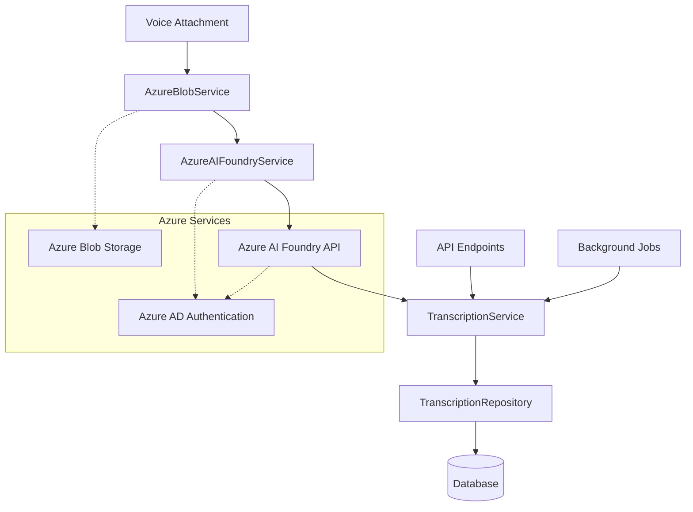

# Azure AI Foundry Voice Transcription

## Overview

The Scribe application integrates with Azure AI Foundry to provide advanced voice transcription capabilities for email voice attachments. This system automatically transcribes voice messages stored in blob storage using state-of-the-art speech-to-text models, providing detailed transcripts with timestamps, confidence scores, and comprehensive metadata.

## Architecture

### Service Components



### Data Flow

1. **Voice Attachment Upload**: Email voice attachments are stored in Azure Blob Storage
2. **Transcription Request**: User or system initiates transcription via API
3. **Audio Download**: Service downloads audio content from blob storage
4. **Azure AI Foundry**: Audio is sent to Azure AI Foundry for transcription
5. **Result Processing**: Transcription results are parsed and stored in database
6. **Metadata Storage**: Segments, timestamps, and quality metrics are saved
7. **Error Handling**: Any failures are logged and tracked for resolution

## Configuration

### Settings (settings.toml)

```toml
# -----------------------------------------------------------------------------
# Azure AI Foundry (Voice Transcription)
# -----------------------------------------------------------------------------
azure_openai_endpoint = "https://scribe-openai.openai.azure.com"
azure_openai_api_version = "2024-10-21"
transcription_model_deployment = "whisper"
transcription_default_language = "en"
transcription_max_concurrent_requests = 3
transcription_retry_attempts = 2
transcription_timeout_seconds = 300
transcription_enable_word_timestamps = true
transcription_enable_segment_timestamps = true
transcription_default_temperature = 0.0
```

### Environment Variables

```bash
# Azure AD Authentication (required)
AZURE_CLIENT_ID="your-azure-client-id"
AZURE_CLIENT_SECRET="your-azure-client-secret"
AZURE_TENANT_ID="your-azure-tenant-id"

# Or use DefaultAzureCredential (recommended for production)
# No environment variables needed - uses managed identity or Azure CLI
```

## Database Schema

### Tables

#### voice_transcriptions
Primary transcription data storage.

| Column | Type | Description |
|--------|------|-------------|
| id | UNIQUEIDENTIFIER | Primary key |
| voice_attachment_id | UNIQUEIDENTIFIER | Foreign key to voice_attachments |
| user_id | UNIQUEIDENTIFIER | Foreign key to users |
| transcript_text | TEXT | Full transcribed text |
| language | NVARCHAR(10) | Language code (ISO-639-1) |
| confidence_score | FLOAT | Overall confidence (0-1) |
| transcription_status | NVARCHAR(20) | completed, failed, processing |
| model_name | NVARCHAR(50) | Model used (whisper-1, gpt-4o-transcribe) |
| response_format | NVARCHAR(20) | Response format used |
| has_word_timestamps | BIT | Whether word timestamps included |
| has_segment_timestamps | BIT | Whether segment timestamps included |
| audio_duration_seconds | FLOAT | Audio duration |
| processing_time_ms | INT | Processing time |
| created_at | DATETIME2 | Record creation timestamp |
| updated_at | DATETIME2 | Record update timestamp |

#### transcription_segments
Word and segment-level transcription details.

| Column | Type | Description |
|--------|------|-------------|
| id | UNIQUEIDENTIFIER | Primary key |
| transcription_id | UNIQUEIDENTIFIER | Foreign key to voice_transcriptions |
| segment_index | INT | Order within transcription |
| segment_type | NVARCHAR(10) | segment or word |
| start_time_seconds | FLOAT | Start time in audio |
| end_time_seconds | FLOAT | End time in audio |
| duration_seconds | FLOAT | Segment duration |
| text | NVARCHAR(1000) | Segment text |
| confidence_score | FLOAT | Segment confidence |
| avg_logprob | FLOAT | Average log probability |

#### transcription_errors
Error tracking for failed transcriptions.

| Column | Type | Description |
|--------|------|-------------|
| id | UNIQUEIDENTIFIER | Primary key |
| voice_attachment_id | UNIQUEIDENTIFIER | Foreign key to voice_attachments |
| user_id | UNIQUEIDENTIFIER | Foreign key to users |
| error_type | NVARCHAR(50) | Error category |
| error_message | TEXT | Detailed error message |
| model_name | NVARCHAR(50) | Model being used |
| audio_format | NVARCHAR(20) | Audio file format |
| http_status_code | INT | HTTP status code |
| is_resolved | BIT | Resolution status |
| retry_count | INT | Number of retry attempts |

## API Reference

### Transcribe Voice Attachment

Transcribe a specific voice attachment using Azure AI Foundry.

```http
POST /api/v1/transcriptions/voice/{voice_attachment_id}
```

#### Request Body
```json
{
  "model_deployment": "whisper",
  "language": "en",
  "prompt": "Expected technical discussion",
  "force_retranscribe": false
}
```

#### Response
```json
{
  "id": "uuid",
  "voice_attachment_id": "uuid",
  "transcript_text": "Hello, this is a test voice message...",
  "language": "en",
  "confidence_score": 0.95,
  "transcription_status": "completed",
  "model_name": "whisper-1",
  "response_format": "verbose_json",
  "has_word_timestamps": true,
  "has_segment_timestamps": true,
  "audio_duration_seconds": 12.5,
  "processing_time_ms": 3420,
  "created_at": "2024-01-15T10:30:00Z",
  "updated_at": "2024-01-15T10:30:00Z",
  "voice_attachment": {
    "id": "uuid",
    "original_filename": "voice_message.m4a",
    "content_type": "audio/m4a",
    "size_bytes": 245760,
    "sender_email": "sender@company.com",
    "subject": "Project Update"
  },
  "segments": [
    {
      "segment_index": 0,
      "segment_type": "segment",
      "start_time_seconds": 0.0,
      "end_time_seconds": 2.5,
      "text": "Hello, this is a test",
      "confidence_score": 0.98
    }
  ]
}
```

### Batch Transcription

Transcribe multiple voice attachments concurrently.

```http
POST /api/v1/transcriptions/batch
```

#### Request Body
```json
{
  "voice_attachment_ids": ["uuid1", "uuid2", "uuid3"],
  "model_deployment": "whisper",
  "language": "en",
  "max_concurrent": 3,
  "force_retranscribe": false
}
```

#### Response
```json
{
  "results": {
    "uuid1": {
      "status": "completed",
      "transcription": { /* transcription object */ }
    },
    "uuid2": {
      "status": "failed",
      "error": "Audio format not supported"
    }
  },
  "successful_count": 1,
  "failed_count": 1,
  "total_count": 2
}
```

### List Transcriptions

Retrieve transcriptions with filtering and search capabilities.

```http
GET /api/v1/transcriptions?status=completed&search=project&limit=20&offset=0
```

#### Query Parameters
- `status`: Filter by transcription status
- `language`: Filter by language code
- `model`: Filter by model name
- `search`: Search in transcript text
- `limit`: Results per page (1-200, default 50)
- `offset`: Results to skip (default 0)
- `order_by`: Field to order by (default created_at)
- `order_direction`: asc or desc (default desc)

### Get Transcription Statistics

Retrieve transcription analytics and statistics.

```http
GET /api/v1/transcriptions/statistics/summary?days_ago=30
```

#### Response
```json
{
  "total_transcriptions": 150,
  "status_breakdown": {
    "completed": 145,
    "failed": 3,
    "processing": 2
  },
  "language_breakdown": {
    "en": 120,
    "es": 25,
    "fr": 5
  },
  "model_breakdown": {
    "whisper-1": 100,
    "gpt-4o-transcribe": 50
  },
  "quality_metrics": {
    "avg_confidence_score": 0.92,
    "avg_processing_time_ms": 2850,
    "avg_audio_duration_seconds": 45.2,
    "total_audio_duration_seconds": 6780
  }
}
```

## Supported Models

### Whisper-1
- **Description**: General-purpose speech recognition model
- **Best for**: General conversations, various audio qualities
- **Max file size**: 25MB
- **Supported formats**: MP3, WAV, M4A, AAC, OGG, AMR, 3GP, WEBM, FLAC

### GPT-4o-Transcribe
- **Description**: Speech to text powered by GPT-4o
- **Best for**: High-accuracy transcription with context understanding
- **Max file size**: 25MB
- **Additional features**: Better handling of technical terms, proper nouns

### GPT-4o-Mini-Transcribe
- **Description**: Speech to text powered by GPT-4o mini
- **Best for**: Fast transcription with good accuracy
- **Max file size**: 25MB
- **Performance**: Lower cost, faster processing

## Usage Examples

### Basic Transcription

```python
from app.services.TranscriptionService import TranscriptionService
from app.dependencies.Transcription import get_transcription_service

# Get service instance (usually via dependency injection)
transcription_service = get_transcription_service()

# Transcribe a voice attachment
transcription = await transcription_service.transcribe_voice_attachment(
    voice_attachment_id="uuid",
    user_id="user-uuid",
    model_deployment="whisper",
    language="en"
)

print(f"Transcription: {transcription.transcript_text}")
print(f"Confidence: {transcription.confidence_score}")
```

### Batch Processing

```python
# Transcribe multiple attachments
results = await transcription_service.transcribe_voice_attachments_batch(
    voice_attachment_ids=["uuid1", "uuid2", "uuid3"],
    user_id="user-uuid",
    max_concurrent=2
)

for attachment_id, result in results.items():
    if isinstance(result, Exception):
        print(f"Failed {attachment_id}: {result}")
    else:
        print(f"Success {attachment_id}: {result.transcript_text[:50]}...")
```

### Search Transcriptions

```python
# Search transcriptions
transcriptions, total = await transcription_service.list_user_transcriptions(
    user_id="user-uuid",
    search_text="project update",
    limit=10
)

for transcription in transcriptions:
    print(f"Found: {transcription.transcript_text[:100]}...")
```

## Error Handling

### Common Error Types

#### blob_download
Audio file could not be downloaded from blob storage.
- **Causes**: Blob not found, access denied, network issues
- **Resolution**: Verify blob exists and user has access

#### transcription_api
Azure AI Foundry API error during transcription.
- **Causes**: Invalid audio format, API limits, authentication issues
- **Resolution**: Check audio format, API quotas, credentials

#### format_validation
Audio file format not supported.
- **Causes**: Unsupported file type, corrupted audio
- **Resolution**: Convert to supported format, verify file integrity

#### network_timeout
Request timed out during transcription.
- **Causes**: Large files, network issues, API congestion
- **Resolution**: Retry with smaller files, check network connectivity

### Error Resolution Workflow

1. **Automatic Retry**: System automatically retries failed transcriptions
2. **Error Logging**: All errors are logged with detailed context
3. **Manual Resolution**: Administrators can mark errors as resolved
4. **Retry Mechanism**: Users can manually retry failed transcriptions

## Performance Considerations

### Optimization Guidelines

1. **Batch Processing**: Use batch API for multiple files
2. **Concurrency Limits**: Configure based on API quotas
3. **File Size**: Smaller files process faster
4. **Audio Quality**: Higher quality improves accuracy
5. **Language Detection**: Specify language when known

### Monitoring Metrics

- **Transcription Success Rate**: Percentage of successful transcriptions
- **Average Processing Time**: Time per transcription
- **Error Rate by Type**: Distribution of error causes
- **API Usage**: Requests per hour/day
- **Storage Usage**: Transcription data storage growth

## Security

### Authentication
- **Azure AD Integration**: Uses DefaultAzureCredential
- **User Isolation**: Users can only access their transcriptions
- **API Authorization**: All endpoints require valid authentication

### Data Privacy
- **Encryption in Transit**: HTTPS for all API communications
- **Encryption at Rest**: Database encryption for stored transcriptions
- **Data Retention**: Configurable retention policies
- **Audit Logging**: All transcription activities logged

## Troubleshooting

### Common Issues

#### "Authentication failed"
**Cause**: Azure AD credentials invalid or expired
**Solution**: 
1. Verify Azure AD configuration
2. Check credential expiration
3. Ensure proper permissions granted

#### "Audio format not supported"
**Cause**: Unsupported or corrupted audio file
**Solution**:
1. Check supported formats list
2. Convert audio to supported format
3. Verify file integrity

#### "Transcription timeout"
**Cause**: Large file or API congestion
**Solution**:
1. Increase timeout settings
2. Split large files
3. Retry during off-peak hours

#### "Insufficient quota"
**Cause**: Azure AI Foundry API limits exceeded
**Solution**:
1. Check API quota usage
2. Request quota increase
3. Implement rate limiting

### Debugging Steps

1. **Check Service Health**
   ```http
   GET /api/v1/transcriptions/health/status
   ```

2. **Review Error Logs**
   ```http
   GET /api/v1/transcriptions/errors/list
   ```

3. **Verify Configuration**
   - Azure OpenAI endpoint URL
   - Model deployment names
   - Authentication credentials

4. **Test with Sample File**
   - Use small, known-good audio file
   - Check specific error messages
   - Verify network connectivity

## Best Practices

### Development
1. **Use Environment Variables**: Store sensitive configuration in environment
2. **Error Handling**: Implement comprehensive error handling
3. **Logging**: Log all transcription activities with context
4. **Testing**: Test with various audio formats and languages
5. **Rate Limiting**: Respect API quotas and implement backoff

### Production
1. **Monitoring**: Set up alerts for failed transcriptions
2. **Backup**: Regular backup of transcription data
3. **Scaling**: Monitor and adjust concurrency limits
4. **Security**: Regular security audits and credential rotation
5. **Cost Optimization**: Monitor API usage and costs

## Migration Guide

### From Azure Speech Services

If migrating from Azure Speech Services:

1. **Update Configuration**: Change endpoints and authentication
2. **Model Mapping**: Map old models to new Azure AI Foundry models
3. **API Changes**: Update API calls to new format
4. **Data Migration**: Migrate existing transcription data
5. **Testing**: Thoroughly test with production data

### Schema Migration

The database migration will:
1. Create new transcription tables
2. Preserve existing voice attachment data
3. Add relationship constraints
4. Create necessary indexes

```bash
# Run migration
alembic upgrade head
```

## Support and Resources

### Documentation
- [Azure AI Foundry Documentation](https://docs.microsoft.com/en-us/azure/ai-foundry/)
- [OpenAI Audio API Reference](https://platform.openai.com/docs/api-reference/audio)
- [Scribe API Documentation](../api/README.md)

### Monitoring
- Application logs in `/logs/transcription.log`
- Azure metrics in Azure portal
- Database performance metrics
- API usage analytics

### Contact
For technical support or questions about the transcription system, contact the development team or create an issue in the project repository.