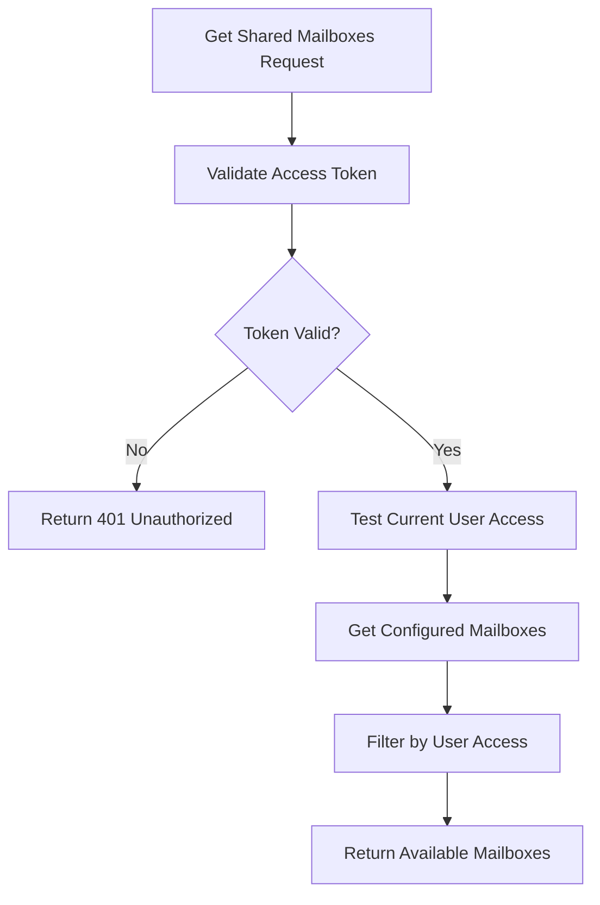
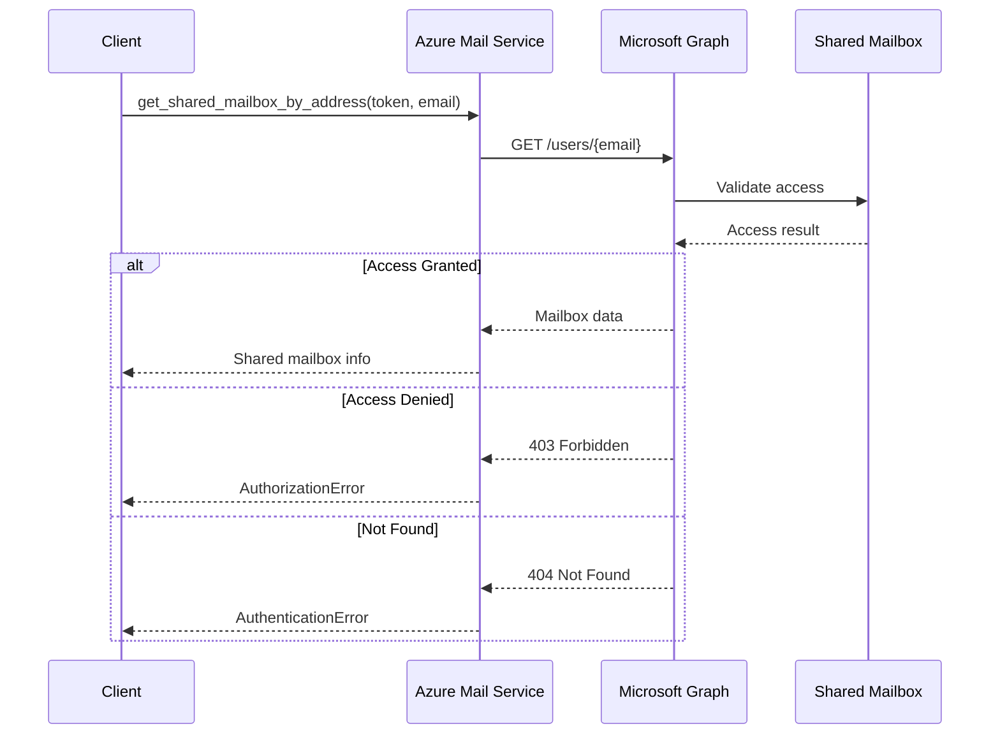
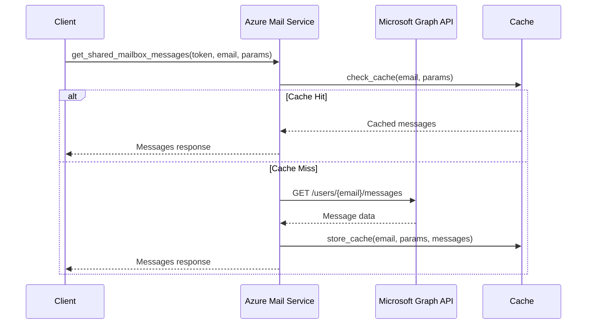
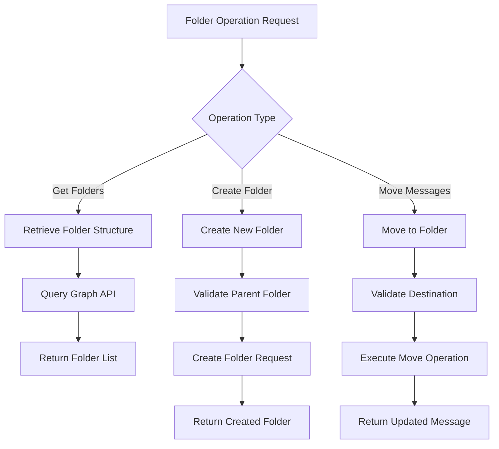
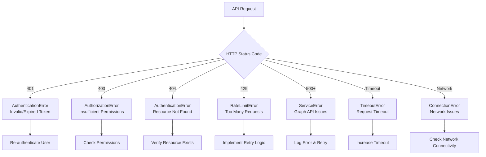

# Azure Mail Service Documentation

The Azure Mail Service provides Microsoft Graph API integration for shared mailbox operations, enabling secure access to Office 365 shared mailboxes with proper permission validation.

## Table of Contents

1. [Overview](#overview)
2. [Architecture](#architecture)
3. [Shared Mailbox Operations](#shared-mailbox-operations)
4. [Permission Management](#permission-management)
5. [Message Operations](#message-operations)
6. [Folder Management](#folder-management)
7. [Error Handling](#error-handling)
8. [API Reference](#api-reference)
9. [Security Considerations](#security-considerations)

## Overview

The AzureMailService class (`app/azure/AzureMailService.py`) serves as the interface for shared mailbox operations through Microsoft Graph API. It handles authentication, permission validation, and CRUD operations for shared mailbox resources.

### Key Responsibilities
- **Shared Mailbox Discovery**: Find accessible shared mailboxes
- **Message Operations**: Read, send, move, and delete messages
- **Folder Management**: Create and manage mail folders
- **Permission Validation**: Ensure user access rights
- **Error Handling**: Robust error handling with retry logic

## Architecture

```mermaid
graph TB
    subgraph "Scribe Application"
        SMS[Shared Mailbox Service]
        AMLS[Azure Mail Service]
        CACHE[In-Memory Cache]
    end
    
    subgraph "Microsoft Graph API"
        USERS[/users/{email}]
        MESSAGES[/users/{email}/messages]
        FOLDERS[/users/{email}/mailFolders]
        SEND[/users/{email}/sendMail]
        ME[/me]
    end
    
    subgraph "Office 365"
        SHARED1[support@company.com]
        SHARED2[sales@company.com]
        SHARED3[hr@company.com]
    end
    
    SMS --> AMLS
    AMLS --> CACHE
    AMLS --> USERS
    AMLS --> MESSAGES
    AMLS --> FOLDERS
    AMLS --> SEND
    AMLS --> ME
    
    USERS --> SHARED1
    MESSAGES --> SHARED1
    FOLDERS --> SHARED1
    SEND --> SHARED1
    
    MESSAGES --> SHARED2
    FOLDERS --> SHARED2
    SEND --> SHARED2
```

### Class Structure

```python
# File: app/azure/AzureMailService.py:25-26
class AzureMailService:
    """Microsoft Graph API service for shared mailbox operations."""
```

## Shared Mailbox Operations

### Shared Mailbox Discovery

Since Microsoft Graph API doesn't provide a direct endpoint to discover shared mailboxes without admin privileges, the service uses a configuration-based approach with access testing.



**Implementation**:
```python
# File: app/azure/AzureMailService.py:28-102
async def get_shared_mailboxes(self, access_token: str) -> Dict[str, Any]:
    """Get list of shared mailboxes the user has access to."""
    try:
        headers = {
            "Authorization": f"Bearer {access_token}",
            "Content-Type": "application/json"
        }

        # Test the current user's access to verify the token works
        async with httpx.AsyncClient() as client:
            response = await client.get(
                "https://graph.microsoft.com/v1.0/me",
                headers=headers,
                timeout=10.0
            )

        if response.status_code == 401:
            raise AuthenticationError("Access token is invalid or expired")
        elif response.status_code == 403:
            raise AuthorizationError("Insufficient permissions to access current user profile")

        # Return configured shared mailboxes
        shared_mailboxes = {
            "value": [
                {
                    "id": "support@company.com",
                    "displayName": "Support Team",
                    "mail": "support@company.com", 
                    "userPrincipalName": "support@company.com",
                    "mailboxType": "Shared",
                    "isActive": True
                },
                {
                    "id": "sales@company.com",
                    "displayName": "Sales Team", 
                    "mail": "sales@company.com",
                    "userPrincipalName": "sales@company.com",
                    "mailboxType": "Shared",
                    "isActive": True
                }
            ]
        }
        
        logger.info(f"Retrieved {len(shared_mailboxes.get('value', []))} configured shared mailboxes")
        return shared_mailboxes
        
    except (AuthenticationError, AuthorizationError):
        raise
    except Exception as e:
        logger.error(f"Unexpected error getting shared mailboxes: {str(e)}")
        return {"value": []}
```

### Shared Mailbox Access Validation



## Permission Management

### Access Control Flow

The service implements permission validation at multiple levels:

1. **Token Validation**: Verify Azure AD access token
2. **Shared Mailbox Access**: Test access to specific mailbox
3. **Operation Permissions**: Validate specific operation rights
4. **Audit Logging**: Track all access attempts

```python
# File: app/azure/AzureMailService.py:128-179
async def get_shared_mailbox_by_address(
    self, 
    access_token: str, 
    email_address: str
) -> Dict[str, Any]:
    """Get shared mailbox information by email address."""
    try:
        headers = {
            "Authorization": f"Bearer {access_token}",
            "Content-Type": "application/json"
        }

        # Query for the specific mailbox
        url = f"https://graph.microsoft.com/v1.0/users/{email_address}"

        async with httpx.AsyncClient() as client:
            response = await client.get(
                url,
                headers=headers,
                timeout=30.0
            )

        if response.status_code == 401:
            raise AuthenticationError("Access token is invalid or expired")
        elif response.status_code == 403:
            raise AuthorizationError("Insufficient permissions to access shared mailbox")
        elif response.status_code == 404:
            raise AuthenticationError("Shared mailbox not found")
        elif not response.is_success:
            logger.error(f"Graph API error: {response.status_code} - {response.text}")
            raise AuthenticationError("Failed to retrieve shared mailbox")

        mailbox_data = response.json()
        logger.info(f"Retrieved shared mailbox: {email_address}")
        return mailbox_data
        
    except (AuthenticationError, AuthorizationError):
        raise
    except Exception as e:
        logger.error(f"Unexpected error getting shared mailbox: {str(e)}")
        raise AuthenticationError("Failed to retrieve shared mailbox")
```

### Permission Levels

| Permission Level | Description | Graph API Scope |
|-----------------|-------------|------------------|
| **Read** | View messages and folders | `Mail.Read.Shared` |
| **Write** | Create, modify, delete messages | `Mail.ReadWrite.Shared` |
| **Send** | Send messages from shared mailbox | `Mail.Send.Shared` |
| **Full Access** | Complete mailbox management | `Mail.ReadWrite.Shared + Mail.Send.Shared` |

## Message Operations

### Message Retrieval



**Implementation**:
```python
# File: app/azure/AzureMailService.py:181-254
async def get_shared_mailbox_messages(
    self, 
    access_token: str,
    email_address: str,
    folder_id: Optional[str] = None,
    filter_params: Optional[Dict[str, Any]] = None
) -> Dict[str, Any]:
    """Get messages from a shared mailbox."""
    try:
        headers = {
            "Authorization": f"Bearer {access_token}",
            "Content-Type": "application/json"
        }

        # Build URL for shared mailbox messages
        if folder_id:
            url = f"https://graph.microsoft.com/v1.0/users/{email_address}/mailFolders/{folder_id}/messages"
        else:
            url = f"https://graph.microsoft.com/v1.0/users/{email_address}/messages"

        # Build query parameters
        params = {}
        if filter_params:
            if "top" in filter_params:
                params["$top"] = filter_params["top"]
            if "skip" in filter_params:
                params["$skip"] = filter_params["skip"]
            if "orderby" in filter_params:
                params["$orderby"] = filter_params["orderby"]
            if "select" in filter_params:
                params["$select"] = ",".join(filter_params["select"])
            if "filter" in filter_params:
                params["$filter"] = filter_params["filter"]

        async with httpx.AsyncClient() as client:
            response = await client.get(
                url,
                headers=headers,
                params=params,
                timeout=30.0
            )

        if response.status_code == 401:
            raise AuthenticationError("Access token is invalid or expired")
        elif response.status_code == 403:
            raise AuthorizationError("Insufficient permissions to access shared mailbox messages")
        elif response.status_code == 404:
            raise AuthenticationError("Shared mailbox or folder not found")
        elif not response.is_success:
            logger.error(f"Graph API error: {response.status_code} - {response.text}")
            raise AuthenticationError("Failed to retrieve shared mailbox messages")

        messages_data = response.json()
        logger.info(f"Retrieved {len(messages_data.get('value', []))} messages from shared mailbox {email_address}")
        return messages_data
        
    except (AuthenticationError, AuthorizationError):
        raise
    except Exception as e:
        logger.error(f"Unexpected error getting shared mailbox messages: {str(e)}")
        raise AuthenticationError("Failed to retrieve shared mailbox messages")
```

### Message Sending

```python
# File: app/azure/AzureMailService.py:308-365
async def send_shared_mailbox_message(
    self,
    access_token: str,
    email_address: str,
    message_data: Dict[str, Any]
) -> Dict[str, Any]:
    """Send a message from a shared mailbox."""
    try:
        headers = {
            "Authorization": f"Bearer {access_token}",
            "Content-Type": "application/json"
        }

        url = f"https://graph.microsoft.com/v1.0/users/{email_address}/sendMail"

        async with httpx.AsyncClient() as client:
            response = await client.post(
                url,
                headers=headers,
                json=message_data,
                timeout=30.0
            )

        if response.status_code == 401:
            raise AuthenticationError("Access token is invalid or expired")
        elif response.status_code == 403:
            raise AuthorizationError("Insufficient permissions to send from shared mailbox")
        elif response.status_code == 404:
            raise AuthenticationError("Shared mailbox not found")
        elif not response.is_success:
            logger.error(f"Graph API error: {response.status_code} - {response.text}")
            raise AuthenticationError("Failed to send shared mailbox message")

        logger.info(f"Sent message from shared mailbox {email_address}")
        
        # Return response data if available
        if response.content:
            return response.json()
        else:
            return {"success": True, "status": "sent"}
            
    except (AuthenticationError, AuthorizationError):
        raise
    except Exception as e:
        logger.error(f"Unexpected error sending shared mailbox message: {str(e)}")
        raise AuthenticationError("Failed to send shared mailbox message")
```

### Message Movement

Moving messages between folders for organization and workflow management:

```python
# File: app/azure/AzureMailService.py:431-490
async def move_shared_mailbox_message(
    self,
    access_token: str,
    email_address: str,
    message_id: str,
    destination_folder_id: str
) -> Dict[str, Any]:
    """Move a message in a shared mailbox."""
    try:
        headers = {
            "Authorization": f"Bearer {access_token}",
            "Content-Type": "application/json"
        }

        url = f"https://graph.microsoft.com/v1.0/users/{email_address}/messages/{message_id}/move"

        request_body = {
            "destinationId": destination_folder_id
        }

        async with httpx.AsyncClient() as client:
            response = await client.post(
                url,
                headers=headers,
                json=request_body,
                timeout=30.0
            )

        if response.status_code == 401:
            raise AuthenticationError("Access token is invalid or expired")
        elif response.status_code == 403:
            raise AuthorizationError("Insufficient permissions to move message in shared mailbox")
        elif response.status_code == 404:
            raise AuthenticationError("Shared mailbox, message, or folder not found")
        elif not response.is_success:
            logger.error(f"Graph API error: {response.status_code} - {response.text}")
            raise AuthenticationError("Failed to move shared mailbox message")

        message_data = response.json()
        logger.info(f"Moved message {message_id} in shared mailbox {email_address}")
        return message_data
        
    except (AuthenticationError, AuthorizationError):
        raise
    except Exception as e:
        logger.error(f"Unexpected error moving shared mailbox message: {str(e)}")
        raise AuthenticationError("Failed to move shared mailbox message")
```

## Folder Management

### Folder Operations Flow



### Folder Retrieval

```python
# File: app/azure/AzureMailService.py:256-306
async def get_shared_mailbox_folders(
    self, 
    access_token: str, 
    email_address: str
) -> Dict[str, Any]:
    """Get folders from a shared mailbox."""
    try:
        headers = {
            "Authorization": f"Bearer {access_token}",
            "Content-Type": "application/json"
        }

        url = f"https://graph.microsoft.com/v1.0/users/{email_address}/mailFolders"

        async with httpx.AsyncClient() as client:
            response = await client.get(
                url,
                headers=headers,
                timeout=30.0
            )

        if response.status_code == 401:
            raise AuthenticationError("Access token is invalid or expired")
        elif response.status_code == 403:
            raise AuthorizationError("Insufficient permissions to access shared mailbox folders")
        elif response.status_code == 404:
            raise AuthenticationError("Shared mailbox not found")
        elif not response.is_success:
            logger.error(f"Graph API error: {response.status_code} - {response.text}")
            raise AuthenticationError("Failed to retrieve shared mailbox folders")

        folders_data = response.json()
        logger.info(f"Retrieved {len(folders_data.get('value', []))} folders from shared mailbox {email_address}")
        return folders_data
        
    except (AuthenticationError, AuthorizationError):
        raise
    except Exception as e:
        logger.error(f"Unexpected error getting shared mailbox folders: {str(e)}")
        raise AuthenticationError("Failed to retrieve shared mailbox folders")
```

### Folder Creation

```python
# File: app/azure/AzureMailService.py:367-429
async def create_shared_mailbox_folder(
    self,
    access_token: str,
    email_address: str,
    folder_data: Dict[str, Any]
) -> Dict[str, Any]:
    """Create a folder in a shared mailbox."""
    try:
        headers = {
            "Authorization": f"Bearer {access_token}",
            "Content-Type": "application/json"
        }

        # Determine parent endpoint
        parent_id = folder_data.get("parentFolderId")
        if parent_id:
            url = f"https://graph.microsoft.com/v1.0/users/{email_address}/mailFolders/{parent_id}/childFolders"
        else:
            url = f"https://graph.microsoft.com/v1.0/users/{email_address}/mailFolders"

        request_body = {
            "displayName": folder_data["displayName"]
        }

        async with httpx.AsyncClient() as client:
            response = await client.post(
                url,
                headers=headers,
                json=request_body,
                timeout=30.0
            )

        if response.status_code == 401:
            raise AuthenticationError("Access token is invalid or expired")
        elif response.status_code == 403:
            raise AuthorizationError("Insufficient permissions to create folder in shared mailbox")
        elif response.status_code == 404:
            raise AuthenticationError("Shared mailbox or parent folder not found")
        elif not response.is_success:
            logger.error(f"Graph API error: {response.status_code} - {response.text}")
            raise AuthenticationError("Failed to create shared mailbox folder")

        created_folder_data = response.json()
        logger.info(f"Created folder in shared mailbox {email_address}: {created_folder_data.get('displayName')}")
        return created_folder_data
        
    except (AuthenticationError, AuthorizationError):
        raise
    except Exception as e:
        logger.error(f"Unexpected error creating shared mailbox folder: {str(e)}")
        raise AuthenticationError("Failed to create shared mailbox folder")
```

## Error Handling

### Error Categories



### Error Response Handling

```python
# Standard error handling pattern across all methods
if response.status_code == 401:
    raise AuthenticationError("Access token is invalid or expired")
elif response.status_code == 403:
    raise AuthorizationError("Insufficient permissions to access shared mailbox")
elif response.status_code == 404:
    raise AuthenticationError("Shared mailbox not found")
elif not response.is_success:
    logger.error(f"Graph API error: {response.status_code} - {response.text}")
    raise AuthenticationError("Failed to retrieve shared mailbox")
```

### Retry Logic

For transient errors (rate limits, temporary service issues):

```python
import asyncio
from tenacity import retry, stop_after_attempt, wait_exponential

@retry(
    stop=stop_after_attempt(3),
    wait=wait_exponential(multiplier=1, min=4, max=10)
)
async def resilient_graph_request(self, url: str, headers: Dict, **kwargs):
    """Make a resilient request to Microsoft Graph API with retry logic."""
    async with httpx.AsyncClient() as client:
        response = await client.request(url=url, headers=headers, **kwargs)
        
        # Retry on specific status codes
        if response.status_code in [429, 500, 502, 503, 504]:
            raise httpx.HTTPStatusError(
                f"Retriable error: {response.status_code}",
                request=response.request,
                response=response
            )
        
        return response
```

## API Reference

### Class Methods

#### `get_shared_mailboxes(access_token: str) -> Dict[str, Any]`
Returns configured shared mailboxes that the user can access.

**Parameters:**
- `access_token`: Valid Azure AD access token

**Returns:**
- Dictionary with `value` array containing shared mailbox information

**Raises:**
- `AuthenticationError`: Invalid or expired token
- `AuthorizationError`: Insufficient permissions

#### `get_shared_mailbox_messages(access_token, email_address, folder_id=None, filter_params=None) -> Dict[str, Any]`
Retrieves messages from a shared mailbox.

**Parameters:**
- `access_token`: Valid Azure AD access token
- `email_address`: Shared mailbox email address
- `folder_id`: Optional folder ID to filter messages
- `filter_params`: Optional OData query parameters

**Filter Parameters:**
- `top`: Number of messages to retrieve (default: 50)
- `skip`: Number of messages to skip for pagination
- `orderby`: Sort order (e.g., "receivedDateTime desc")
- `select`: Fields to retrieve (e.g., ["id", "subject", "from"])
- `filter`: OData filter expression

**Returns:**
- Dictionary with `value` array containing message objects

#### `send_shared_mailbox_message(access_token, email_address, message_data) -> Dict[str, Any]`
Sends a message from a shared mailbox.

**Parameters:**
- `access_token`: Valid Azure AD access token
- `email_address`: Shared mailbox email address
- `message_data`: Message object following Graph API schema

**Message Data Format:**
```json
{
  "message": {
    "subject": "Message Subject",
    "body": {
      "contentType": "HTML",
      "content": "Message content"
    },
    "toRecipients": [
      {
        "emailAddress": {
          "address": "recipient@example.com",
          "name": "Recipient Name"
        }
      }
    ]
  },
  "saveToSentItems": true
}
```

## Security Considerations

### Token Security
- Tokens are validated on every request
- Short-lived access tokens (1 hour default)
- Secure token transmission over HTTPS
- No token storage in service (stateless)

### Permission Validation
- Multi-level permission checking
- Shared mailbox access validation
- Operation-specific permission verification
- Audit logging for all access attempts

### Rate Limiting
- Respect Microsoft Graph API rate limits
- Implement exponential backoff for retries
- Monitor and log rate limit violations
- Use efficient queries with proper filtering

### Data Privacy
- No sensitive data logging
- Minimal data exposure in error messages
- Proper error handling without information leakage
- Compliance with data protection regulations

---

**File References:**
- Azure Mail Service: `app/azure/AzureMailService.py:1-550`
- Shared Mailbox Service: `app/services/SharedMailboxService.py:1-300`
- Mail Models: `app/models/MailModel.py:1-200`
- Exception Handling: `app/core/Exceptions.py:1-100`

**Related Documentation:**
- [Azure Graph Service](graph-service.md)
- [Shared Mailbox API](../api/shared-mailbox.md)
- [Architecture Overview](../architecture/overview.md)
- [Security Guide](../guides/security.md)