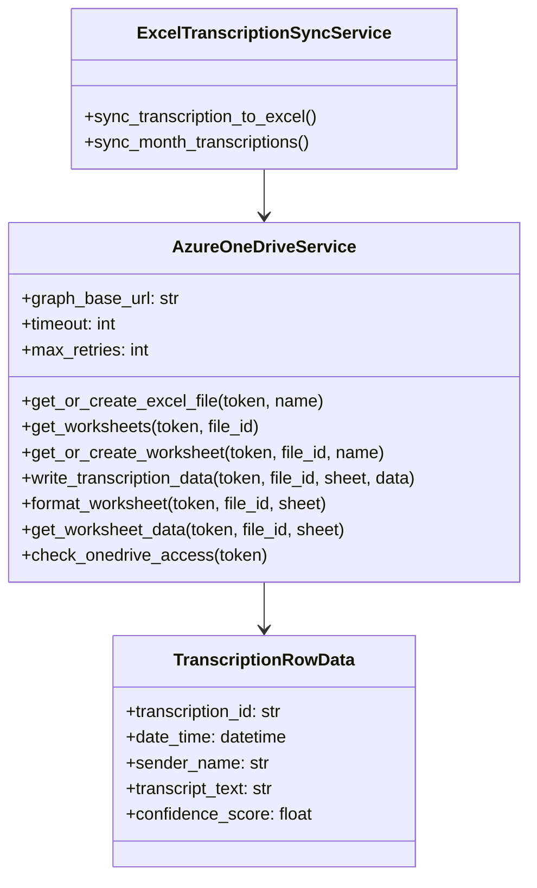
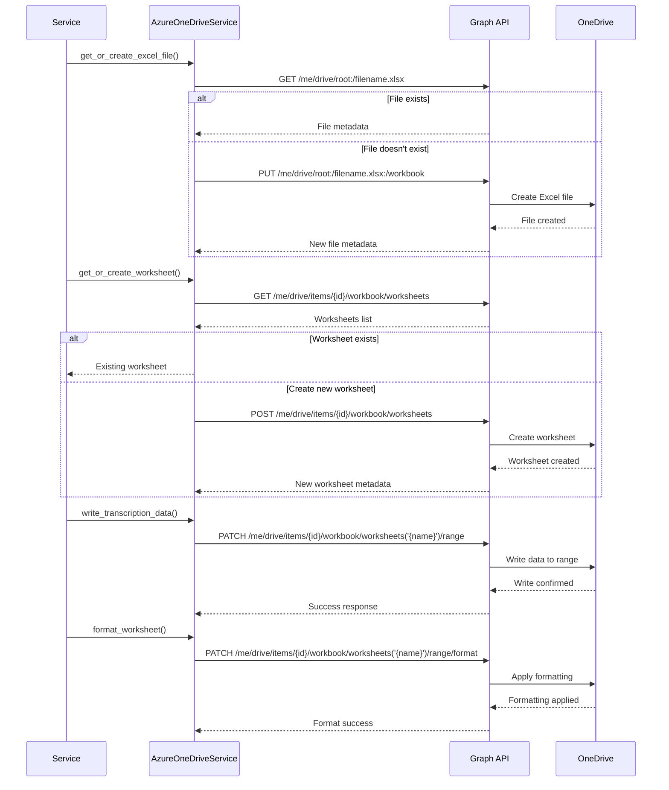

# Azure OneDrive Excel Service

Microsoft Graph API integration for OneDrive file operations and Excel workbook management, enabling automated creation and management of formatted Excel spreadsheets.

## Table of Contents

1. [Overview](#overview)
2. [Architecture](#architecture)
3. [Implementation](#implementation)
4. [Graph API Integration](#graph-api-integration)
5. [Excel Operations](#excel-operations)
6. [Error Handling](#error-handling)
7. [Examples](#examples)
8. [Reference](#reference)

## Overview

The `AzureOneDriveService` provides a comprehensive interface to Microsoft Graph API for OneDrive and Excel operations. It handles file management, worksheet operations, data writing, and formatting through the Graph API's Excel endpoints.

### Key Capabilities

- **File Management**: Create, access, and manage Excel files in OneDrive
- **Worksheet Operations**: Create and manage worksheets within Excel files
- **Data Operations**: Write and read data from Excel ranges
- **Formatting**: Apply professional formatting including headers, column widths, and styling
- **Health Monitoring**: Check OneDrive connectivity and permissions

### Service Architecture

```mermaid
graph TB
    subgraph "Scribe Application"
        ESS[ExcelSyncService]
        AOS[AzureOneDriveService]
    end
    
    subgraph "Microsoft Graph API"
        FILES[/me/drive/items]
        WORKBOOKS[/workbook]
        WORKSHEETS[/worksheets]
        RANGES[/range]
    end
    
    subgraph "OneDrive"
        EXCEL[Excel Files]
        SHEETS[Worksheets]
        DATA[Cell Data]
    end
    
    ESS --> AOS
    AOS --> FILES
    AOS --> WORKBOOKS
    AOS --> WORKSHEETS
    AOS --> RANGES
    
    FILES --> EXCEL
    WORKBOOKS --> EXCEL
    WORKSHEETS --> SHEETS
    RANGES --> DATA
    
    style AOS fill:#e1f5fe
    style EXCEL fill:#e8f5e8
```

## Architecture

### Service Structure



### Graph API Workflow



## Implementation

### Core Service Class

The service is implemented as a singleton with comprehensive error handling:

```python
# app/azure/AzureOneDriveService.py:25
class AzureOneDriveService:
    """Microsoft Graph API service for OneDrive and Excel operations."""

    def __init__(self):
        """Initialize OneDrive service."""
        self.graph_base_url = "https://graph.microsoft.com/v1.0"
        self.timeout = getattr(settings, 'excel_sync_timeout_seconds', 120)
        self.max_retries = getattr(settings, 'excel_max_retry_attempts', 3)
```

### File Management Operations

#### Get or Create Excel File

```python
# app/azure/AzureOneDriveService.py:34
async def get_or_create_excel_file(
    self,
    access_token: str,
    file_name: str
) -> Dict[str, Any]:
    """
    Get existing Excel file or create new one in OneDrive root.
    
    Process:
    1. Try to get existing file using Graph API
    2. If file doesn't exist (404), create new Excel workbook
    3. Return file metadata for further operations
    """
    try:
        headers = {
            "Authorization": f"Bearer {access_token}",
            "Content-Type": "application/json"
        }

        # First, try to get existing file
        file_name_with_ext = f"{file_name}.xlsx"
        get_url = f"{self.graph_base_url}/me/drive/root:/{file_name_with_ext}"

        async with httpx.AsyncClient() as client:
            response = await client.get(
                get_url,
                headers=headers,
                timeout=self.timeout
            )

        # If file exists, return it
        if response.status_code == 200:
            file_data = response.json()
            logger.info(f"Found existing Excel file: {file_name_with_ext}")
            return file_data

        # If file doesn't exist (404), create it
        elif response.status_code == 404:
            return await self._create_excel_file(access_token, file_name)
```

#### Create New Excel File

```python
# app/azure/AzureOneDriveService.py:78
async def _create_excel_file(
    self,
    access_token: str,
    file_name: str
) -> Dict[str, Any]:
    """
    Create a new Excel file in OneDrive root.
    
    Uses the Graph API workbook endpoint to create an empty Excel file
    with a default worksheet.
    """
    file_name_with_ext = f"{file_name}.xlsx"
    
    # Create empty Excel workbook using the workbooks endpoint
    create_url = f"{self.graph_base_url}/me/drive/root:/{file_name_with_ext}:/workbook"

    async with httpx.AsyncClient() as client:
        response = await client.put(
            create_url,
            headers=headers,
            json={},
            timeout=self.timeout
        )
```

### Worksheet Management

#### Get or Create Worksheet

```python
# app/azure/AzureOneDriveService.py:150
async def get_or_create_worksheet(
    self,
    access_token: str,
    file_id: str,
    worksheet_name: str
) -> Dict[str, Any]:
    """
    Get existing worksheet or create new one.
    
    This method ensures that the required worksheet exists,
    creating it if necessary with the specified name.
    """
    # First, try to get existing worksheet
    worksheets = await self.get_worksheets(access_token, file_id)
    
    for worksheet in worksheets:
        if worksheet["name"] == worksheet_name:
            logger.info(f"Found existing worksheet: {worksheet_name}")
            return worksheet

    # If worksheet doesn't exist, create it
    return await self._create_worksheet(access_token, file_id, worksheet_name)
```

### Data Operations

#### Write Transcription Data

```python
# app/azure/AzureOneDriveService.py:240
async def write_transcription_data(
    self,
    access_token: str,
    file_id: str,
    worksheet_name: str,
    transcriptions: List[TranscriptionRowData],
    start_row: int = 2  # Start after header row
) -> Dict[str, Any]:
    """
    Write transcription data to Excel worksheet.
    
    Converts TranscriptionRowData objects to Excel-compatible format
    and writes them to the specified range.
    """
    if not transcriptions:
        logger.warning("No transcription data provided")
        return {"rows_written": 0}

    # Prepare data for Excel
    values = []
    for transcription in transcriptions:
        row = [
            transcription.transcription_id,
            transcription.date_time.strftime("%Y-%m-%d %H:%M:%S"),
            transcription.sender_name or "",
            transcription.sender_email,
            transcription.subject,
            transcription.audio_duration or "",
            transcription.transcript_text,
            transcription.confidence_score or "",
            transcription.language or "",
            transcription.model_used,
            transcription.processing_time_ms or ""
        ]
        values.append(row)

    # Calculate range
    end_row = start_row + len(values) - 1
    range_address = f"A{start_row}:K{end_row}"

    # Write data to worksheet
    url = f"{self.graph_base_url}/me/drive/items/{file_id}/workbook/worksheets('{worksheet_name}')/range(address='{range_address}')"

    request_body = {
        "values": values
    }

    async with httpx.AsyncClient() as client:
        response = await client.patch(
            url,
            headers=headers,
            json=request_body,
            timeout=self.timeout
        )
```

### Formatting Operations

#### Apply Worksheet Formatting

```python
# app/azure/AzureOneDriveService.py:320
async def format_worksheet(
    self,
    access_token: str,
    file_id: str,
    worksheet_name: str,
    apply_header_formatting: bool = True,
    apply_column_formatting: bool = True,
    freeze_header_row: bool = True
) -> Dict[str, Any]:
    """
    Apply formatting to Excel worksheet.
    
    Includes:
    - Header row formatting (bold, colors)
    - Column width adjustment
    - Text wrapping for specific columns
    - Freeze panes for headers
    """
    formatting_results = {}

    # Format header row
    if apply_header_formatting:
        await self._format_header_row(access_token, file_id, worksheet_name, headers)
        formatting_results["header_formatted"] = True

    # Format columns
    if apply_column_formatting:
        await self._format_columns(access_token, file_id, worksheet_name, headers)
        formatting_results["columns_formatted"] = True

    # Freeze header row
    if freeze_header_row:
        await self._freeze_header_row(access_token, file_id, worksheet_name, headers)
        formatting_results["header_frozen"] = True

    return formatting_results
```

## Graph API Integration

### Authentication

The service uses Bearer token authentication with the Microsoft Graph API:

```python
headers = {
    "Authorization": f"Bearer {access_token}",
    "Content-Type": "application/json"
}
```

### Required Permissions

The service requires the following Microsoft Graph permissions:

| Permission | Scope | Usage |
|------------|-------|--------|
| `Files.ReadWrite` | Delegated | Read and write user's files |
| `Files.ReadWrite.All` | Application | Read and write all files (admin) |

### API Endpoints Used

| Operation | Endpoint | Method |
|-----------|----------|--------|
| Get file | `/me/drive/root:/{filename}` | GET |
| Create file | `/me/drive/root:/{filename}:/workbook` | PUT |
| Get worksheets | `/me/drive/items/{id}/workbook/worksheets` | GET |
| Create worksheet | `/me/drive/items/{id}/workbook/worksheets` | POST |
| Write data | `/me/drive/items/{id}/workbook/worksheets('{name}')/range(address='{range}')` | PATCH |
| Format range | `/me/drive/items/{id}/workbook/worksheets('{name}')/range(address='{range}')/format` | PATCH |

### Rate Limiting

The Microsoft Graph API implements rate limiting. The service handles this with:

```python
# Exponential backoff for rate limit handling
import asyncio
from random import uniform

async def _handle_rate_limit(self, retry_count: int):
    """Handle rate limiting with exponential backoff."""
    delay = min(60, (2 ** retry_count) + uniform(0, 1))
    logger.warning(f"Rate limited, waiting {delay:.2f} seconds")
    await asyncio.sleep(delay)
```

## Excel Operations

### Column Structure

The service creates Excel files with the following structure:

```
A: ID (Transcription ID)
B: Date & Time (Creation timestamp)
C: Sender Name (Voice message sender)
D: Sender Email (Sender's email)
E: Subject (Email subject)
F: Audio Duration (Duration in seconds)
G: Transcript Text (Transcribed content)
H: Confidence Score (AI confidence 0-1)
I: Language (Detected language code)
J: Model Used (AI model name)
K: Processing Time (Processing duration in ms)
```

### Header Formatting

```python
# app/azure/AzureOneDriveService.py:390
async def _format_header_row(
    self,
    access_token: str,
    file_id: str,
    worksheet_name: str,
    headers: Dict[str, str]
) -> None:
    """Format the header row with bold text and background color."""
    
    # Set header values
    header_values = [[
        "ID", "Date & Time", "Sender Name", "Sender Email", "Subject",
        "Audio Duration", "Transcript Text", "Confidence Score",
        "Language", "Model Used", "Processing Time (ms)"
    ]]

    # Apply formatting
    format_body = {
        "font": {
            "bold": True,
            "color": "#FFFFFF"
        },
        "fill": {
            "color": "#4472C4"
        }
    }
```

### Column Formatting

```python
# app/azure/AzureOneDriveService.py:420
async def _format_columns(
    self,
    access_token: str,
    file_id: str,
    worksheet_name: str,
    headers: Dict[str, str]
) -> None:
    """Format column widths and text wrapping."""
    
    column_configs = [
        ("A", column_widths.get("ID", 25), False),  # ID
        ("B", column_widths.get("Date_Time", 20), False),  # Date & Time
        ("C", column_widths.get("Sender_Name", 25), False),  # Sender Name
        ("D", column_widths.get("Sender_Email", 30), False),  # Sender Email
        ("E", column_widths.get("Subject", 40), True),  # Subject (wrapped)
        ("F", column_widths.get("Audio_Duration", 15), False),  # Audio Duration
        ("G", column_widths.get("Transcript_Text", 80), True),  # Transcript (wrapped)
        ("H", column_widths.get("Confidence_Score", 18), False),  # Confidence
        ("I", column_widths.get("Language", 12), False),  # Language
        ("J", column_widths.get("Model_Used", 20), False),  # Model Used
        ("K", column_widths.get("Processing_Time", 18), False),  # Processing Time
    ]
```

## Error Handling

### HTTP Error Handling

```python
# Standard HTTP error handling pattern
if response.status_code == 401:
    raise AuthenticationError("Access token is invalid or expired")
elif response.status_code == 403:
    raise AuthorizationError("Insufficient permissions to access OneDrive")
elif response.status_code == 404:
    # Handle not found - may create resource
    pass
elif response.status_code == 429:
    # Handle rate limiting
    await self._handle_rate_limit(retry_count)
else:
    logger.error(f"Graph API error: {response.status_code} - {response.text}")
    raise AuthenticationError("Failed to perform OneDrive operation")
```

### Retry Logic

```python
from tenacity import retry, stop_after_attempt, wait_exponential

@retry(
    stop=stop_after_attempt(3),
    wait=wait_exponential(multiplier=1, min=4, max=10)
)
async def _write_data_with_retry(self, ...):
    """Write data with automatic retry on failure."""
    pass
```

### Error Categories

| Error Type | HTTP Code | Description | Resolution |
|------------|-----------|-------------|------------|
| **Authentication** | 401 | Token expired or invalid | Refresh access token |
| **Authorization** | 403 | Insufficient permissions | Update OAuth scopes |
| **Not Found** | 404 | File/worksheet doesn't exist | Create missing resource |
| **Rate Limit** | 429 | API quota exceeded | Exponential backoff retry |
| **Server Error** | 5xx | Microsoft service issue | Retry with backoff |

## Examples

### Basic File Creation

```python
from app.azure.AzureOneDriveService import azure_onedrive_service

# Create or get Excel file
file_data = await azure_onedrive_service.get_or_create_excel_file(
    access_token="eyJ0eXAi...",
    file_name="Transcripts"
)

print(f"File ID: {file_data['id']}")
print(f"File URL: {file_data['webUrl']}")
```

### Worksheet Management

```python
# Get or create worksheet for current month
import datetime

current_month = datetime.datetime.now().strftime("%B %Y")  # "December 2024"

worksheet = await azure_onedrive_service.get_or_create_worksheet(
    access_token="eyJ0eXAi...",
    file_id="01BYE5RZ6QN3ZWBTUKMFDK2QJQZQSO6J2P",
    worksheet_name=current_month
)

print(f"Worksheet: {worksheet['name']}")
print(f"Worksheet ID: {worksheet['id']}")
```

### Data Writing

```python
from app.models.ExcelSync import TranscriptionRowData
from datetime import datetime

# Prepare transcription data
transcriptions = [
    TranscriptionRowData(
        transcription_id="trans-123",
        date_time=datetime.now(),
        sender_name="John Doe",
        sender_email="john@company.com",
        subject="Weekly Update",
        audio_duration=45.2,
        transcript_text="This week's progress report shows excellent results...",
        confidence_score=0.958,
        language="en",
        model_used="whisper-1",
        processing_time_ms=2340
    )
]

# Write to Excel
result = await azure_onedrive_service.write_transcription_data(
    access_token="eyJ0eXAi...",
    file_id="01BYE5RZ6QN3ZWBTUKMFDK2QJQZQSO6J2P",
    worksheet_name="December 2024",
    transcriptions=transcriptions
)

print(f"Rows written: {result['rows_written']}")
print(f"Range: {result['range_address']}")
```

### Formatting Application

```python
# Apply professional formatting
format_result = await azure_onedrive_service.format_worksheet(
    access_token="eyJ0eXAi...",
    file_id="01BYE5RZ6QN3ZWBTUKMFDK2QJQZQSO6J2P",
    worksheet_name="December 2024",
    apply_header_formatting=True,
    apply_column_formatting=True,
    freeze_header_row=True
)

print("Formatting applied:")
for operation, success in format_result.items():
    print(f"  {operation}: {success}")
```

### Health Check

```python
# Check OneDrive connectivity and permissions
health = await azure_onedrive_service.check_onedrive_access("eyJ0eXAi...")

if health["accessible"]:
    print(f"OneDrive accessible - Drive ID: {health['drive_id']}")
    print(f"Quota used: {health['quota']['used']} / {health['quota']['total']}")
else:
    print(f"OneDrive not accessible: {health['error']}")
```

## Reference

### Configuration Settings

| Setting | Type | Default | Description |
|---------|------|---------|-------------|
| `excel_sync_timeout_seconds` | int | 120 | API operation timeout |
| `excel_max_retry_attempts` | int | 3 | Maximum retry attempts |
| `excel_column_widths` | dict | See config | Column width specifications |

### Graph API Rate Limits

| Resource | Limit | Window |
|----------|-------|--------|
| **Excel API** | 200 requests | 60 seconds |
| **Files API** | 10,000 requests | 10 minutes |
| **General** | 10,000 requests | 10 minutes |

### Common Response Codes

| Code | Meaning | Action |
|------|---------|--------|
| 200 | Success | Continue processing |
| 201 | Created | Resource created successfully |
| 400 | Bad Request | Check request format |
| 401 | Unauthorized | Refresh access token |
| 403 | Forbidden | Check permissions |
| 404 | Not Found | Create missing resource |
| 429 | Rate Limited | Wait and retry |
| 500 | Server Error | Retry with backoff |

### File Size Limits

| Operation | Limit | Notes |
|-----------|-------|-------|
| **Excel File** | 100 MB | Maximum file size |
| **Single Request** | 4 MB | Per API call |
| **Range Update** | 5 million cells | Per operation |

---

**Last Updated**: December 2024  
**Service Version**: 1.0.0  
**Graph API Version**: v1.0  
**Dependencies**: Microsoft Graph API, Azure Active Directory