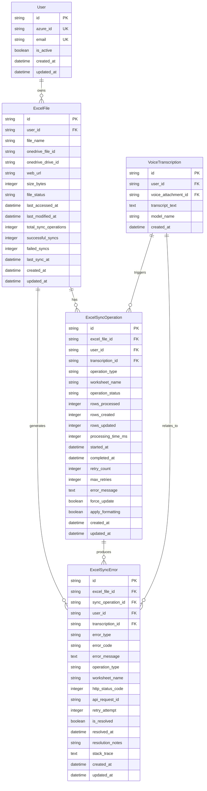
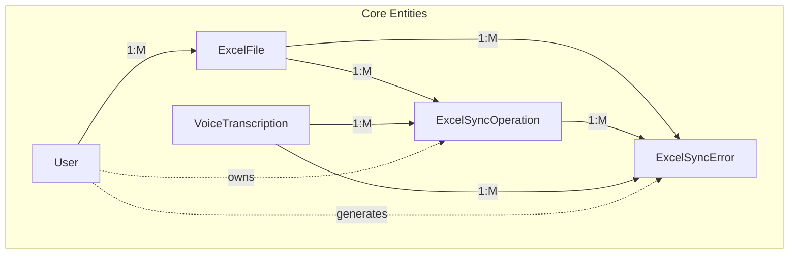

# Excel Sync Database Models

Database models and schema design for tracking Excel transcription synchronization operations, following Third Normal Form (3NF) principles.

## Table of Contents

1. [Overview](#overview)
2. [Database Design](#database-design)
3. [Model Definitions](#model-definitions)
4. [Relationships](#relationships)
5. [Indexes and Constraints](#indexes-and-constraints)
6. [Repository Implementation](#repository-implementation)
7. [Usage Examples](#usage-examples)
8. [Migration Guide](#migration-guide)
9. [Reference](#reference)

## Overview

The Excel sync tracking system uses three normalized tables to track Excel file operations, sync history, and error management. This design ensures data integrity while providing comprehensive audit trails and performance metrics.

### Key Design Principles

- **Third Normal Form (3NF)**: No redundant data, proper entity separation
- **UUID Primary Keys**: Consistent with application architecture
- **Comprehensive Tracking**: Full audit trail of all operations
- **Performance Optimization**: Strategic indexes for common queries
- **Error Management**: Detailed error tracking with resolution capabilities

### Entity Relationship Diagram



## Database Design

### Normalization Analysis

#### First Normal Form (1NF) ✅
- ✅ Each cell contains atomic values
- ✅ No repeating groups or arrays
- ✅ Each record is unique with UUID primary key

#### Second Normal Form (2NF) ✅
- ✅ All tables are in 1NF
- ✅ No partial dependencies (all tables use single-column primary keys)
- ✅ All non-key columns depend on the entire primary key

#### Third Normal Form (3NF) ✅
- ✅ All tables are in 2NF
- ✅ No transitive dependencies
- ✅ Non-key columns depend only on the primary key

### Entity Separation

| Entity | Responsibility | Key Attributes |
|--------|----------------|----------------|
| **ExcelFile** | Track Excel file metadata and OneDrive information | file_name, onedrive_file_id, sync_stats |
| **ExcelSyncOperation** | Record individual sync operations with metrics | operation_type, status, processing_metrics |
| **ExcelSyncError** | Log errors and track resolution status | error_type, error_message, resolution_info |

## Model Definitions

### ExcelFile Model

Tracks Excel file metadata and synchronization statistics.

```python
# app/db/models/ExcelSyncTracking.py:27
class ExcelFile(Base, UUIDMixin, TimestampMixin):
    """Excel file metadata and OneDrive information."""
    __tablename__ = "excel_files"

    # Owner relationship
    user_id: Mapped[str] = mapped_column(ForeignKey("users.id"), nullable=False)
    
    # File identification
    file_name: Mapped[str] = mapped_column(NVARCHAR(255), nullable=False)  # "Transcripts"
    onedrive_file_id: Mapped[Optional[str]] = mapped_column(NVARCHAR(100), nullable=True)
    onedrive_drive_id: Mapped[Optional[str]] = mapped_column(NVARCHAR(100), nullable=True)
    
    # File metadata
    web_url: Mapped[Optional[str]] = mapped_column(NVARCHAR(1000), nullable=True)
    size_bytes: Mapped[Optional[int]] = mapped_column(Integer, nullable=True)
    
    # Status tracking
    file_status: Mapped[str] = mapped_column(NVARCHAR(20), default="active", nullable=False)
    last_accessed_at: Mapped[Optional[datetime]] = mapped_column(DateTime, nullable=True)
    last_modified_at: Mapped[Optional[datetime]] = mapped_column(DateTime, nullable=True)
    
    # Sync statistics (denormalized for performance)
    total_sync_operations: Mapped[int] = mapped_column(Integer, default=0, nullable=False)
    successful_syncs: Mapped[int] = mapped_column(Integer, default=0, nullable=False)
    failed_syncs: Mapped[int] = mapped_column(Integer, default=0, nullable=False)
    last_sync_at: Mapped[Optional[datetime]] = mapped_column(DateTime, nullable=True)
```

#### Field Specifications

| Field | Type | Purpose | Constraints |
|-------|------|---------|-------------|
| `user_id` | Foreign Key | Owner relationship | NOT NULL, references users.id |
| `file_name` | NVARCHAR(255) | Excel file name | NOT NULL, combined unique with user_id |
| `onedrive_file_id` | NVARCHAR(100) | OneDrive file identifier | Nullable, set after file creation |
| `file_status` | NVARCHAR(20) | File state | CHECK: 'active', 'deleted', 'error' |
| `total_sync_operations` | Integer | Count of all sync attempts | >= 0 |
| `successful_syncs` | Integer | Count of successful syncs | >= 0 |
| `failed_syncs` | Integer | Count of failed syncs | >= 0, <= total_sync_operations |

### ExcelSyncOperation Model

Records individual synchronization operations with detailed metrics.

```python
# app/db/models/ExcelSyncTracking.py:104
class ExcelSyncOperation(Base, UUIDMixin, TimestampMixin):
    """Individual Excel sync operation tracking."""
    __tablename__ = "excel_sync_operations"

    # Foreign key relationships
    excel_file_id: Mapped[str] = mapped_column(ForeignKey("excel_files.id"), nullable=False)
    user_id: Mapped[str] = mapped_column(ForeignKey("users.id"), nullable=False)
    transcription_id: Mapped[Optional[str]] = mapped_column(ForeignKey("voice_transcriptions.id"), nullable=True)
    
    # Operation details
    operation_type: Mapped[str] = mapped_column(NVARCHAR(20), nullable=False)  # single, batch, full_sync
    worksheet_name: Mapped[str] = mapped_column(NVARCHAR(100), nullable=False)
    operation_status: Mapped[str] = mapped_column(NVARCHAR(20), default="pending", nullable=False)
    
    # Processing metrics
    rows_processed: Mapped[int] = mapped_column(Integer, default=0, nullable=False)
    rows_created: Mapped[int] = mapped_column(Integer, default=0, nullable=False)
    rows_updated: Mapped[int] = mapped_column(Integer, default=0, nullable=False)
    processing_time_ms: Mapped[Optional[int]] = mapped_column(Integer, nullable=True)
    
    # Timing information
    started_at: Mapped[datetime] = mapped_column(DateTime, nullable=False)
    completed_at: Mapped[Optional[datetime]] = mapped_column(DateTime, nullable=True)
    
    # Error handling
    retry_count: Mapped[int] = mapped_column(Integer, default=0, nullable=False)
    max_retries: Mapped[int] = mapped_column(Integer, default=3, nullable=False)
    error_message: Mapped[Optional[str]] = mapped_column(Text, nullable=True)
    
    # Configuration
    force_update: Mapped[bool] = mapped_column(Boolean, default=False, nullable=False)
    apply_formatting: Mapped[bool] = mapped_column(Boolean, default=True, nullable=False)
```

#### Operation Types

| Type | Description | transcription_id | Usage |
|------|-------------|------------------|-------|
| `single` | Single transcription sync | Required | Automatic sync after transcription |
| `batch` | Monthly batch sync | NULL | Manual monthly operations |
| `full_sync` | Complete re-sync | NULL | Data recovery, maintenance |

#### Status Values

| Status | Description | Next Actions |
|--------|-------------|--------------|
| `pending` | Queued for processing | Wait for execution |
| `in_progress` | Currently executing | Monitor progress |
| `completed` | Successfully finished | Update statistics |
| `failed` | Operation failed | Check errors, retry |
| `retrying` | Retry attempt in progress | Monitor retry |

### ExcelSyncError Model

Comprehensive error tracking with resolution management.

```python
# app/db/models/ExcelSyncTracking.py:173
class ExcelSyncError(Base, UUIDMixin, TimestampMixin):
    """Error tracking for Excel sync operations."""
    __tablename__ = "excel_sync_errors"

    # Foreign key relationships
    excel_file_id: Mapped[str] = mapped_column(ForeignKey("excel_files.id"), nullable=False)
    sync_operation_id: Mapped[Optional[str]] = mapped_column(ForeignKey("excel_sync_operations.id"), nullable=True)
    user_id: Mapped[str] = mapped_column(ForeignKey("users.id"), nullable=False)
    
    # Error classification
    error_type: Mapped[str] = mapped_column(NVARCHAR(50), nullable=False)
    error_code: Mapped[Optional[str]] = mapped_column(NVARCHAR(20), nullable=True)
    error_message: Mapped[str] = mapped_column(Text, nullable=False)
    
    # Context information
    operation_type: Mapped[Optional[str]] = mapped_column(NVARCHAR(20), nullable=True)
    worksheet_name: Mapped[Optional[str]] = mapped_column(NVARCHAR(100), nullable=True)
    transcription_id: Mapped[Optional[str]] = mapped_column(ForeignKey("voice_transcriptions.id"), nullable=True)
    
    # Technical details
    http_status_code: Mapped[Optional[int]] = mapped_column(Integer, nullable=True)
    api_request_id: Mapped[Optional[str]] = mapped_column(NVARCHAR(100), nullable=True)
    retry_attempt: Mapped[int] = mapped_column(Integer, default=0, nullable=False)
    stack_trace: Mapped[Optional[str]] = mapped_column(Text, nullable=True)
    
    # Resolution tracking
    is_resolved: Mapped[bool] = mapped_column(Boolean, default=False, nullable=False)
    resolved_at: Mapped[Optional[datetime]] = mapped_column(DateTime, nullable=True)
    resolution_notes: Mapped[Optional[str]] = mapped_column(NVARCHAR(500), nullable=True)
```

#### Error Types

| Type | Description | Common Causes |
|------|-------------|---------------|
| `network` | Network connectivity issues | Internet outage, DNS problems |
| `authentication` | Token or auth failures | Expired token, invalid credentials |
| `authorization` | Permission denied | Missing scopes, access revoked |
| `api_limit` | Rate limiting | Too many requests |
| `file_locked` | File access denied | File open in Excel |
| `sync_error` | Data sync issues | Duplicate detection, data format |
| `format_error` | Formatting failures | Column sizing, style application |

## Relationships

### Primary Relationships



### Foreign Key Relationships

| Child Table | Foreign Key | Parent Table | Relationship |
|-------------|-------------|--------------|--------------|
| excel_files | user_id | users | One user has many Excel files |
| excel_sync_operations | excel_file_id | excel_files | One file has many operations |
| excel_sync_operations | user_id | users | One user has many operations |
| excel_sync_operations | transcription_id | voice_transcriptions | One transcription can trigger multiple operations |
| excel_sync_errors | excel_file_id | excel_files | One file can have many errors |
| excel_sync_errors | sync_operation_id | excel_sync_operations | One operation can have many errors |
| excel_sync_errors | user_id | users | One user can have many errors |
| excel_sync_errors | transcription_id | voice_transcriptions | One transcription can have related errors |

## Indexes and Constraints

### Primary Indexes

All tables use UUID primary keys with clustered indexes:

```sql
-- Automatically created for primary keys
CREATE CLUSTERED INDEX PK_excel_files ON excel_files(id);
CREATE CLUSTERED INDEX PK_excel_sync_operations ON excel_sync_operations(id);  
CREATE CLUSTERED INDEX PK_excel_sync_errors ON excel_sync_errors(id);
```

### Foreign Key Indexes

```sql
-- Foreign key indexes for performance
CREATE INDEX IX_excel_files_user_id ON excel_files(user_id);
CREATE INDEX IX_excel_sync_operations_excel_file_id ON excel_sync_operations(excel_file_id);
CREATE INDEX IX_excel_sync_operations_user_id ON excel_sync_operations(user_id);
CREATE INDEX IX_excel_sync_operations_transcription_id ON excel_sync_operations(transcription_id);
CREATE INDEX IX_excel_sync_errors_excel_file_id ON excel_sync_errors(excel_file_id);
CREATE INDEX IX_excel_sync_errors_sync_operation_id ON excel_sync_errors(sync_operation_id);
```

### Performance Indexes

```sql
-- Query optimization indexes
CREATE INDEX IX_excel_files_user_status ON excel_files(user_id, file_status);
CREATE INDEX IX_excel_files_user_last_sync ON excel_files(user_id, last_sync_at);

CREATE INDEX IX_excel_sync_operations_status ON excel_sync_operations(operation_status);
CREATE INDEX IX_excel_sync_operations_user_status ON excel_sync_operations(user_id, operation_status);
CREATE INDEX IX_excel_sync_operations_status_started ON excel_sync_operations(operation_status, started_at);

CREATE INDEX IX_excel_sync_errors_resolved ON excel_sync_errors(is_resolved);
CREATE INDEX IX_excel_sync_errors_user_resolved ON excel_sync_errors(user_id, is_resolved);
CREATE INDEX IX_excel_sync_errors_type_created ON excel_sync_errors(error_type, created_at);
```

### Unique Constraints

```sql
-- Business rule constraints
ALTER TABLE excel_files 
ADD CONSTRAINT UQ_excel_files_user_name 
UNIQUE (user_id, file_name);
```

### Check Constraints

```sql
-- Data integrity constraints
ALTER TABLE excel_files
ADD CONSTRAINT CK_excel_files_status 
CHECK (file_status IN ('active', 'deleted', 'error'));

ALTER TABLE excel_files
ADD CONSTRAINT CK_excel_files_sync_totals
CHECK (successful_syncs + failed_syncs <= total_sync_operations);

ALTER TABLE excel_sync_operations
ADD CONSTRAINT CK_excel_sync_operations_type
CHECK (operation_type IN ('single', 'batch', 'full_sync'));

ALTER TABLE excel_sync_operations
ADD CONSTRAINT CK_excel_sync_operations_status
CHECK (operation_status IN ('pending', 'in_progress', 'completed', 'failed', 'retrying'));

ALTER TABLE excel_sync_operations
ADD CONSTRAINT CK_excel_sync_operations_row_totals
CHECK (rows_created + rows_updated <= rows_processed);
```

## Repository Implementation

### ExcelSyncRepository Class

The repository provides data access methods following the repository pattern:

```python
# app/repositories/ExcelSyncRepository.py:30
class ExcelSyncRepository:
    """Repository for Excel sync tracking data access."""

    def __init__(self, db_session: AsyncSession):
        """Initialize repository with database session."""
        self.db_session = db_session

    async def create_excel_file(
        self,
        user_id: str,
        file_name: str,
        onedrive_file_id: Optional[str] = None,
        onedrive_drive_id: Optional[str] = None,
        web_url: Optional[str] = None,
        size_bytes: Optional[int] = None
    ) -> ExcelFile:
        """Create a new Excel file record."""
        
    async def get_excel_file_by_user_and_name(
        self,
        user_id: str,
        file_name: str
    ) -> Optional[ExcelFile]:
        """Get Excel file by user ID and file name."""
        
    async def create_sync_operation(
        self,
        excel_file_id: str,
        user_id: str,
        operation_type: str,
        worksheet_name: str,
        transcription_id: Optional[str] = None,
        force_update: bool = False,
        apply_formatting: bool = True,
        max_retries: int = 3
    ) -> ExcelSyncOperation:
        """Create a new sync operation record."""
```

### Common Query Patterns

#### Get User Excel Files

```python
async def get_user_excel_files(
    self,
    user_id: str,
    include_inactive: bool = False
) -> List[ExcelFile]:
    """Get all Excel files for a user."""
    
    stmt = select(ExcelFile).where(ExcelFile.user_id == user_id)
    
    if not include_inactive:
        stmt = stmt.where(ExcelFile.file_status == "active")
    
    result = await self.db_session.execute(stmt)
    return result.scalars().all()
```

#### Get Sync Statistics

```python
async def get_sync_statistics(
    self,
    user_id: str,
    days_ago: Optional[int] = None
) -> Dict[str, Any]:
    """Get comprehensive sync statistics for a user."""
    
    # Base queries
    excel_file_query = select(ExcelFile).where(ExcelFile.user_id == user_id)
    sync_ops_query = select(ExcelSyncOperation).where(ExcelSyncOperation.user_id == user_id)
    
    # Apply date filter if specified
    if days_ago:
        cutoff_date = datetime.utcnow() - timedelta(days=days_ago)
        sync_ops_query = sync_ops_query.where(ExcelSyncOperation.started_at >= cutoff_date)
    
    # Execute queries and calculate statistics
    # ... (detailed implementation in repository)
```

#### Get Pending Operations

```python
async def get_pending_sync_operations(
    self,
    user_id: Optional[str] = None,
    limit: int = 50
) -> List[ExcelSyncOperation]:
    """Get pending sync operations for processing."""
    
    stmt = (
        select(ExcelSyncOperation)
        .where(ExcelSyncOperation.operation_status.in_(["pending", "retrying"]))
        .order_by(ExcelSyncOperation.started_at)
        .limit(limit)
    )
    
    if user_id:
        stmt = stmt.where(ExcelSyncOperation.user_id == user_id)
    
    result = await self.db_session.execute(stmt)
    return result.scalars().all()
```

## Usage Examples

### Creating Excel File Tracking

```python
from app.repositories.ExcelSyncRepository import ExcelSyncRepository

# Initialize repository
excel_sync_repo = ExcelSyncRepository(db_session)

# Create Excel file tracking record
excel_file = await excel_sync_repo.create_excel_file(
    user_id="user-123",
    file_name="Transcripts",
    onedrive_file_id="01BYE5RZ6QN3ZWBTUKMFDK2QJQZQSO6J2P",
    onedrive_drive_id="b!-RIj2DuyvEyV1T4NlOaMHk8XkS_I8MdFlUCq1BlcjgmhRfAj77-yQICPEC5c0tJL",
    web_url="https://contoso-my.sharepoint.com/personal/john_contoso_com/_layouts/15/Doc.aspx?...",
    size_bytes=15680
)

print(f"Created Excel file tracking: {excel_file.id}")
```

### Recording Sync Operations

```python
# Create sync operation for single transcription
sync_operation = await excel_sync_repo.create_sync_operation(
    excel_file_id=excel_file.id,
    user_id="user-123",
    operation_type="single",
    worksheet_name="December 2024",
    transcription_id="trans-456",
    force_update=False,
    apply_formatting=True
)

print(f"Created sync operation: {sync_operation.id}")

# Update operation status with metrics
await excel_sync_repo.update_sync_operation_status(
    sync_operation_id=sync_operation.id,
    status="completed",
    rows_processed=1,
    rows_created=1,
    rows_updated=0,
    processing_time_ms=1240
)
```

### Error Tracking

```python
# Log sync error
sync_error = await excel_sync_repo.create_sync_error(
    excel_file_id=excel_file.id,
    user_id="user-123",
    error_type="authentication",
    error_message="Access token expired",
    sync_operation_id=sync_operation.id,
    error_code="TOKEN_EXPIRED",
    http_status_code=401,
    api_request_id="req-789"
)

# Later, resolve the error
await excel_sync_repo.resolve_sync_error(
    error_id=sync_error.id,
    resolution_notes="Token refreshed, operation retried successfully"
)
```

### Statistics Queries

```python
# Get comprehensive sync statistics
stats = await excel_sync_repo.get_sync_statistics(
    user_id="user-123",
    days_ago=30
)

print(f"Success rate: {stats['success_rate_percent']}%")
print(f"Total operations: {stats['total_sync_operations']}")
print(f"Average processing time: {stats['avg_processing_time_ms']}ms")
print(f"Unresolved errors: {stats['unresolved_errors']}")
```

## Migration Guide

### Initial Migration

Create the Excel sync tracking tables:

```python
# alembic/versions/xxx_add_excel_sync_tables.py
"""Add Excel sync tracking tables

Revision ID: xxx
Revises: previous_revision
Create Date: 2024-12-15 10:30:00.000000
"""

from alembic import op
import sqlalchemy as sa
from sqlalchemy.dialects import mssql

def upgrade():
    # Create excel_files table
    op.create_table('excel_files',
        sa.Column('id', mssql.NVARCHAR(36), nullable=False),
        sa.Column('user_id', mssql.NVARCHAR(36), nullable=False),
        sa.Column('file_name', mssql.NVARCHAR(255), nullable=False),
        sa.Column('onedrive_file_id', mssql.NVARCHAR(100), nullable=True),
        sa.Column('onedrive_drive_id', mssql.NVARCHAR(100), nullable=True),
        sa.Column('web_url', mssql.NVARCHAR(1000), nullable=True),
        sa.Column('size_bytes', sa.Integer(), nullable=True),
        sa.Column('file_status', mssql.NVARCHAR(20), nullable=False, default='active'),
        sa.Column('last_accessed_at', sa.DateTime(), nullable=True),
        sa.Column('last_modified_at', sa.DateTime(), nullable=True),
        sa.Column('total_sync_operations', sa.Integer(), nullable=False, default=0),
        sa.Column('successful_syncs', sa.Integer(), nullable=False, default=0),
        sa.Column('failed_syncs', sa.Integer(), nullable=False, default=0),
        sa.Column('last_sync_at', sa.DateTime(), nullable=True),
        sa.Column('created_at', sa.DateTime(), nullable=False),
        sa.Column('updated_at', sa.DateTime(), nullable=False),
        sa.PrimaryKeyConstraint('id'),
        sa.ForeignKeyConstraint(['user_id'], ['users.id'], ),
        sa.UniqueConstraint('user_id', 'file_name', name='uq_excel_files_user_name'),
        sa.CheckConstraint("file_status IN ('active', 'deleted', 'error')", name='ck_excel_files_status')
    )

    # Add indexes
    op.create_index('ix_excel_files_user_id', 'excel_files', ['user_id'])
    op.create_index('ix_excel_files_file_status', 'excel_files', ['file_status'])
    op.create_index('ix_excel_files_last_sync_at', 'excel_files', ['last_sync_at'])
    
    # Continue with other tables...

def downgrade():
    op.drop_table('excel_sync_errors')
    op.drop_table('excel_sync_operations')
    op.drop_table('excel_files')
```

### Data Migration

Migrate existing data if needed:

```python
def migrate_existing_data():
    """Migrate any existing Excel sync data."""
    
    # Get users with transcriptions
    users_with_transcriptions = session.query(User).join(VoiceTranscription).distinct().all()
    
    for user in users_with_transcriptions:
        # Create Excel file tracking record
        excel_file = ExcelFile(
            user_id=user.id,
            file_name="Transcripts",
            file_status="active"
        )
        session.add(excel_file)
    
    session.commit()
```

## Reference

### Table Summary

| Table | Purpose | Primary Key | Foreign Keys |
|-------|---------|-------------|--------------|
| **excel_files** | Excel file metadata | id (UUID) | user_id → users.id |
| **excel_sync_operations** | Sync operation history | id (UUID) | excel_file_id, user_id, transcription_id |
| **excel_sync_errors** | Error tracking | id (UUID) | excel_file_id, sync_operation_id, user_id, transcription_id |

### Column Types Reference

| Type | SQL Server | Python | Usage |
|------|------------|--------|-------|
| UUID Primary Key | NVARCHAR(36) | str | All primary keys |
| String | NVARCHAR(n) | str | Text fields |
| Long Text | TEXT | str | Error messages, notes |
| Integer | INTEGER | int | Counters, metrics |
| Boolean | BIT | bool | Flags |
| DateTime | DATETIME2 | datetime | Timestamps |

### Index Strategy

| Index Type | Usage | Performance Impact |
|------------|-------|-------------------|
| **Primary** | Entity lookup | High |
| **Foreign Key** | Join operations | High |
| **Composite** | Complex queries | Medium |
| **Filtered** | Status-based queries | Medium |

### Constraint Reference

| Constraint Type | Purpose | Examples |
|-----------------|---------|----------|
| **Primary Key** | Unique identification | All tables |
| **Foreign Key** | Referential integrity | All relationships |
| **Unique** | Business rules | user_id + file_name |
| **Check** | Data validation | Status enums, positive numbers |

---

**Last Updated**: December 2024  
**Schema Version**: 1.0.0  
**Database**: Azure SQL Database  
**ORM**: SQLAlchemy 2.0