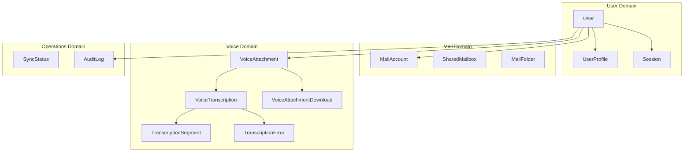
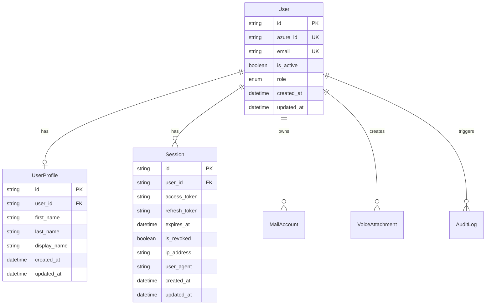
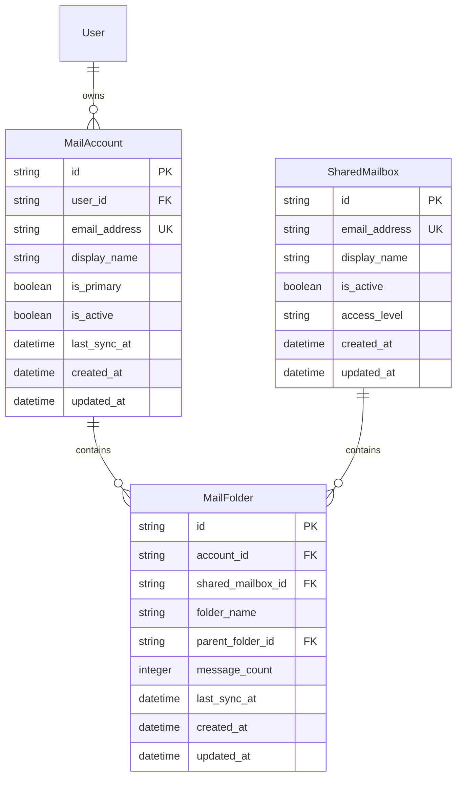
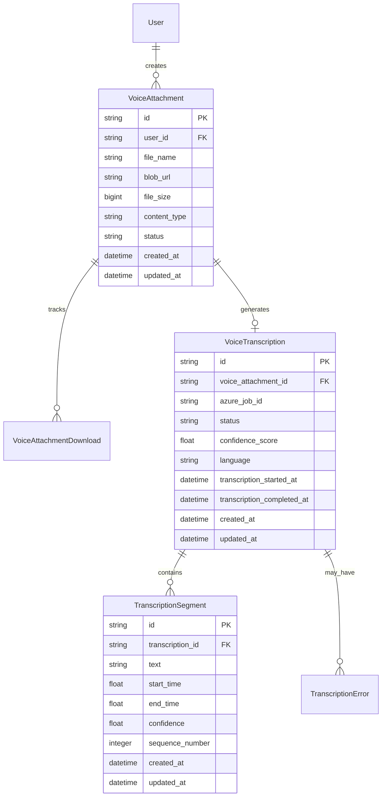
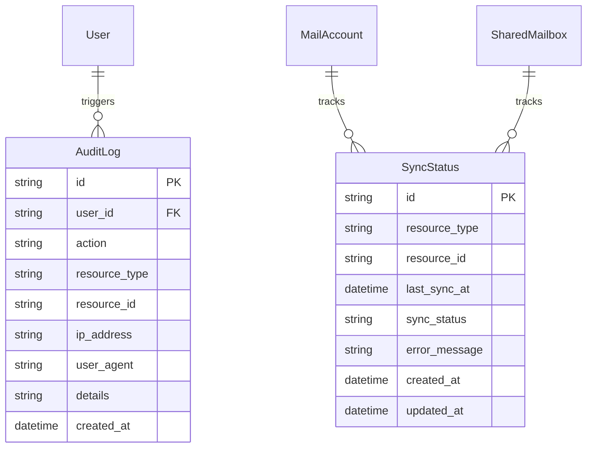

# Database Models Documentation

This document provides comprehensive documentation of the SQLAlchemy database models in the Scribe application, following Third Normal Form (3NF) normalization principles.

## Table of Contents

1. [Overview](#overview)
2. [Design Principles](#design-principles)
3. [Base Classes](#base-classes)
4. [User Models](#user-models)
5. [Mail Models](#mail-models)
6. [Voice and Transcription Models](#voice-and-transcription-models)
7. [Operational Models](#operational-models)
8. [Relationships](#relationships)
9. [Indexes and Performance](#indexes-and-performance)
10. [Migration Strategy](#migration-strategy)

## Overview

The Scribe database follows a normalized design that eliminates redundancy and ensures data integrity. All models inherit from common base classes that provide UUID primary keys, timestamps, and consistent patterns.

### Model Organization



## Design Principles

### Third Normal Form (3NF) Compliance

Following the principles defined in the database CLAUDE.md:

1. **No Redundancy**: Each fact stored exactly once
2. **No JSON/Array columns**: Each cell contains atomic values  
3. **No Calculated fields**: Don't store what can be computed
4. **Proper Entity separation**: Each table represents ONE subject
5. **Consistent Naming**: Plural table names, singular column names

### Key Design Decisions

```python
# File: app/db/models/__init__.py:5-22
"""
Design Principles:
- No redundancy: Each fact stored exactly once
- No JSON/array columns: Each cell contains atomic values
- No calculated fields: Don't store what can be computed
- Proper entity separation: Each table represents ONE subject
- UUID primary keys with SQL Server NEWID()
- Consistent naming: plural table names, singular column names
"""
```

## Base Classes

### UUIDMixin

Provides UUID primary keys for all models:

```python
# File: app/models/DatabaseModel.py:30-35
class UUIDMixin:
    """Mixin to add UUID primary key to models."""
    id: Mapped[str] = mapped_column(
        String(36), 
        primary_key=True, 
        default=lambda: str(uuid.uuid4())
    )
```

### TimestampMixin  

Adds automatic timestamp tracking:

```python
# File: app/models/DatabaseModel.py:37-45
class TimestampMixin:
    """Mixin to add timestamp fields to models."""
    created_at: Mapped[datetime] = mapped_column(
        DateTime, 
        default=datetime.utcnow, 
        nullable=False
    )
    updated_at: Mapped[datetime] = mapped_column(
        DateTime, 
        default=datetime.utcnow, 
        onupdate=datetime.utcnow, 
        nullable=False
    )
```

## User Models

### User Entity Relationship



### User Model

Core authentication entity with minimal normalized data:

```python
# File: app/db/models/User.py:32-61
class User(Base, UUIDMixin, TimestampMixin):
    """Core user authentication table - minimal, normalized data only."""
    __tablename__ = "users"

    # Core authentication fields
    azure_id: Mapped[Optional[str]] = create_azure_id_column(nullable=False, unique=True)
    email: Mapped[str] = create_email_column(nullable=False, unique=True)
    is_active: Mapped[bool] = mapped_column(Boolean, default=True, nullable=False)
    role: Mapped[UserRole] = mapped_column(
        SQLEnum(UserRole, name="user_role_enum"),
        default=UserRole.USER,
        nullable=False
    )
    
    # Relationships
    profile: Mapped[Optional["UserProfile"]] = relationship("UserProfile", back_populates="user", uselist=False)
    sessions: Mapped[List["Session"]] = relationship("Session", back_populates="user", cascade="all, delete-orphan")
    mail_accounts: Mapped[List["MailAccount"]] = relationship("MailAccount", back_populates="user", cascade="all, delete-orphan")
    audit_logs: Mapped[List["AuditLog"]] = relationship("AuditLog", back_populates="user")

    # Indexes
    __table_args__ = (
        Index("ix_users_azure_id", "azure_id"),
        Index("ix_users_email", "email"),
        Index("ix_users_active", "is_active"),
        Index("ix_users_role", "role"),
    )
```

**Key Features:**
- **Azure Integration**: Maps to Azure AD user via `azure_id`
- **Role-Based Access**: Simple USER/SUPERUSER role system
- **Email Unique Constraint**: Ensures one account per email
- **Soft Delete Support**: `is_active` flag for user deactivation

### UserProfile Model

Extended user information separate from core authentication:

```python
# File: app/db/models/User.py:64-86
class UserProfile(Base, UUIDMixin, TimestampMixin):
    """Extended user information - separate from core auth data."""
    __tablename__ = "user_profiles"

    # Foreign key to users table
    user_id: Mapped[str] = mapped_column(ForeignKey("users.id"), nullable=False, unique=True)
    
    # Profile information
    first_name: Mapped[Optional[str]] = mapped_column(NVARCHAR(50), nullable=True)
    last_name: Mapped[Optional[str]] = mapped_column(NVARCHAR(50), nullable=True)
    display_name: Mapped[Optional[str]] = mapped_column(NVARCHAR(100), nullable=True)
    
    # Relationships
    user: Mapped["User"] = relationship("User", back_populates="profile")

    # Indexes
    __table_args__ = (
        Index("ix_user_profiles_user_id", "user_id"),
        Index("ix_user_profiles_display_name", "display_name"),
    )
```

**Design Rationale:**
- **Separation of Concerns**: Profile data separate from authentication
- **One-to-One Relationship**: Each user has at most one profile
- **Nullable Fields**: Allow gradual profile completion
- **Display Name Index**: Support user search functionality

### Session Model  

Active user sessions with audit trail:

```python
# File: app/db/models/User.py:89-117
class Session(Base, UUIDMixin, TimestampMixin):
    """Active user sessions - one-to-many with users."""
    __tablename__ = "sessions"

    # Foreign key to users table
    user_id: Mapped[str] = mapped_column(ForeignKey("users.id"), nullable=False)
    
    # Session data
    access_token: Mapped[str] = mapped_column(NVARCHAR(4000), nullable=False)  # JWT tokens can be long
    refresh_token: Mapped[Optional[str]] = mapped_column(NVARCHAR(4000), nullable=True)
    expires_at: Mapped[datetime] = mapped_column(DateTime, nullable=False)
    is_revoked: Mapped[bool] = mapped_column(Boolean, default=False, nullable=False)
    
    # Optional session metadata
    ip_address: Mapped[Optional[str]] = mapped_column(NVARCHAR(45), nullable=True)  # IPv6 compatible
    user_agent: Mapped[Optional[str]] = mapped_column(NVARCHAR(500), nullable=True)
    
    # Relationships
    user: Mapped["User"] = relationship("User", back_populates="sessions")

    # Indexes
    __table_args__ = (
        Index("ix_sessions_user_id", "user_id"),
        Index("ix_sessions_expires_at", "expires_at"),
        Index("ix_sessions_is_revoked", "is_revoked"),
        Index("ix_sessions_active", "user_id", "expires_at", "is_revoked"),  # Composite for active sessions
    )
```

**Key Features:**
- **Token Storage**: Secure storage of OAuth tokens
- **Session Expiration**: Automatic cleanup of expired sessions
- **Audit Trail**: IP address and user agent tracking
- **Revocation Support**: Explicit session termination
- **Performance Optimized**: Composite index for active session queries

## Mail Models

### Mail Entity Relationships



### MailAccount Model

User's personal mail account connections:

```python
# File: app/db/models/MailAccount.py:20-55
class MailAccount(Base, UUIDMixin, TimestampMixin):
    """User's mail account - personal mailbox connection."""
    __tablename__ = "mail_accounts"

    # Foreign key to users table
    user_id: Mapped[str] = mapped_column(ForeignKey("users.id"), nullable=False)
    
    # Mail account information
    email_address: Mapped[str] = create_email_column(nullable=False)
    display_name: Mapped[Optional[str]] = mapped_column(NVARCHAR(200), nullable=True)
    is_primary: Mapped[bool] = mapped_column(Boolean, default=False, nullable=False)
    is_active: Mapped[bool] = mapped_column(Boolean, default=True, nullable=False)
    
    # Sync tracking
    last_sync_at: Mapped[Optional[datetime]] = mapped_column(DateTime, nullable=True)
    
    # Relationships
    user: Mapped["User"] = relationship("User", back_populates="mail_accounts")
    folders: Mapped[List["MailFolder"]] = relationship("MailFolder", back_populates="account", cascade="all, delete-orphan")

    # Indexes and constraints
    __table_args__ = (
        Index("ix_mail_accounts_user_id", "user_id"),
        Index("ix_mail_accounts_email", "email_address"),
        Index("ix_mail_accounts_active", "is_active"),
        UniqueConstraint("user_id", "email_address", name="uq_user_email"),
    )
```

### SharedMailbox Model

Shared mailboxes available to multiple users:

```python
# File: app/db/models/MailAccount.py:58-85
class SharedMailbox(Base, UUIDMixin, TimestampMixin):
    """Shared mailbox - accessible by multiple users based on permissions."""
    __tablename__ = "shared_mailboxes"

    # Shared mailbox information
    email_address: Mapped[str] = create_email_column(nullable=False, unique=True)
    display_name: Mapped[str] = mapped_column(NVARCHAR(200), nullable=False)
    is_active: Mapped[bool] = mapped_column(Boolean, default=True, nullable=False)
    access_level: Mapped[str] = mapped_column(NVARCHAR(20), default="read", nullable=False)  # read, write, full
    
    # Relationships
    folders: Mapped[List["MailFolder"]] = relationship("MailFolder", back_populates="shared_mailbox", cascade="all, delete-orphan")

    # Indexes
    __table_args__ = (
        Index("ix_shared_mailboxes_email", "email_address"),
        Index("ix_shared_mailboxes_active", "is_active"),
        Index("ix_shared_mailboxes_access_level", "access_level"),
    )
```

### MailFolder Model

Mail folder structure for both personal and shared mailboxes:

```python
# File: app/db/models/MailData.py:20-65
class MailFolder(Base, UUIDMixin, TimestampMixin):
    """Mail folder - belongs to either personal account or shared mailbox."""
    __tablename__ = "mail_folders"

    # Either account_id OR shared_mailbox_id will be set (not both)
    account_id: Mapped[Optional[str]] = mapped_column(ForeignKey("mail_accounts.id"), nullable=True)
    shared_mailbox_id: Mapped[Optional[str]] = mapped_column(ForeignKey("shared_mailboxes.id"), nullable=True)
    
    # Folder information
    folder_name: Mapped[str] = mapped_column(NVARCHAR(255), nullable=False)
    parent_folder_id: Mapped[Optional[str]] = mapped_column(ForeignKey("mail_folders.id"), nullable=True)
    
    # Metadata (computed, not stored duplicated)
    message_count: Mapped[Optional[int]] = mapped_column(Integer, nullable=True)  # Cached count for performance
    last_sync_at: Mapped[Optional[datetime]] = mapped_column(DateTime, nullable=True)
    
    # Relationships
    account: Mapped[Optional["MailAccount"]] = relationship("MailAccount", back_populates="folders")
    shared_mailbox: Mapped[Optional["SharedMailbox"]] = relationship("SharedMailbox", back_populates="folders")
    parent_folder: Mapped[Optional["MailFolder"]] = relationship("MailFolder", remote_side="MailFolder.id")
    child_folders: Mapped[List["MailFolder"]] = relationship("MailFolder")

    # Indexes and constraints
    __table_args__ = (
        Index("ix_mail_folders_account_id", "account_id"),
        Index("ix_mail_folders_shared_mailbox_id", "shared_mailbox_id"),
        Index("ix_mail_folders_parent_id", "parent_folder_id"),
        Index("ix_mail_folders_name", "folder_name"),
        CheckConstraint(
            "(account_id IS NOT NULL AND shared_mailbox_id IS NULL) OR "
            "(account_id IS NULL AND shared_mailbox_id IS NOT NULL)",
            name="ck_folder_belongs_to_one_mailbox"
        ),
    )
```

**Design Features:**
- **Flexible Ownership**: Belongs to either personal account or shared mailbox
- **Hierarchical Structure**: Self-referencing for folder trees
- **Check Constraint**: Ensures folder belongs to exactly one mailbox type
- **Performance Caching**: Message count cached for UI performance

## Voice and Transcription Models

### Voice Processing Entity Relationships



### VoiceAttachment Model

Voice file storage and metadata:

```python
# File: app/db/models/VoiceAttachment.py:20-65
class VoiceAttachment(Base, UUIDMixin, TimestampMixin):
    """Voice attachment file - stored in Azure Blob Storage."""
    __tablename__ = "voice_attachments"

    # Foreign key to users table
    user_id: Mapped[str] = mapped_column(ForeignKey("users.id"), nullable=False)
    
    # File information
    file_name: Mapped[str] = mapped_column(NVARCHAR(255), nullable=False)
    blob_url: Mapped[str] = mapped_column(NVARCHAR(1000), nullable=False)  # Azure Blob Storage URL
    file_size: Mapped[int] = mapped_column(BigInteger, nullable=False)  # Size in bytes
    content_type: Mapped[Optional[str]] = mapped_column(NVARCHAR(100), nullable=True)  # MIME type
    
    # Processing status
    status: Mapped[str] = mapped_column(
        NVARCHAR(20), 
        default="uploaded", 
        nullable=False
    )  # uploaded, processing, completed, failed
    
    # Relationships
    user: Mapped["User"] = relationship("User", back_populates="voice_attachments")
    downloads: Mapped[List["VoiceAttachmentDownload"]] = relationship("VoiceAttachmentDownload", back_populates="voice_attachment", cascade="all, delete-orphan")
    transcription: Mapped[Optional["VoiceTranscription"]] = relationship("VoiceTranscription", back_populates="voice_attachment", uselist=False)

    # Indexes
    __table_args__ = (
        Index("ix_voice_attachments_user_id", "user_id"),
        Index("ix_voice_attachments_status", "status"),
        Index("ix_voice_attachments_created_at", "created_at"),
    )
```

### VoiceTranscription Model

Transcription results with metadata:

```python
# File: app/db/models/Transcription.py:25-70
class VoiceTranscription(Base, UUIDMixin, TimestampMixin):
    """Voice transcription result from Azure AI Foundry."""
    __tablename__ = "voice_transcriptions"

    # Foreign key to voice_attachments table
    voice_attachment_id: Mapped[str] = mapped_column(ForeignKey("voice_attachments.id"), nullable=False, unique=True)
    
    # Azure AI job information
    azure_job_id: Mapped[Optional[str]] = mapped_column(NVARCHAR(100), nullable=True)  # Azure job ID
    
    # Transcription status and metadata
    status: Mapped[str] = mapped_column(
        NVARCHAR(20), 
        default="pending", 
        nullable=False
    )  # pending, processing, completed, failed
    confidence_score: Mapped[Optional[float]] = mapped_column(Float, nullable=True)  # Overall confidence (0.0-1.0)
    language: Mapped[Optional[str]] = mapped_column(NVARCHAR(10), nullable=True)  # Detected/specified language code
    
    # Timing information
    transcription_started_at: Mapped[Optional[datetime]] = mapped_column(DateTime, nullable=True)
    transcription_completed_at: Mapped[Optional[datetime]] = mapped_column(DateTime, nullable=True)
    
    # Relationships
    voice_attachment: Mapped["VoiceAttachment"] = relationship("VoiceAttachment", back_populates="transcription")
    segments: Mapped[List["TranscriptionSegment"]] = relationship("TranscriptionSegment", back_populates="transcription", cascade="all, delete-orphan")
    errors: Mapped[List["TranscriptionError"]] = relationship("TranscriptionError", back_populates="transcription", cascade="all, delete-orphan")

    # Indexes
    __table_args__ = (
        Index("ix_voice_transcriptions_attachment_id", "voice_attachment_id"),
        Index("ix_voice_transcriptions_status", "status"),
        Index("ix_voice_transcriptions_azure_job_id", "azure_job_id"),
    )
```

### TranscriptionSegment Model

Individual transcription segments with timing:

```python
# File: app/db/models/Transcription.py:73-105
class TranscriptionSegment(Base, UUIDMixin, TimestampMixin):
    """Individual transcription segment with timing information."""
    __tablename__ = "transcription_segments"

    # Foreign key to transcriptions table
    transcription_id: Mapped[str] = mapped_column(ForeignKey("voice_transcriptions.id"), nullable=False)
    
    # Segment content
    text: Mapped[str] = mapped_column(NVARCHAR(2000), nullable=False)  # Transcribed text
    
    # Timing information (in seconds from start)
    start_time: Mapped[float] = mapped_column(Float, nullable=False)  # Start time in seconds
    end_time: Mapped[float] = mapped_column(Float, nullable=False)    # End time in seconds
    confidence: Mapped[Optional[float]] = mapped_column(Float, nullable=True)  # Confidence score (0.0-1.0)
    sequence_number: Mapped[int] = mapped_column(Integer, nullable=False)  # Order within transcription
    
    # Relationships
    transcription: Mapped["VoiceTranscription"] = relationship("VoiceTranscription", back_populates="segments")

    # Indexes
    __table_args__ = (
        Index("ix_transcription_segments_transcription_id", "transcription_id"),
        Index("ix_transcription_segments_sequence", "transcription_id", "sequence_number"),
        Index("ix_transcription_segments_timing", "start_time", "end_time"),
    )
```

## Operational Models

### System Operations Entity Relationships



### SyncStatus Model

Track synchronization status for various resources:

```python
# File: app/db/models/Operational.py:20-50
class SyncStatus(Base, UUIDMixin, TimestampMixin):
    """Track synchronization status for various resources."""
    __tablename__ = "sync_status"

    # Resource identification
    resource_type: Mapped[str] = mapped_column(NVARCHAR(50), nullable=False)  # mail_account, shared_mailbox, folder
    resource_id: Mapped[str] = mapped_column(String(36), nullable=False)  # UUID of the resource
    
    # Sync information
    last_sync_at: Mapped[Optional[datetime]] = mapped_column(DateTime, nullable=True)
    sync_status: Mapped[str] = mapped_column(
        NVARCHAR(20), 
        default="pending", 
        nullable=False
    )  # pending, syncing, completed, failed
    error_message: Mapped[Optional[str]] = mapped_column(NVARCHAR(1000), nullable=True)
    
    # Indexes and constraints
    __table_args__ = (
        Index("ix_sync_status_resource", "resource_type", "resource_id"),
        Index("ix_sync_status_status", "sync_status"),
        Index("ix_sync_status_last_sync", "last_sync_at"),
        UniqueConstraint("resource_type", "resource_id", name="uq_sync_status_resource"),
    )
```

### AuditLog Model

Comprehensive audit trail for all user actions:

```python
# File: app/db/models/Operational.py:53-85
class AuditLog(Base, UUIDMixin, TimestampMixin):
    """Audit log for tracking user actions and system events."""
    __tablename__ = "audit_logs"

    # User information (nullable for system events)
    user_id: Mapped[Optional[str]] = mapped_column(ForeignKey("users.id"), nullable=True)
    
    # Action information
    action: Mapped[str] = mapped_column(NVARCHAR(100), nullable=False)  # login, read_messages, send_message, etc.
    resource_type: Mapped[Optional[str]] = mapped_column(NVARCHAR(50), nullable=True)  # message, folder, attachment
    resource_id: Mapped[Optional[str]] = mapped_column(String(36), nullable=True)  # UUID of the resource
    
    # Request metadata
    ip_address: Mapped[Optional[str]] = mapped_column(NVARCHAR(45), nullable=True)  # IPv6 compatible
    user_agent: Mapped[Optional[str]] = mapped_column(NVARCHAR(500), nullable=True)
    
    # Additional details (JSON-like but stored as text for search)
    details: Mapped[Optional[str]] = mapped_column(NVARCHAR(2000), nullable=True)
    
    # Relationships
    user: Mapped[Optional["User"]] = relationship("User", back_populates="audit_logs")

    # Indexes
    __table_args__ = (
        Index("ix_audit_logs_user_id", "user_id"),
        Index("ix_audit_logs_action", "action"),
        Index("ix_audit_logs_created_at", "created_at"),
        Index("ix_audit_logs_resource", "resource_type", "resource_id"),
    )
```

## Relationships

### Relationship Patterns

The database uses several relationship patterns consistently:

#### One-to-One Relationships
```python
# User to UserProfile
profile: Mapped[Optional["UserProfile"]] = relationship("UserProfile", back_populates="user", uselist=False)

# VoiceAttachment to VoiceTranscription  
transcription: Mapped[Optional["VoiceTranscription"]] = relationship("VoiceTranscription", back_populates="voice_attachment", uselist=False)
```

#### One-to-Many Relationships
```python
# User to Sessions
sessions: Mapped[List["Session"]] = relationship("Session", back_populates="user", cascade="all, delete-orphan")

# VoiceTranscription to TranscriptionSegments
segments: Mapped[List["TranscriptionSegment"]] = relationship("TranscriptionSegment", back_populates="transcription", cascade="all, delete-orphan")
```

#### Self-Referencing Relationships
```python
# MailFolder hierarchical structure
parent_folder: Mapped[Optional["MailFolder"]] = relationship("MailFolder", remote_side="MailFolder.id")
child_folders: Mapped[List["MailFolder"]] = relationship("MailFolder")
```

### Cascade Behaviors

Strategic use of cascade operations:

- **CASCADE DELETE**: Child records deleted when parent is deleted
- **CASCADE UPDATE**: Foreign keys updated when parent key changes
- **DELETE ORPHAN**: Remove child records when relationship is broken

```python
# Examples of cascade usage
sessions: Mapped[List["Session"]] = relationship("Session", cascade="all, delete-orphan")
segments: Mapped[List["TranscriptionSegment"]] = relationship("TranscriptionSegment", cascade="all, delete-orphan")
```

## Indexes and Performance

### Index Strategy

```python
# Primary indexes on foreign keys
Index("ix_sessions_user_id", "user_id")
Index("ix_mail_folders_account_id", "account_id")

# Composite indexes for common queries
Index("ix_sessions_active", "user_id", "expires_at", "is_revoked")
Index("ix_transcription_segments_sequence", "transcription_id", "sequence_number")

# Functional indexes for search
Index("ix_user_profiles_display_name", "display_name")
Index("ix_audit_logs_action", "action")
```

### Performance Considerations

#### Query Optimization
- **Eager Loading**: Use `joinedload` for related data
- **Lazy Loading**: Default for large collections
- **Select Loading**: For specific use cases

#### Cache-Friendly Design
- **Immutable Data**: Historical records never change
- **Computed Fields**: Cached counts for performance
- **Partitioning Ready**: Date-based partitioning support

## Migration Strategy

### Alembic Integration

All models integrate with Alembic for version-controlled migrations:

```python
# File: app/db/migrations/env.py:25-30
from app.db.models import Base
target_metadata = Base.metadata
```

### Migration Best Practices

1. **Incremental Changes**: Small, focused migrations
2. **Data Preservation**: Never lose existing data
3. **Backward Compatibility**: Support old and new schemas during transition
4. **Performance Testing**: Test migrations on production-sized data

### Example Migration

```python
# File: app/db/migrations/versions/add_voice_attachments_final.py:15-35
def upgrade():
    # Create voice_attachments table
    op.create_table('voice_attachments',
        sa.Column('id', sa.String(length=36), nullable=False),
        sa.Column('user_id', sa.String(length=36), nullable=False),
        sa.Column('file_name', sa.NVARCHAR(length=255), nullable=False),
        sa.Column('blob_url', sa.NVARCHAR(length=1000), nullable=False),
        sa.Column('file_size', sa.BigInteger(), nullable=False),
        sa.Column('content_type', sa.NVARCHAR(length=100), nullable=True),
        sa.Column('status', sa.NVARCHAR(length=20), nullable=False),
        sa.Column('created_at', sa.DateTime(), nullable=False),
        sa.Column('updated_at', sa.DateTime(), nullable=False),
        sa.ForeignKeyConstraint(['user_id'], ['users.id'], ),
        sa.PrimaryKeyConstraint('id')
    )
    op.create_index('ix_voice_attachments_user_id', 'voice_attachments', ['user_id'])
    op.create_index('ix_voice_attachments_status', 'voice_attachments', ['status'])
```

---

**File References:**
- Database Models: `app/db/models/__init__.py:1-53`
- User Models: `app/db/models/User.py:1-118`
- Mail Models: `app/db/models/MailAccount.py:1-85`, `app/db/models/MailData.py:1-65`
- Voice Models: `app/db/models/VoiceAttachment.py:1-65`, `app/db/models/Transcription.py:1-140`
- Database Design Guide: `app/db/CLAUDE.md:1-200`

**Related Documentation:**
- [Database Schema](schema.md)
- [Repository Patterns](repositories.md)
- [Migration Guide](migrations.md)
- [Architecture Overview](../architecture/overview.md)