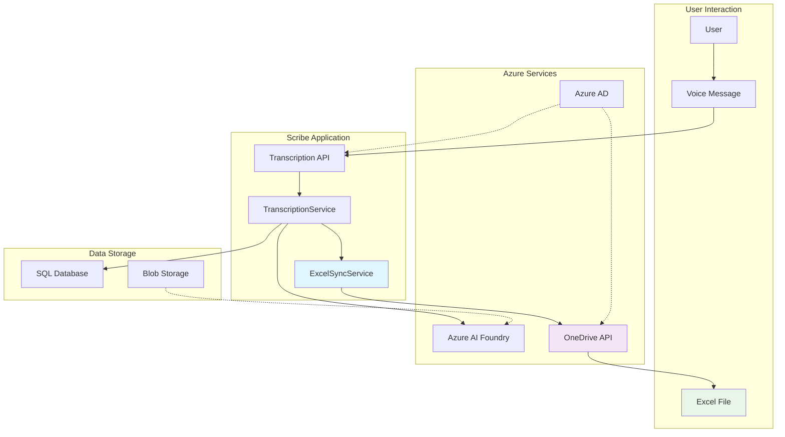

# Excel Sync Integration Guide

Comprehensive guide for integrating and using the Excel transcription synchronization feature, including setup, configuration, and best practices.

## Table of Contents

1. [Overview](#overview)
2. [Quick Start](#quick-start)
3. [Configuration](#configuration)
4. [Integration Patterns](#integration-patterns)
5. [Monitoring & Troubleshooting](#monitoring--troubleshooting)
6. [Performance Optimization](#performance-optimization)
7. [Security Considerations](#security-considerations)
8. [Best Practices](#best-practices)
9. [FAQ](#faq)

## Overview

The Excel Sync feature automatically creates and maintains Excel spreadsheets in users' OneDrive accounts, containing their voice message transcription history. This guide covers everything from initial setup to advanced usage patterns.

### Feature Benefits

- **Organized Data**: Transcriptions organized by month in professional Excel format
- **Offline Access**: Users can access their transcription history without the application
- **Data Analysis**: Excel format enables advanced filtering, searching, and analysis
- **Backup & Archive**: Provides secondary storage for transcription data
- **Professional Reports**: Formatted for business use with proper styling

### Architecture Overview



## Quick Start

### Prerequisites

Before enabling Excel sync, ensure:

1. **Azure AD Configuration**: Proper OAuth scopes configured
2. **OneDrive Access**: Users have OneDrive accounts
3. **Token Management**: Valid access token handling
4. **Database Setup**: Excel sync models deployed

### 1. Enable Excel Sync

Update `settings.toml`:

```toml
# Enable Excel synchronization
excel_sync_enabled = true
excel_file_name = "Transcripts"
excel_auto_format = true

# Add OneDrive scope
azure_scopes = [
    "User.Read",
    "Mail.Read", 
    "Mail.ReadWrite",
    "Files.ReadWrite"  # Required for OneDrive
]
```

### 2. Deploy Database Changes

Run migrations to create Excel sync tables:

```bash
# Generate migration for Excel sync models
alembic revision --autogenerate -m "Add Excel sync tracking tables"

# Apply migration
alembic upgrade head

# Verify tables created
python -c "from app.db.models import ExcelFile; print('Excel sync models ready')"
```

### 3. Test Basic Functionality

```python
# Test Excel sync service
from app.services.ExcelTranscriptionSyncService import ExcelTranscriptionSyncService
from app.dependencies.Transcription import get_excel_sync_service

# Get service instance
excel_sync_service = get_excel_sync_service()

# Test health check
health = await excel_sync_service.health_check(
    user_id="test-user",
    access_token="test-token"
)

print(f"Service status: {health['service_status']}")
```

### 4. Verify Automatic Sync

Create a transcription and verify Excel sync triggers:

```bash
# Make transcription API call
curl -X POST "http://localhost:8000/api/v1/transcriptions/voice/voice-123" \
  -H "Authorization: Bearer YOUR_TOKEN" \
  -H "Content-Type: application/json" \
  -d '{"model_deployment": "whisper"}'

# Check sync operation in database
python -c "
from app.db.Database import get_async_db
from app.repositories.ExcelSyncRepository import ExcelSyncRepository
# Query recent operations...
"
```

## Configuration

### Core Settings

| Setting | Type | Default | Description |
|---------|------|---------|-------------|
| `excel_sync_enabled` | boolean | `true` | Enable/disable Excel sync |
| `excel_file_name` | string | `"Transcripts"` | Excel file name (no extension) |
| `excel_auto_format` | boolean | `true` | Apply professional formatting |
| `excel_max_retry_attempts` | integer | `3` | Maximum retry attempts for failed operations |
| `excel_sync_batch_size` | integer | `100` | Maximum transcriptions per batch operation |
| `excel_sync_timeout_seconds` | integer | `120` | API operation timeout |

### Column Configuration

Customize Excel column widths and formatting:

```toml
excel_column_widths = {
    "ID" = 25,                    # Transcription ID
    "Date_Time" = 20,             # Creation timestamp  
    "Sender_Name" = 25,           # Voice message sender
    "Sender_Email" = 30,          # Sender's email
    "Subject" = 40,               # Email subject (wrapped)
    "Audio_Duration" = 15,        # Duration in seconds
    "Transcript_Text" = 80,       # Transcribed text (wrapped)
    "Confidence_Score" = 18,      # AI confidence percentage
    "Language" = 12,              # ISO language code
    "Model_Used" = 20,            # AI model name
    "Processing_Time" = 18        # Processing time in ms
}
```

### Environment-Specific Configuration

```toml
[development]
excel_sync_enabled = true
excel_auto_format = true
excel_sync_timeout_seconds = 60
excel_max_retry_attempts = 2

[production]  
excel_sync_enabled = true
excel_auto_format = true
excel_sync_timeout_seconds = 180
excel_max_retry_attempts = 5
excel_sync_batch_size = 150
```

### OAuth Scope Configuration

Ensure proper permissions are requested:

```toml
# Required scopes for Excel sync
azure_scopes = [
    "User.Read",              # User profile access
    "Files.ReadWrite",        # OneDrive file access (required)
    "Mail.Read",              # Email access (for context)
    "Mail.ReadWrite",         # Email operations
    # ... other scopes
]
```

## Integration Patterns

### Pattern 1: Automatic Background Sync

Default pattern - sync happens automatically after transcription:

```python
# In TranscriptionService.py - automatically integrated
async def transcribe_voice_attachment(self, ...):
    # ... transcription logic ...
    
    # Save to database
    transcription = await self._save_transcription_result(...)
    
    # Automatic Excel sync (background task)
    if self.excel_sync_enabled and self.excel_sync_service:
        asyncio.create_task(
            self._sync_transcription_to_excel(transcription, user_id)
        )
    
    return transcription
```

**Advantages**:
- Zero user intervention required
- Immediate sync after transcription
- No impact on transcription response time

**Considerations**:
- Requires valid access token
- Background failures may go unnoticed
- Limited error reporting to user

### Pattern 2: Manual Sync with User Control

Give users control over when sync occurs:

```javascript
// Frontend integration
class TranscriptionManager {
    async transcribeAndSync(voiceFile, enableSync = true) {
        // 1. Transcribe voice file
        const transcription = await this.transcribeVoice(voiceFile);
        
        // 2. Optionally sync to Excel
        if (enableSync) {
            try {
                const syncResult = await this.syncToExcel(transcription.id);
                this.showSyncSuccess(syncResult);
            } catch (error) {
                this.showSyncError(error);
                // Transcription still succeeded
            }
        }
        
        return transcription;
    }
    
    async syncToExcel(transcriptionId) {
        const response = await fetch(`/api/v1/transcriptions/excel/sync/${transcriptionId}`, {
            method: 'POST',
            headers: { 'Authorization': `Bearer ${this.token}` }
        });
        
        if (!response.ok) {
            throw new Error(`Sync failed: ${response.statusText}`);
        }
        
        return response.json();
    }
}
```

### Pattern 3: Batch Monthly Sync

Periodic sync of all transcriptions for a month:

```python
# Scheduled task or admin function
async def monthly_excel_sync_job():
    """Run monthly Excel sync for all users."""
    
    # Get users with recent transcriptions
    users = await get_users_with_transcriptions_this_month()
    
    for user in users:
        try:
            # Get user's access token
            access_token = await refresh_user_token(user.id)
            
            # Trigger monthly sync
            result = await excel_sync_service.sync_month_transcriptions(
                user_id=user.id,
                month_year=datetime.now().strftime("%B %Y"),
                access_token=access_token,
                force_full_sync=True
            )
            
            logger.info(f"Monthly sync for {user.email}: {result.synced_transcriptions} transcriptions")
            
        except Exception as e:
            logger.error(f"Monthly sync failed for {user.email}: {str(e)}")
```

### Pattern 4: On-Demand Sync with Retry

User-triggered sync with robust error handling:

```python
@router.post("/transcriptions/excel/sync-with-retry/{transcription_id}")
async def sync_with_retry(
    transcription_id: str,
    max_retries: int = Query(3, ge=1, le=10),
    current_user: UserInfo = Depends(get_current_user)
):
    """Sync transcription with automatic retry logic."""
    
    last_error = None
    
    for attempt in range(max_retries):
        try:
            # Get fresh access token for each attempt
            access_token = await get_current_user_token()
            
            result = await excel_sync_service.sync_transcription_to_excel(
                user_id=current_user.id,
                transcription_id=transcription_id,
                access_token=access_token
            )
            
            if result.status == "completed":
                return {
                    "status": "success",
                    "attempt": attempt + 1,
                    "result": result
                }
        
        except Exception as e:
            last_error = str(e)
            if attempt < max_retries - 1:
                # Exponential backoff
                wait_time = 2 ** attempt
                await asyncio.sleep(wait_time)
                logger.warning(f"Sync attempt {attempt + 1} failed, retrying in {wait_time}s: {e}")
            else:
                logger.error(f"All sync attempts failed: {e}")
    
    raise HTTPException(
        status_code=500,
        detail=f"Sync failed after {max_retries} attempts: {last_error}"
    )
```

## Monitoring & Troubleshooting

### Health Check Implementation

```python
# Regular health monitoring
async def monitor_excel_sync_health():
    """Monitor Excel sync service health across all users."""
    
    health_report = {
        "overall_status": "healthy",
        "service_enabled": settings.excel_sync_enabled,
        "total_users": 0,
        "healthy_users": 0,
        "unhealthy_users": 0,
        "issues": []
    }
    
    # Sample users for health check
    sample_users = await get_sample_users_for_health_check()
    
    for user in sample_users:
        try:
            access_token = await get_user_token(user.id)
            health = await excel_sync_service.health_check(user.id, access_token)
            
            if health["service_status"] == "healthy":
                health_report["healthy_users"] += 1
            else:
                health_report["unhealthy_users"] += 1
                health_report["issues"].append({
                    "user_id": user.id,
                    "issue": health.get("error_message", "Unknown")
                })
        
        except Exception as e:
            health_report["unhealthy_users"] += 1
            health_report["issues"].append({
                "user_id": user.id,
                "issue": str(e)
            })
    
    health_report["total_users"] = len(sample_users)
    
    if health_report["unhealthy_users"] > 0:
        health_report["overall_status"] = "degraded"
    
    return health_report
```

### Error Analysis Dashboard

```python
# Analytics for Excel sync errors
async def get_excel_sync_analytics(days: int = 7):
    """Get Excel sync analytics and error patterns."""
    
    cutoff_date = datetime.utcnow() - timedelta(days=days)
    
    # Query sync operations
    operations = await excel_sync_repo.get_operations_since(cutoff_date)
    errors = await excel_sync_repo.get_errors_since(cutoff_date)
    
    analytics = {
        "period_days": days,
        "total_operations": len(operations),
        "successful_operations": len([op for op in operations if op.operation_status == "completed"]),
        "failed_operations": len([op for op in operations if op.operation_status == "failed"]),
        "success_rate": 0,
        "avg_processing_time": 0,
        "error_breakdown": {},
        "top_errors": [],
        "performance_trends": []
    }
    
    # Calculate success rate
    if analytics["total_operations"] > 0:
        analytics["success_rate"] = (
            analytics["successful_operations"] / analytics["total_operations"] * 100
        )
    
    # Calculate average processing time
    completed_ops = [op for op in operations if op.processing_time_ms]
    if completed_ops:
        analytics["avg_processing_time"] = (
            sum(op.processing_time_ms for op in completed_ops) / len(completed_ops)
        )
    
    # Error breakdown
    error_types = {}
    for error in errors:
        error_types[error.error_type] = error_types.get(error.error_type, 0) + 1
    
    analytics["error_breakdown"] = error_types
    analytics["top_errors"] = sorted(error_types.items(), key=lambda x: x[1], reverse=True)[:5]
    
    return analytics
```

### Common Issues and Solutions

#### Issue 1: Access Token Expiration

**Symptoms**: Sync operations fail with "401 Unauthorized" errors

**Detection**:
```python
# Check for token expiration errors
token_errors = await excel_sync_repo.get_sync_errors(
    error_type="authentication",
    is_resolved=False
)

for error in token_errors:
    if "expired" in error.error_message.lower():
        # Handle token refresh
        await handle_token_expiration(error.user_id)
```

**Resolution**:
```python
async def handle_token_expiration(user_id: str):
    """Handle expired access tokens."""
    
    try:
        # Refresh user's access token
        new_token = await refresh_user_access_token(user_id)
        
        # Retry failed operations
        pending_ops = await excel_sync_repo.get_pending_sync_operations(user_id)
        
        for operation in pending_ops:
            # Retry with new token
            await retry_sync_operation(operation.id, new_token)
    
    except Exception as e:
        logger.error(f"Failed to handle token expiration for user {user_id}: {str(e)}")
```

#### Issue 2: OneDrive API Rate Limiting

**Symptoms**: "429 Too Many Requests" errors, especially during batch operations

**Detection**:
```python
# Monitor rate limit errors
rate_limit_errors = await excel_sync_repo.get_sync_errors(
    error_type="api_limit",
    days_ago=1
)

if len(rate_limit_errors) > 10:  # Threshold
    logger.warning(f"High rate limit errors: {len(rate_limit_errors)}")
    # Implement rate limiting
    await implement_adaptive_rate_limiting()
```

**Resolution**:
```python
async def implement_adaptive_rate_limiting():
    """Implement adaptive rate limiting for OneDrive API."""
    
    # Reduce batch sizes
    await update_config("excel_sync_batch_size", 50)
    
    # Add delays between operations
    await update_config("excel_sync_delay_ms", 1000)
    
    # Implement exponential backoff
    await enable_exponential_backoff()
```

#### Issue 3: Large File Performance

**Symptoms**: Timeouts on Excel operations, slow sync performance

**Optimization**:
```python
async def optimize_large_file_performance():
    """Optimize performance for large Excel files."""
    
    # Increase timeouts
    await update_config("excel_sync_timeout_seconds", 300)
    
    # Implement pagination for large datasets
    await enable_pagination_for_large_syncs()
    
    # Use streaming writes for large batches
    await enable_streaming_excel_writes()
```

## Performance Optimization

### Database Query Optimization

```python
# Optimized query for sync statistics
async def get_optimized_sync_stats(user_id: str):
    """Get sync statistics with optimized queries."""
    
    # Use single query with aggregations
    stmt = (
        select(
            func.count(ExcelSyncOperation.id).label("total_ops"),
            func.sum(
                case(
                    (ExcelSyncOperation.operation_status == "completed", 1),
                    else_=0
                )
            ).label("successful_ops"),
            func.avg(ExcelSyncOperation.processing_time_ms).label("avg_time"),
            func.max(ExcelSyncOperation.completed_at).label("last_sync")
        )
        .where(ExcelSyncOperation.user_id == user_id)
    )
    
    result = await db_session.execute(stmt)
    stats = result.first()
    
    return {
        "total_operations": stats.total_ops or 0,
        "successful_operations": stats.successful_ops or 0,
        "success_rate": (stats.successful_ops / stats.total_ops * 100) if stats.total_ops else 0,
        "avg_processing_time_ms": stats.avg_time,
        "last_sync_at": stats.last_sync
    }
```

### Caching Strategy

```python
from functools import lru_cache
from datetime import datetime, timedelta

class ExcelSyncCache:
    """Caching layer for Excel sync operations."""
    
    def __init__(self):
        self._file_cache = {}
        self._worksheet_cache = {}
        self._cache_ttl = timedelta(minutes=15)
    
    @lru_cache(maxsize=100)
    async def get_cached_file_info(self, user_id: str, file_name: str):
        """Cache Excel file information."""
        cache_key = f"{user_id}:{file_name}"
        
        if cache_key in self._file_cache:
            cached_data, timestamp = self._file_cache[cache_key]
            if datetime.utcnow() - timestamp < self._cache_ttl:
                return cached_data
        
        # Fetch fresh data
        file_info = await excel_sync_repo.get_excel_file_by_user_and_name(user_id, file_name)
        
        # Cache result
        self._file_cache[cache_key] = (file_info, datetime.utcnow())
        
        return file_info
    
    def invalidate_user_cache(self, user_id: str):
        """Invalidate all cache entries for a user."""
        keys_to_remove = [key for key in self._file_cache.keys() if key.startswith(f"{user_id}:")]
        for key in keys_to_remove:
            del self._file_cache[key]
```

### Batch Processing Optimization

```python
async def optimized_batch_sync(
    user_id: str,
    transcription_ids: List[str],
    access_token: str
):
    """Optimized batch synchronization."""
    
    # Group transcriptions by month for better efficiency
    transcriptions_by_month = {}
    
    for transcription_id in transcription_ids:
        transcription = await transcription_repo.get_transcription(transcription_id, user_id)
        month_key = transcription.created_at.strftime("%B %Y")
        
        if month_key not in transcriptions_by_month:
            transcriptions_by_month[month_key] = []
        
        transcriptions_by_month[month_key].append(transcription)
    
    # Process each month in parallel
    sync_tasks = []
    for month, transcriptions in transcriptions_by_month.items():
        task = sync_month_batch(user_id, month, transcriptions, access_token)
        sync_tasks.append(task)
    
    # Execute with controlled concurrency
    results = await asyncio.gather(*sync_tasks, return_exceptions=True)
    
    return results
```

## Security Considerations

### Token Security

```python
class SecureTokenManager:
    """Secure token management for Excel sync."""
    
    def __init__(self):
        self._token_cache = {}
        self._max_token_age = timedelta(minutes=50)  # Refresh before expiry
    
    async def get_secure_token(self, user_id: str) -> str:
        """Get secure access token with automatic refresh."""
        
        cache_key = user_id
        
        # Check cached token
        if cache_key in self._token_cache:
            token_data = self._token_cache[cache_key]
            if datetime.utcnow() < token_data["expires_at"]:
                return token_data["token"]
        
        # Refresh token
        fresh_token = await self._refresh_user_token(user_id)
        
        # Cache with expiry
        self._token_cache[cache_key] = {
            "token": fresh_token["access_token"],
            "expires_at": datetime.utcnow() + timedelta(seconds=fresh_token["expires_in"] - 300)  # 5 min buffer
        }
        
        return fresh_token["access_token"]
    
    async def _refresh_user_token(self, user_id: str) -> dict:
        """Refresh user's access token securely."""
        # Implementation depends on your token storage strategy
        pass
```

### Data Privacy

```python
async def ensure_data_privacy(user_id: str, operation_type: str):
    """Ensure data privacy compliance for Excel sync."""
    
    # Check user consent for Excel sync
    user_consent = await get_user_consent(user_id, "excel_sync")
    if not user_consent:
        raise ValidationError("User has not consented to Excel sync")
    
    # Log data processing activity
    await log_data_processing_activity(
        user_id=user_id,
        activity_type="excel_sync",
        operation_type=operation_type,
        timestamp=datetime.utcnow()
    )
    
    # Validate data retention policy
    await validate_data_retention(user_id)
```

### Access Control

```python
def require_excel_sync_permission(func):
    """Decorator to ensure proper permissions for Excel sync operations."""
    
    @wraps(func)
    async def wrapper(user_id: str, *args, **kwargs):
        # Check if user has Excel sync enabled
        user_settings = await get_user_settings(user_id)
        if not user_settings.get("excel_sync_enabled", True):
            raise AuthorizationError("Excel sync is disabled for this user")
        
        # Check token permissions
        access_token = kwargs.get("access_token")
        if not access_token:
            raise AuthenticationError("Access token required")
        
        # Validate token has required scopes
        token_info = await validate_token_scopes(access_token, ["Files.ReadWrite"])
        if not token_info.valid:
            raise AuthorizationError("Insufficient permissions for Excel sync")
        
        return await func(user_id, *args, **kwargs)
    
    return wrapper
```

## Best Practices

### 1. Configuration Management

```python
# Use environment-specific configurations
class ExcelSyncConfig:
    """Environment-aware Excel sync configuration."""
    
    @classmethod
    def get_config(cls, environment: str = None):
        environment = environment or os.getenv("ENV_FOR_DYNACONF", "development")
        
        configs = {
            "development": {
                "batch_size": 50,
                "timeout_seconds": 60,
                "max_retries": 2,
                "enable_debug_logging": True
            },
            "production": {
                "batch_size": 100,
                "timeout_seconds": 180,
                "max_retries": 5,
                "enable_debug_logging": False
            }
        }
        
        return configs.get(environment, configs["development"])
```

### 2. Error Handling

```python
# Comprehensive error handling with classification
async def handle_excel_sync_error(
    error: Exception,
    operation: ExcelSyncOperation,
    user_id: str
) -> bool:
    """Handle Excel sync errors with proper classification and recovery."""
    
    error_handlers = {
        AuthenticationError: handle_auth_error,
        AuthorizationError: handle_authorization_error,
        ValidationError: handle_validation_error,
        TimeoutError: handle_timeout_error,
        httpx.HTTPStatusError: handle_http_error
    }
    
    error_type = type(error)
    handler = error_handlers.get(error_type, handle_generic_error)
    
    try:
        recovery_action = await handler(error, operation, user_id)
        return recovery_action.should_retry
    
    except Exception as handler_error:
        logger.error(f"Error handler failed: {str(handler_error)}")
        return False
```

### 3. Performance Monitoring

```python
# Performance monitoring with metrics
class ExcelSyncMetrics:
    """Excel sync performance metrics collection."""
    
    def __init__(self):
        self.operation_timers = {}
        self.success_counters = defaultdict(int)
        self.error_counters = defaultdict(int)
    
    async def record_operation_start(self, operation_id: str):
        """Record operation start time."""
        self.operation_timers[operation_id] = time.time()
    
    async def record_operation_end(
        self,
        operation_id: str,
        success: bool,
        operation_type: str
    ):
        """Record operation completion and metrics."""
        
        if operation_id in self.operation_timers:
            duration = time.time() - self.operation_timers[operation_id]
            
            # Record metrics
            await self.record_metric("excel_sync_duration", duration, {
                "operation_type": operation_type,
                "success": success
            })
            
            if success:
                self.success_counters[operation_type] += 1
            else:
                self.error_counters[operation_type] += 1
            
            del self.operation_timers[operation_id]
```

### 4. Testing Strategy

```python
# Comprehensive testing approach
class ExcelSyncTestSuite:
    """Comprehensive test suite for Excel sync functionality."""
    
    async def test_end_to_end_sync(self):
        """Test complete sync workflow."""
        
        # 1. Create test transcription
        transcription = await self.create_test_transcription()
        
        # 2. Mock OneDrive responses
        with patch('app.azure.AzureOneDriveService') as mock_onedrive:
            mock_onedrive.return_value = self.mock_successful_responses()
            
            # 3. Execute sync
            result = await excel_sync_service.sync_transcription_to_excel(
                user_id="test-user",
                transcription_id=transcription.id,
                access_token="test-token"
            )
            
            # 4. Verify results
            assert result.status == "completed"
            assert result.rows_processed == 1
            
            # 5. Verify database tracking
            sync_ops = await excel_sync_repo.get_user_sync_operations("test-user")
            assert len(sync_ops) == 1
            assert sync_ops[0].operation_status == "completed"
```

## FAQ

### Q: What happens if a user's OneDrive is full?

**A**: The sync operation will fail with a specific error indicating insufficient storage. The error is logged in the `excel_sync_errors` table with error type "storage_full". Users need to free up OneDrive space or upgrade their plan.

### Q: Can users disable Excel sync for their account?

**A**: Yes, Excel sync can be disabled per user through user settings. When disabled, no sync operations will be triggered for that user, but existing Excel files remain untouched.

### Q: How are duplicate transcriptions handled?

**A**: The system checks existing Excel data before writing new rows. Transcriptions are identified by their UUID, so true duplicates are automatically prevented unless `force_update=True` is used.

### Q: What happens if OneDrive API is down?

**A**: Failed sync operations are recorded in the database with retry capabilities. The system will automatically retry failed operations when the API becomes available again, up to the configured maximum retry attempts.

### Q: Can the Excel file structure be customized?

**A**: Column widths and basic formatting can be customized through configuration. The column structure (ID, Date, Sender, etc.) is fixed to ensure consistency, but formatting can be adjusted.

### Q: How much OneDrive storage does Excel sync use?

**A**: Storage usage depends on transcription volume. Typical Excel files with 1000 transcriptions use approximately 500KB-1MB. Monthly worksheets help organize data efficiently.

### Q: Is there a limit on Excel file size?

**A**: OneDrive supports Excel files up to 100MB. The system monitors file size and will create additional files or optimize data if limits are approached.

### Q: Can Excel sync work with shared OneDrive folders?

**A**: Currently, Excel sync creates files in the user's personal OneDrive root folder. Shared folder support could be added as a future enhancement.

---

**Last Updated**: December 2024  
**Guide Version**: 1.0.0  
**Compatibility**: Scribe Application v1.0.0