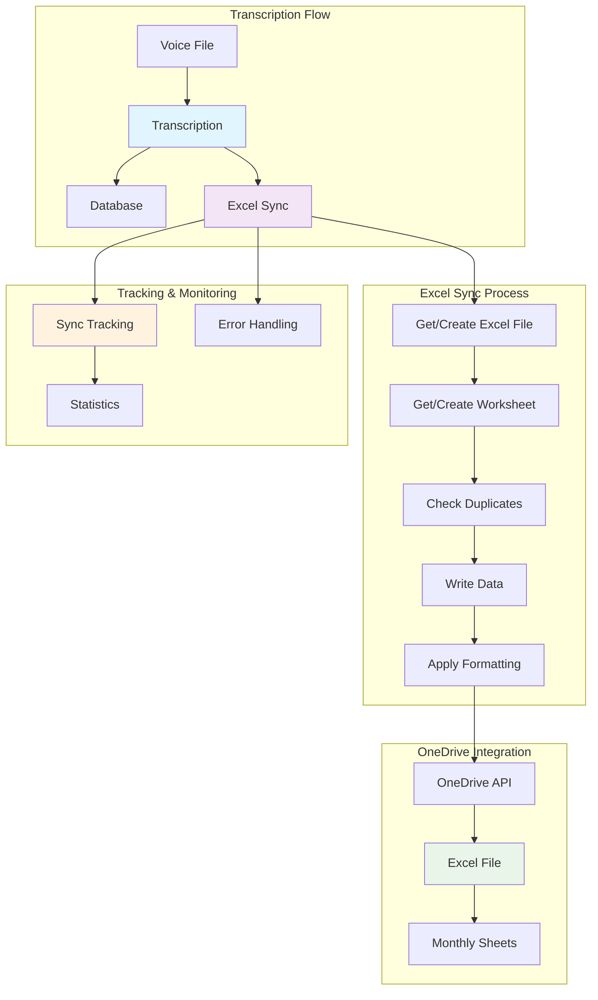
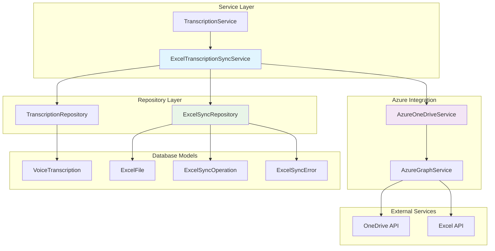
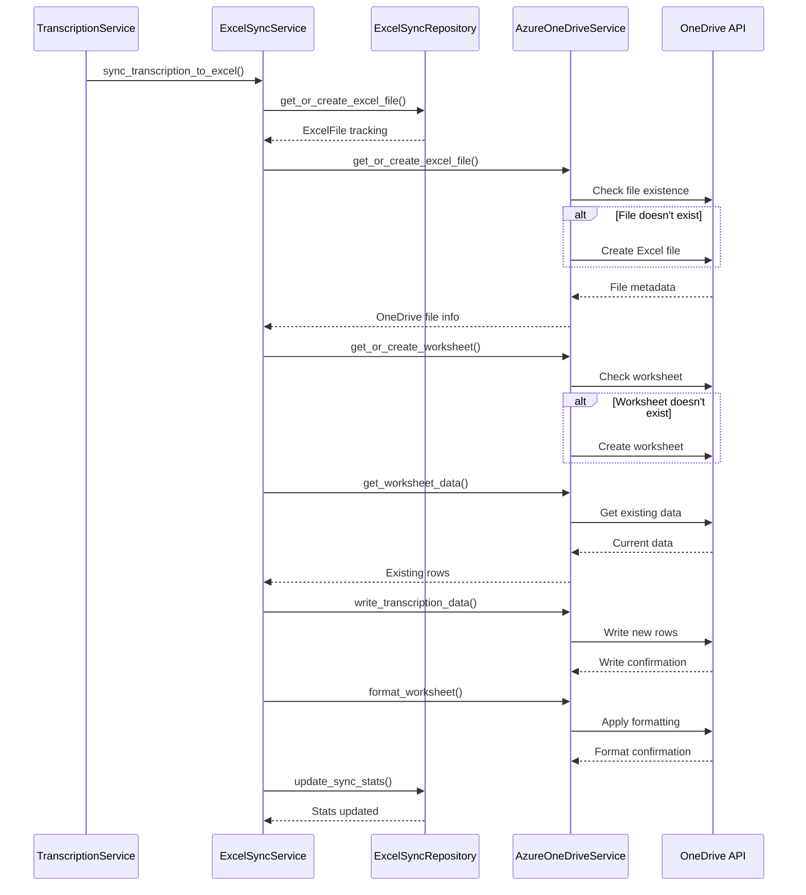

# Excel Transcription Sync Service

Automated synchronization service that syncs voice message transcriptions to Excel files in OneDrive, providing users with organized, formatted spreadsheets of their transcription history.

## Table of Contents

1. [Overview](#overview)
2. [Architecture](#architecture)
3. [Implementation](#implementation)
4. [Configuration](#configuration)
5. [API Integration](#api-integration)
6. [Examples](#examples)
7. [Troubleshooting](#troubleshooting)
8. [Reference](#reference)

## Overview

The Excel Transcription Sync Service automatically creates and maintains Excel spreadsheets in users' OneDrive accounts containing their voice message transcription data. The service operates in two modes:

- **Automatic Sync**: Background synchronization after each transcription
- **Manual Sync**: User-triggered synchronization for specific transcriptions or entire months

### Key Features

- **Monthly Organization**: Creates worksheets by month (e.g., "December 2024")
- **Auto-Formatting**: Professional formatting with headers, column sizing, and styling
- **Duplicate Prevention**: Intelligent checking to avoid duplicate entries
- **Error Recovery**: Comprehensive error handling with retry mechanisms
- **Performance Tracking**: Detailed statistics and operation history

### Visual Overview



## Architecture

### Component Structure



### Data Flow



## Implementation

### Core Service Class

The `ExcelTranscriptionSyncService` orchestrates all Excel synchronization operations:

```python
# app/services/ExcelTranscriptionSyncService.py:33
class ExcelTranscriptionSyncService:
    """Service for synchronizing transcriptions with Excel files in OneDrive."""
    
    def __init__(
        self,
        transcription_repository: TranscriptionRepository,
        excel_sync_repository: ExcelSyncRepository
    ):
        self.transcription_repository = transcription_repository
        self.excel_sync_repository = excel_sync_repository
        self.excel_sync_enabled = getattr(settings, 'excel_sync_enabled', True)
```

### Single Transcription Sync

```python
# app/services/ExcelTranscriptionSyncService.py:50
async def sync_transcription_to_excel(
    self,
    user_id: str,
    transcription_id: str,
    access_token: Optional[str] = None,
    force_update: bool = False
) -> ExcelSyncResult:
    """
    Sync a single transcription to Excel.
    
    This method:
    1. Retrieves transcription from database
    2. Gets or creates Excel file in OneDrive
    3. Creates monthly worksheet if needed
    4. Checks for duplicates
    5. Writes transcription data
    6. Applies formatting
    7. Updates tracking statistics
    """
```

### Monthly Batch Sync

```python
# app/services/ExcelTranscriptionSyncService.py:150
async def sync_month_transcriptions(
    self,
    user_id: str,
    month_year: str,
    access_token: str,
    force_full_sync: bool = False
) -> ExcelBatchSyncResult:
    """
    Sync all transcriptions for a specific month to Excel.
    
    Used for:
    - Initial setup of Excel file
    - Monthly maintenance
    - Data recovery scenarios
    """
```

### Azure OneDrive Integration

The `AzureOneDriveService` handles all OneDrive and Excel operations:

```python
# app/azure/AzureOneDriveService.py:25
class AzureOneDriveService:
    """Microsoft Graph API service for OneDrive and Excel operations."""
    
    async def get_or_create_excel_file(
        self,
        access_token: str,
        file_name: str
    ) -> Dict[str, Any]:
        """Get existing Excel file or create new one in OneDrive root."""
        
    async def write_transcription_data(
        self,
        access_token: str,
        file_id: str,
        worksheet_name: str,
        transcriptions: List[TranscriptionRowData],
        start_row: int = 2
    ) -> Dict[str, Any]:
        """Write transcription data to Excel worksheet."""
```

### Database Tracking Models

Excel synchronization operations are tracked using normalized database models:

```python
# app/db/models/ExcelSyncTracking.py:27
class ExcelFile(Base, UUIDMixin, TimestampMixin):
    """Excel file metadata and OneDrive information."""
    
    user_id: Mapped[str] = mapped_column(ForeignKey("users.id"))
    file_name: Mapped[str] = mapped_column(NVARCHAR(255))
    onedrive_file_id: Mapped[Optional[str]] = mapped_column(NVARCHAR(100))
    onedrive_drive_id: Mapped[Optional[str]] = mapped_column(NVARCHAR(100))
    
    # Sync statistics
    total_sync_operations: Mapped[int] = mapped_column(Integer, default=0)
    successful_syncs: Mapped[int] = mapped_column(Integer, default=0)
    failed_syncs: Mapped[int] = mapped_column(Integer, default=0)
    last_sync_at: Mapped[Optional[datetime]] = mapped_column(DateTime)

class ExcelSyncOperation(Base, UUIDMixin, TimestampMixin):
    """Individual Excel sync operation tracking."""
    
    excel_file_id: Mapped[str] = mapped_column(ForeignKey("excel_files.id"))
    operation_type: Mapped[str] = mapped_column(NVARCHAR(20))  # single, batch, full_sync
    worksheet_name: Mapped[str] = mapped_column(NVARCHAR(100))
    operation_status: Mapped[str] = mapped_column(NVARCHAR(20))  # pending, completed, failed
    
    # Processing metrics
    rows_processed: Mapped[int] = mapped_column(Integer, default=0)
    rows_created: Mapped[int] = mapped_column(Integer, default=0)
    rows_updated: Mapped[int] = mapped_column(Integer, default=0)
    processing_time_ms: Mapped[Optional[int]] = mapped_column(Integer)
```

## Configuration

### Excel Sync Settings

Configure Excel synchronization in `settings.toml`:

```toml
# Excel Transcription Sync (OneDrive)
excel_sync_enabled = true
excel_file_name = "Transcripts"
excel_auto_format = true
excel_max_retry_attempts = 3
excel_sync_batch_size = 100
excel_sync_timeout_seconds = 120
excel_worksheet_date_format = "%B %Y"  # "December 2024"

# Column width configuration
excel_column_widths = {
    "ID" = 25,
    "Date_Time" = 20,
    "Sender_Name" = 25,
    "Sender_Email" = 30,
    "Subject" = 40,
    "Audio_Duration" = 15,
    "Transcript_Text" = 80,
    "Confidence_Score" = 18,
    "Language" = 12,
    "Model_Used" = 20,
    "Processing_Time" = 18
}
```

### OAuth Permissions

Ensure the following scopes are included for OneDrive access:

```toml
azure_scopes = [
    "User.Read",
    "Mail.Read", 
    "Mail.ReadWrite",
    "Mail.Send",
    "Mail.Read.Shared",
    "Mail.ReadWrite.Shared", 
    "Mail.Send.Shared",
    "Files.ReadWrite"  # Required for OneDrive Excel access
]
```

### Development vs Production

```toml
[development]
excel_sync_enabled = true
excel_auto_format = true
excel_sync_timeout_seconds = 60

[production]
excel_sync_enabled = true
excel_auto_format = true
excel_sync_timeout_seconds = 120
excel_max_retry_attempts = 5
```

## API Integration

### Automatic Sync Integration

Excel sync is automatically triggered after successful transcription:

```python
# app/services/TranscriptionService.py:167
logger.info(f"Successfully saved transcription {transcription.id}")

# Trigger Excel sync if enabled and service is available
if self.excel_sync_enabled and self.excel_sync_service:
    asyncio.create_task(self._sync_transcription_to_excel(transcription, user_id))

return transcription
```

### Manual Sync Endpoints

Three new endpoints are available for manual Excel synchronization:

#### 1. Monthly Sync Endpoint

```http
POST /api/v1/transcriptions/excel/sync-month
```

Sync all transcriptions for a specific month:

```json
{
    "month_year": "December 2024"
}
```

#### 2. Single Transcription Sync

```http
POST /api/v1/transcriptions/excel/sync/{transcription_id}?force_update=false
```

Sync a specific transcription to Excel.

#### 3. Health Check Endpoint

```http
GET /api/v1/transcriptions/excel/health
```

Check Excel sync service health and OneDrive connectivity.

### Response Format

All Excel sync endpoints return detailed status information:

```json
{
    "status": "completed",
    "worksheet_name": "December 2024",
    "rows_processed": 15,
    "rows_created": 12,
    "rows_updated": 3,
    "errors": [],
    "processing_time_ms": 2340,
    "completed_at": "2024-12-15T10:30:45.123Z"
}
```

## Examples

### Excel File Structure

The generated Excel file contains the following columns:

| Column | Description | Width | Format |
|--------|-------------|-------|--------|
| **ID** | Transcription UUID | 25 chars | Text |
| **Date & Time** | Creation timestamp | 20 chars | `YYYY-MM-DD HH:MM:SS` |
| **Sender Name** | Voice message sender | 25 chars | Text |
| **Sender Email** | Sender's email address | 30 chars | Text |
| **Subject** | Email subject line | 40 chars | Text, wrapped |
| **Audio Duration** | Length in seconds | 15 chars | Numeric |
| **Transcript Text** | Transcribed content | 80 chars | Text, wrapped |
| **Confidence Score** | AI confidence (0-1) | 18 chars | Percentage |
| **Language** | Detected language | 12 chars | ISO code |
| **Model Used** | AI model name | 20 chars | Text |
| **Processing Time** | Processing duration | 18 chars | Milliseconds |

### Sample Excel Data

```
| ID        | Date & Time         | Sender Name | Sender Email      | Subject           | Audio Duration | Transcript Text        | Confidence | Language | Model Used | Processing Time |
|-----------|---------------------|-------------|-------------------|-------------------|----------------|------------------------|------------|----------|------------|-----------------|
| trans-123 | 2024-12-15 10:30:45 | John Doe    | john@company.com  | Weekly Update     | 45.2          | This week's progress...| 95.8%      | en       | whisper-1  | 2340           |
| trans-124 | 2024-12-15 14:22:10 | Jane Smith  | jane@company.com  | Project Review    | 32.7          | The project status is..| 92.3%      | en       | whisper-1  | 1890           |
```

### Worksheet Organization

Transcriptions are organized into monthly worksheets:

- **"December 2024"** - All December 2024 transcriptions
- **"January 2025"** - All January 2025 transcriptions
- **"February 2025"** - All February 2025 transcriptions

Each worksheet includes:
- **Frozen header row** with column titles
- **Professional formatting** with blue headers and white text
- **Auto-sized columns** based on content
- **Text wrapping** for transcript and subject columns

### Programmatic Usage

```python
# Dependency injection
from app.dependencies.Transcription import get_excel_sync_service

excel_sync_service = get_excel_sync_service()

# Single transcription sync
result = await excel_sync_service.sync_transcription_to_excel(
    user_id="user-123",
    transcription_id="trans-456",
    access_token=user_access_token
)

# Monthly batch sync
batch_result = await excel_sync_service.sync_month_transcriptions(
    user_id="user-123",
    month_year="December 2024",
    access_token=user_access_token,
    force_full_sync=True
)

# Health check
health = await excel_sync_service.health_check(
    user_id="user-123",
    access_token=user_access_token
)
```

## Troubleshooting

### Common Issues

#### 1. Excel File Not Created

**Symptoms**: Sync appears successful but no Excel file in OneDrive
**Causes**:
- Insufficient OneDrive permissions
- Invalid access token
- OneDrive API quota exceeded

**Resolution**:
```python
# Check OneDrive access
health_result = await azure_onedrive_service.check_onedrive_access(access_token)
if not health_result["accessible"]:
    # Handle authentication issue
```

#### 2. Duplicate Entries

**Symptoms**: Same transcription appears multiple times in Excel
**Causes**:
- Force update enabled inappropriately
- Duplicate detection logic failure
- Concurrent sync operations

**Resolution**:
- Check `force_update=False` in sync calls
- Review sync operation logs in database
- Implement proper concurrency control

#### 3. Formatting Issues

**Symptoms**: Excel file lacks proper formatting or column sizing
**Causes**:
- Auto-formatting disabled
- OneDrive API formatting limits
- Large dataset formatting timeouts

**Resolution**:
```toml
# Enable auto-formatting
excel_auto_format = true

# Increase timeout for large files
excel_sync_timeout_seconds = 180
```

#### 4. Sync Operation Failures

**Symptoms**: Sync status shows "failed" with error messages
**Causes**:
- Network connectivity issues
- OneDrive API rate limiting
- Invalid Excel file state

**Resolution**:
```python
# Check sync errors in database
errors = await excel_sync_repository.get_sync_errors(
    user_id="user-123",
    is_resolved=False
)

# Retry failed operations
for error in errors:
    await excel_sync_service.retry_sync_operation(error.sync_operation_id)
```

### Performance Issues

#### Large Dataset Sync

For users with many transcriptions:

```toml
# Increase batch size for better performance
excel_sync_batch_size = 200

# Extend timeout for large operations
excel_sync_timeout_seconds = 300
```

#### Rate Limiting

Handle Microsoft Graph API rate limits:

```python
# Implement exponential backoff
@retry(
    stop=stop_after_attempt(3),
    wait=wait_exponential(multiplier=1, min=4, max=10)
)
async def write_with_retry():
    return await azure_onedrive_service.write_transcription_data(...)
```

### Monitoring and Debugging

#### Enable Debug Logging

```toml
[development]
log_level = "DEBUG"

# Enable SQL query logging for sync operations
database_echo = true
```

#### Check Sync Statistics

```python
# Get detailed sync statistics
stats = await excel_sync_repository.get_sync_statistics(
    user_id="user-123",
    days_ago=30
)

print(f"Success rate: {stats['success_rate_percent']}%")
print(f"Total operations: {stats['total_sync_operations']}")
print(f"Unresolved errors: {stats['unresolved_errors']}")
```

## Reference

### Configuration Reference

| Setting | Type | Default | Description |
|---------|------|---------|-------------|
| `excel_sync_enabled` | boolean | `true` | Enable/disable Excel sync |
| `excel_file_name` | string | `"Transcripts"` | Excel file name (no extension) |
| `excel_auto_format` | boolean | `true` | Apply automatic formatting |
| `excel_max_retry_attempts` | integer | `3` | Maximum retry attempts |
| `excel_sync_batch_size` | integer | `100` | Maximum transcriptions per batch |
| `excel_sync_timeout_seconds` | integer | `120` | API operation timeout |
| `excel_worksheet_date_format` | string | `"%B %Y"` | Worksheet name format |

### API Endpoints Reference

| Endpoint | Method | Purpose | Authentication |
|----------|--------|---------|----------------|
| `/transcriptions/excel/sync-month` | POST | Monthly batch sync | Required |
| `/transcriptions/excel/sync/{id}` | POST | Single transcription sync | Required |
| `/transcriptions/excel/health` | GET | Service health check | Required |

### Database Tables Reference

| Table | Purpose | Key Relationships |
|-------|---------|-------------------|
| `excel_files` | Track Excel file metadata | `user_id` → `users.id` |
| `excel_sync_operations` | Individual sync operations | `excel_file_id` → `excel_files.id` |
| `excel_sync_errors` | Error tracking and resolution | `sync_operation_id` → `excel_sync_operations.id` |

### Error Codes Reference

| Error Type | Description | Resolution |
|------------|-------------|------------|
| `network` | Network connectivity issues | Check internet connection |
| `authentication` | Token expired or invalid | Refresh access token |
| `api_limit` | OneDrive API rate limit | Implement retry with backoff |
| `file_locked` | Excel file locked by another user | Wait and retry |
| `permission_denied` | Insufficient OneDrive permissions | Update OAuth scopes |

### Performance Benchmarks

| Operation | Typical Duration | Factors |
|-----------|------------------|---------|
| Single sync | 500-2000ms | File size, network |
| Monthly sync (50 items) | 5-15 seconds | OneDrive API limits |
| Excel file creation | 1-3 seconds | OneDrive response time |
| Worksheet formatting | 500-1500ms | Column count, data size |

---

**Last Updated**: December 2024  
**Service Version**: 1.0.0  
**Dependencies**: AzureOneDriveService, TranscriptionService, ExcelSyncRepository