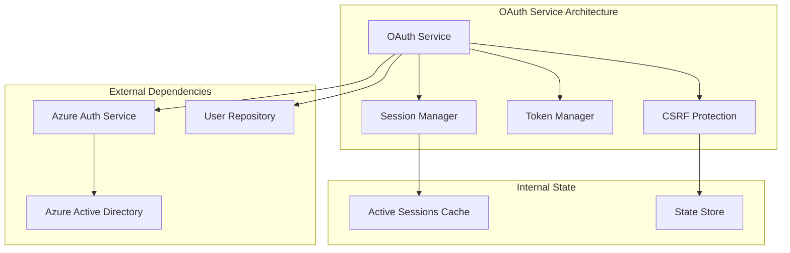
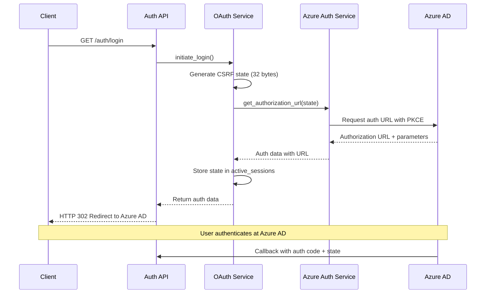
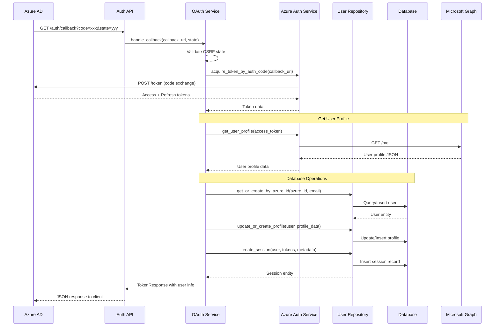
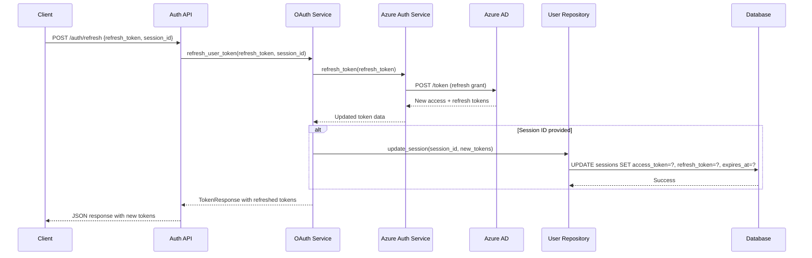

# OAuth Service Documentation

The OAuth Service handles Azure AD authentication flows, token management, and user session lifecycle in the Scribe application.

## Table of Contents

1. [Overview](#overview)
2. [Architecture](#architecture)
3. [OAuth Flow Implementation](#oauth-flow-implementation)
4. [Token Management](#token-management)
5. [Session Management](#session-management)
6. [Security Features](#security-features)
7. [API Reference](#api-reference)
8. [Error Handling](#error-handling)
9. [Testing](#testing)

## Overview

The OAuthService class (`app/services/OAuthService.py`) provides a complete implementation of OAuth 2.0 authorization code flow with PKCE (Proof Key for Code Exchange) for secure authentication with Azure Active Directory.

### Key Responsibilities
- **OAuth Flow Management**: Initiate login and handle callbacks
- **Token Operations**: Exchange codes for tokens and refresh expired tokens
- **User Management**: Create and update user profiles from Azure AD
- **Session Tracking**: Maintain active user sessions with audit trails
- **Security**: CSRF protection and secure token storage

## Architecture



### Class Structure

```python
# File: app/services/OAuthService.py:33-44
class OAuthService:
    """Service for handling OAuth authentication operations."""
    
    def __init__(self, user_repository: Optional[UserRepository] = None):
        self._active_sessions: Dict[str, Dict[str, Any]] = {}
        self.user_repository = user_repository
```

## OAuth Flow Implementation

### Login Initiation Flow



**Implementation**:
```python
# File: app/services/OAuthService.py:45-72
def initiate_login(self) -> Dict[str, str]:
    """Initiate OAuth login flow."""
    try:
        # Generate secure state parameter for CSRF protection
        state = secrets.token_urlsafe(32)
        
        # Get authorization URL from Azure client
        auth_data = azure_auth_service.get_authorization_url(state=state)
        
        # Store state for validation
        self._active_sessions[state] = {
            "created_at": datetime.utcnow(),
            "status": "pending"
        }
        
        logger.info(f"Initiated OAuth login flow with state: {state}")
        return auth_data
        
    except Exception as e:
        logger.error(f"Failed to initiate login: {str(e)}")
        raise AuthenticationError("Failed to initiate login process")
```

### Callback Handling Flow



**Implementation**:
```python
# File: app/services/OAuthService.py:74-204
async def handle_callback(
    self, 
    callback_url: str, 
    state: Optional[str] = None,
    ip_address: Optional[str] = None,
    user_agent: Optional[str] = None
) -> TokenResponse:
    """Handle OAuth callback and exchange code for tokens."""
    try:
        # Validate state parameter for CSRF protection
        if state and state in self._active_sessions:
            session = self._active_sessions[state]
            if session["status"] != "pending":
                raise ValidationError("Invalid session state")
            
            # Check if session is expired (10 minutes)
            if datetime.utcnow() - session["created_at"] > timedelta(minutes=10):
                del self._active_sessions[state]
                raise ValidationError("Session expired")
            
            session["status"] = "processing"
        
        # Exchange authorization code for tokens
        token_data = azure_auth_service.acquire_token_by_auth_code(callback_url)
        
        # Get user profile from Microsoft Graph
        access_token = token_data["access_token"]
        user_profile = await azure_auth_service.get_user_profile(access_token)
        
        # Create user info and persist to database
        user_info = UserInfo(
            id=user_profile["id"],
            display_name=user_profile.get("displayName", ""),
            email=user_profile.get("mail") or user_profile.get("userPrincipalName", ""),
            given_name=user_profile.get("givenName", ""),
            surname=user_profile.get("surname", "")
        )
        
        # Database persistence with error handling
        session_id = None
        if self.user_repository:
            user = await self.user_repository.get_or_create_by_azure_id(
                azure_id=user_profile["id"],
                email=user_info.email
            )
            
            # Create session record
            expires_in = token_data.get("expires_in", 3600)
            expires_at = datetime.utcnow() + timedelta(seconds=expires_in)
            
            session = await self.user_repository.create_session(
                user=user,
                access_token=access_token,
                refresh_token=token_data.get("refresh_token"),
                expires_at=expires_at,
                ip_address=ip_address,
                user_agent=user_agent
            )
            session_id = session.id
            
            user_info.role = user.role
            user_info.is_superuser = (user.role == UserRole.SUPERUSER)
        
        # Create token response
        token_response = TokenResponse(
            access_token=access_token,
            refresh_token=token_data.get("refresh_token"),
            token_type=token_data.get("token_type", "Bearer"),
            expires_in=token_data.get("expires_in", 3600),
            scope=" ".join(token_data.get("scope", [])),
            user_info=user_info
        )
        
        # Store session ID for future reference
        if session_id:
            token_response.session_id = session_id
        
        # Clean up OAuth state session
        if state and state in self._active_sessions:
            del self._active_sessions[state]
        
        logger.info(f"Successfully authenticated user: {user_info.email}")
        return token_response
        
    except (ValidationError, AuthenticationError):
        raise
    except Exception as e:
        logger.error(f"Unexpected error handling callback: {str(e)}")
        raise AuthenticationError("Failed to process authentication callback")
```

## Token Management

### Token Refresh Flow



**Implementation**:
```python
# File: app/services/OAuthService.py:205-287
async def refresh_user_token(
    self, 
    refresh_token: str,
    session_id: Optional[str] = None
) -> TokenResponse:
    """Refresh an expired access token."""
    try:
        # Refresh the token using Azure Auth Service
        token_data = azure_auth_service.refresh_token(refresh_token)
        
        # Get updated user profile
        access_token = token_data["access_token"]
        user_profile = await azure_auth_service.get_user_profile(access_token)
        
        # Create user info with role information
        user_info = UserInfo(
            id=user_profile["id"],
            display_name=user_profile.get("displayName", ""),
            email=user_profile.get("mail") or user_profile.get("userPrincipalName", ""),
            given_name=user_profile.get("givenName", ""),
            surname=user_profile.get("surname", "")
        )
        
        # Get role information from database
        if self.user_repository:
            user = await self.user_repository.get_by_azure_id(user_profile["id"])
            if user:
                user_info.role = user.role
                user_info.is_superuser = (user.role == UserRole.SUPERUSER)
        
        # Update session in database if available
        if self.user_repository and session_id:
            expires_in = token_data.get("expires_in", 3600)
            expires_at = datetime.utcnow() + timedelta(seconds=expires_in)
            
            await self.user_repository.update_session(
                session_id=session_id,
                access_token=access_token,
                refresh_token=token_data.get("refresh_token", refresh_token),
                expires_at=expires_at
            )
        
        # Create token response
        return TokenResponse(
            access_token=access_token,
            refresh_token=token_data.get("refresh_token", refresh_token),
            token_type=token_data.get("token_type", "Bearer"),
            expires_in=token_data.get("expires_in", 3600),
            scope=" ".join(token_data.get("scope", [])),
            user_info=user_info
        )
        
    except Exception as e:
        logger.error(f"Failed to refresh token: {str(e)}")
        raise AuthenticationError("Failed to refresh access token")
```

### Token Validation

**Implementation**:
```python
# File: app/services/OAuthService.py:331-344
def validate_access_token(self, access_token: str) -> bool:
    """Validate if an access token is still valid."""
    try:
        return azure_auth_service.validate_token(access_token)
    except Exception as e:
        logger.error(f"Error validating token: {str(e)}")
        return False
```

## Session Management

### Session Creation
Sessions are created during successful authentication and include:
- **Access Token**: For API authorization
- **Refresh Token**: For token renewal
- **Expiration Time**: Token lifecycle management
- **Metadata**: IP address and user agent for audit trails

### Session Cleanup
```python
# File: app/services/OAuthService.py:384-412
async def cleanup_expired_sessions(self) -> None:
    """Clean up expired sessions in both memory and database."""
    try:
        # Clean up OAuth state sessions (in-memory)
        current_time = datetime.utcnow()
        expired_sessions = [
            state for state, session in self._active_sessions.items()
            if current_time - session["created_at"] > timedelta(minutes=10)
        ]
        
        for state in expired_sessions:
            del self._active_sessions[state]
        
        # Clean up database sessions
        if self.user_repository:
            cleaned_count = await self.user_repository.cleanup_expired_sessions()
            if cleaned_count > 0:
                logger.info(f"Cleaned up {cleaned_count} expired database sessions")
                
    except Exception as e:
        logger.error(f"Error cleaning up sessions: {str(e)}")
```

## Security Features

### CSRF Protection
- **State Parameter**: 32-byte cryptographically secure random string
- **State Validation**: Verifies callback state matches stored state
- **Expiration**: State expires after 10 minutes
- **Single Use**: State is deleted after successful validation

### Secure Token Storage
- **Database Storage**: Tokens stored in database sessions table
- **Encryption**: Database uses Always Encrypted for sensitive columns
- **Access Control**: Row-level security (RLS) isolates user data
- **Audit Trail**: All token operations are logged

### Session Security
- **IP Tracking**: Session includes client IP for audit
- **User Agent**: Browser/client identification
- **Expiration**: Automatic session cleanup
- **Revocation**: Explicit session termination support

## API Reference

### Class Methods

#### `initiate_login() -> Dict[str, str]`
Starts the OAuth login flow by generating authorization URL.

**Returns:**
- `auth_uri`: Azure AD authorization URL
- `state`: CSRF protection state parameter

**Raises:**
- `AuthenticationError`: If login initiation fails

#### `handle_callback(callback_url, state=None, ip_address=None, user_agent=None) -> TokenResponse`
Processes OAuth callback and exchanges authorization code for tokens.

**Parameters:**
- `callback_url`: Full callback URL with auth code
- `state`: Optional CSRF state parameter
- `ip_address`: Optional client IP for audit
- `user_agent`: Optional client user agent

**Returns:**
- `TokenResponse`: Access token, refresh token, and user info

**Raises:**
- `ValidationError`: If state validation fails
- `AuthenticationError`: If token exchange fails

#### `refresh_user_token(refresh_token, session_id=None) -> TokenResponse`
Refreshes an expired access token using refresh token.

**Parameters:**
- `refresh_token`: Valid refresh token
- `session_id`: Optional session ID to update

**Returns:**
- `TokenResponse`: New access token and user info

**Raises:**
- `AuthenticationError`: If token refresh fails

#### `get_current_user(access_token) -> UserInfo`
Retrieves current user information from access token.

**Parameters:**
- `access_token`: Valid access token

**Returns:**
- `UserInfo`: Current user details with role information

**Raises:**
- `AuthenticationError`: If token is invalid

#### `logout(session_id=None) -> bool`
Logs out user and cleans up session.

**Parameters:**
- `session_id`: Optional session ID to revoke

**Returns:**
- `bool`: Success status

## Error Handling

### Exception Types
- **ValidationError**: Invalid input or state validation failures
- **AuthenticationError**: Token exchange or validation failures
- **DatabaseError**: Database operation failures (logged but not exposed)

### Error Responses
```python
# Example error response format
{
    "error": "Authentication Error",
    "message": "Failed to refresh access token",
    "error_code": "TOKEN_REFRESH_FAILED",
    "details": null,
    "timestamp": "2025-08-26T10:30:00Z"
}
```

### Logging
All operations are logged with appropriate levels:
- **INFO**: Successful operations and user actions
- **WARNING**: State validation issues and unusual conditions
- **ERROR**: Authentication failures and system errors
- **DEBUG**: Detailed flow information (development only)

## Testing

### Unit Test Structure
```python
# tests/unit/test_services/test_OAuthService.py
class TestOAuthService:
    @pytest.fixture
    def mock_user_repository(self):
        return Mock()
    
    @pytest.fixture
    def oauth_service(self, mock_user_repository):
        return OAuthService(mock_user_repository)
    
    @pytest.mark.asyncio
    async def test_initiate_login_success(self, oauth_service):
        # Test successful login initiation
        result = oauth_service.initiate_login()
        
        assert "auth_uri" in result
        assert "state" in result
        assert result["state"] in oauth_service._active_sessions
    
    @pytest.mark.asyncio
    async def test_handle_callback_success(self, oauth_service, mock_user_repository):
        # Test successful callback handling
        # ... test implementation
```

### Integration Testing
Integration tests verify end-to-end OAuth flow with actual Azure AD (in test environment):
```bash
# Run integration tests
pytest tests/integration/test_api/test_auth_endpoints.py -v
```

---

**File References:**
- OAuth Service: `app/services/OAuthService.py:1-415`
- Azure Auth Service: `app/azure/AzureAuthService.py:1-200`
- Auth Models: `app/models/AuthModel.py:1-150`
- Auth Endpoints: `app/api/v1/endpoints/auth.py:1-234`

**Related Documentation:**
- [Architecture Overview](../architecture/overview.md)
- [Azure Integration](../azure/auth-service.md)
- [API Endpoints](../api/authentication.md)
- [Security Guide](../guides/security.md)