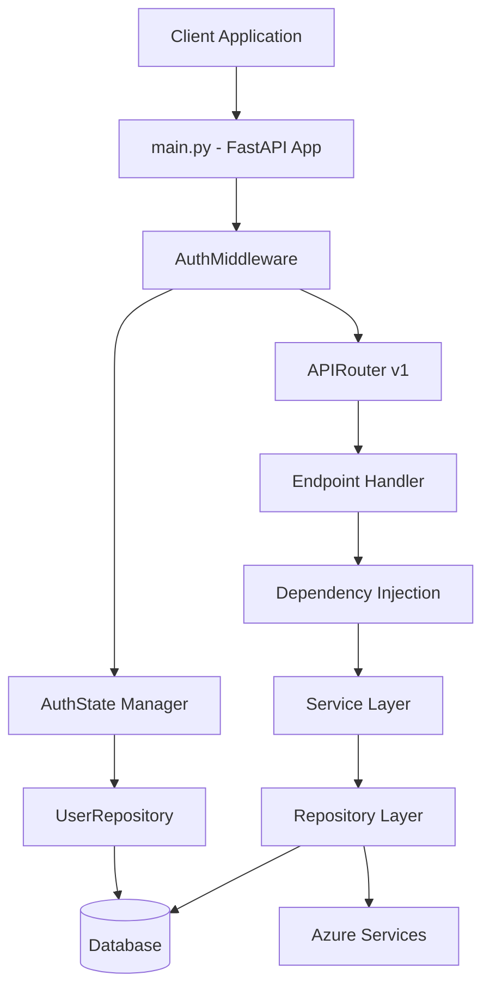
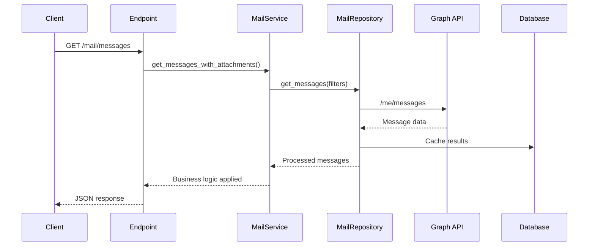
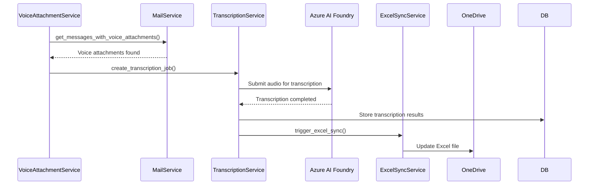
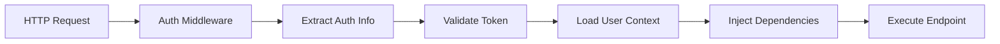
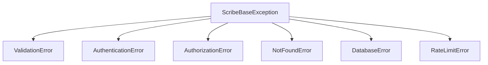
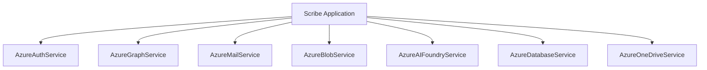
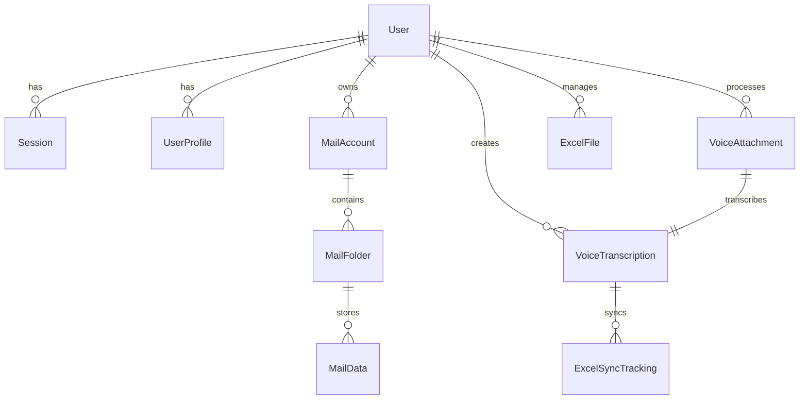

# Scribe Application Workflow Documentation

## Overview

The Scribe FastAPI application is an enterprise-grade email processing system that integrates Azure AD authentication, Microsoft Graph API, voice transcription services, and Excel synchronization. This document explains how all components work together.

## Request Flow Architecture

### 1. High-Level Request Flow
```
Client Request → FastAPI App → Authentication → Router → Endpoint → Service → Repository → Database/Azure
```

### 2. Detailed Component Flow


## Authentication & Authorization Flow

### OAuth 2.0 Flow with Azure AD

1. **Login Initiation** (`GET /auth/login`)
   - Generates secure state parameter (CSRF protection)
   - Creates authorization URL with Azure AD
   - Redirects user to Azure AD login

2. **OAuth Callback** (`GET /auth/callback`)
   - Validates state parameter
   - Exchanges authorization code for tokens
   - Retrieves user profile from Microsoft Graph
   - Creates/updates user in database
   - Stores authentication state
   - Sets secure cookies

3. **Request Authentication**
   - AuthMiddleware extracts tokens from:
     - Authorization header (Bearer token)
     - Session cookies
     - X-Session-Id header
   - Validates tokens against Azure AD or database sessions
   - Injects user context into request

4. **Session Management**
   - Database sessions with expiration
   - In-memory auth state caching
   - Automatic cleanup of expired sessions

## Service Layer Architecture

### Service Responsibilities

#### OAuthService (`/app/services/OAuthService.py`)
**Purpose**: Manages OAuth authentication lifecycle
- **Token Management**: Acquire, refresh, validate access tokens
- **Session Lifecycle**: Create, validate, cleanup user sessions
- **User Profile Sync**: Synchronize Azure AD profiles with database
- **State Management**: Handle OAuth state parameters for security

**Key Methods**:
- `initiate_login()` - Start OAuth flow
- `handle_callback()` - Process OAuth callback
- `refresh_user_token()` - Refresh expired tokens
- `logout()` - Clean up sessions

#### MailService (`/app/services/MailService.py`)
**Purpose**: Orchestrates mail operations and business logic
- **Folder Management**: List, create, organize mail folders
- **Message Processing**: Retrieve, filter, update messages
- **Voice Detection**: Identify and categorize voice attachments
- **Business Rules**: Apply filtering and validation logic

**Key Methods**:
- `list_mail_folders()` - Get folder hierarchy
- `get_messages_with_attachments()` - Filter messages by attachments
- `get_messages_with_voice_attachments()` - Voice-specific filtering
- `organize_voice_by_date()` - Organize messages by date

#### TranscriptionService (`/app/services/TranscriptionService.py`)
**Purpose**: Manages voice transcription pipeline
- **Audio Processing**: Download and prepare audio files
- **Transcription Orchestration**: Submit to Azure AI services
- **Result Management**: Store and retrieve transcription results
- **Error Handling**: Manage failed transcriptions and retries

#### SharedMailboxService (`/app/services/SharedMailboxService.py`)
**Purpose**: Handles shared mailbox operations
- **Access Control**: Validate permissions for shared mailboxes
- **Delegated Operations**: Perform actions on behalf of shared mailboxes
- **Statistics**: Generate shared mailbox usage statistics

## Repository Pattern Implementation

### BaseRepository (`/app/repositories/BaseRepository.py`)
**Purpose**: Provides generic CRUD operations using SQLAlchemy 2.0+

**Generic Operations**:
- `create(obj_data)` - Insert new entity with validation
- `get_by_id(id)` - Retrieve by primary key
- `get_all(limit, offset, filters)` - Paginated retrieval
- `update(id_or_entity, obj_data)` - Modify existing entity
- `delete(id)` - Remove entity
- `exists(id)` - Check entity existence
- `find_by(**kwargs)` - Query by arbitrary fields

### Domain-Specific Repositories

#### UserRepository (`/app/repositories/UserRepository.py`)
**Purpose**: User and session management
- **User Lifecycle**: Create, retrieve, update user profiles
- **Session Management**: Create, validate, cleanup sessions
- **Role Management**: Handle user roles and permissions

#### MailRepository (`/app/repositories/MailRepository.py`)
**Purpose**: Mail data access via Microsoft Graph API
- **Folder Operations**: List, create folders via Graph API
- **Message Retrieval**: Get messages with filtering and pagination
- **Attachment Processing**: Download and process attachments
- **Caching Integration**: Cache frequently accessed data

#### TranscriptionRepository (`/app/repositories/TranscriptionRepository.py`)
**Purpose**: Voice transcription data management
- **Transcription Lifecycle**: Create, update, retrieve transcriptions
- **Status Tracking**: Monitor transcription progress
- **Error Management**: Store and track failed transcriptions

## Data Flow Patterns

### 1. Mail Processing Workflow



### 2. Voice Transcription Pipeline



### 3. Authentication Context Flow



## Dependency Injection System

### FastAPI DI Container Structure

```python
# Example dependency chain
Request → get_async_db() → UserRepository → OAuthService → Current Endpoint
```

### Key Dependency Providers

#### Database Dependencies (`/app/dependencies/`)
- `get_async_db()` - Database session per request
- `get_user_repository()` - UserRepository with DB session
- `get_mail_service()` - MailService with dependencies

#### Authentication Dependencies
- `get_current_user()` - Extract and validate current user
- `get_current_user_optional()` - Optional authentication
- `get_oauth_service()` - OAuth service with repositories

### Dependency Lifecycle

1. **Request Arrives** → FastAPI creates dependency container
2. **Bottom-Up Resolution** → Dependencies resolved in dependency order
3. **Database Session** → Created once per request
4. **Service Instantiation** → Services get required repositories
5. **Endpoint Execution** → All dependencies injected
6. **Cleanup Phase** → Sessions closed, resources released

## Caching Strategy

### In-Memory Cache (`/app/core/Cache.py`)
**Purpose**: High-performance request-level caching optimized for Azure Functions

**Features**:
- **LRU Eviction**: Least Recently Used items removed when capacity reached
- **TTL-Based Expiration**: 5-minute default Time To Live
- **Size Limits**: Maximum 1000 entries to prevent memory issues
- **Automatic Cleanup**: Background cleanup every 3 minutes
- **Per-User Isolation**: Cache keys include user context for security

**Cache Patterns**:
```python
# User profile caching
cache.set_user_profile(user_id, profile_data, ttl=300)
profile = cache.get_user_profile(user_id)

# Mail folder caching  
cache.set_folders(email, folders, ttl=180)
folders = cache.get_folders(email)

# Message caching
cache.set_messages(email, folder_id, messages, ttl=60)
messages = cache.get_messages(email, folder_id)
```

## Error Handling Chain

### Exception Hierarchy



### Error Flow

1. **Service Layer** catches exceptions → Wraps in domain exceptions
2. **Endpoint Layer** catches domain exceptions → Returns appropriate HTTP status
3. **Global Handler** catches unhandled exceptions → Returns standardized error response
4. **Middleware** logs errors → Provides request context

### Error Response Format

```json
{
  "error": "Authentication Error",
  "message": "Invalid or expired token",
  "error_code": "AUTH_TOKEN_EXPIRED",
  "details": {
    "operation": "token_validation",
    "timestamp": "2025-01-XX"
  }
}
```

## Azure Services Integration

### Service Architecture



### Service Responsibilities

- **AzureAuthService**: OAuth token management, user profile retrieval
- **AzureGraphService**: Core Microsoft Graph API operations
- **AzureMailService**: Shared mailbox and mail-specific operations
- **AzureBlobService**: File storage and retrieval
- **AzureAIFoundryService**: Voice transcription services
- **AzureDatabaseService**: Database connection with Azure AD authentication
- **AzureOneDriveService**: Excel file synchronization

## Database Design & Relationships

### Core Entities



### Key Relationships

- **User ↔ Sessions**: One-to-many with cascade delete
- **User ↔ VoiceAttachment**: One-to-many for ownership tracking
- **VoiceAttachment ↔ VoiceTranscription**: One-to-one relationship
- **User ↔ ExcelFile**: One-to-many for file ownership

## Configuration Management

### Dynaconf Setup

**Files**:
- `settings.toml` - Non-sensitive configuration
- `.secrets.toml` - Sensitive credentials (gitignored)

**Environment Switching**:
```bash
export ENV_FOR_DYNACONF=production
```

**Configuration Categories**:
- **Application**: Name, version, debug mode
- **Database**: Connection strings, pool settings
- **Azure**: Client IDs, tenant information
- **Cache**: TTL settings, size limits
- **Rate Limiting**: Request limits, time windows

## Performance Considerations

### Request Optimization

1. **Connection Pooling**: SQLAlchemy connection pools for database
2. **Async Operations**: FastAPI async/await throughout
3. **Caching Strategy**: Multi-level caching (in-memory + database)
4. **Pagination**: Implemented on list endpoints
5. **Lazy Loading**: SQLAlchemy relationships loaded on demand

### Azure Integration Performance

1. **Token Caching**: Access tokens cached to avoid repeated OAuth calls
2. **Request Batching**: Microsoft Graph batch requests where possible
3. **Result Caching**: API responses cached based on data freshness requirements
4. **Connection Reuse**: HTTP client connection pooling

## Security Implementation

### Authentication Security

- **CSRF Protection**: OAuth state parameters
- **Token Validation**: Azure AD token verification
- **Session Security**: Secure cookie settings
- **Rate Limiting**: Per-endpoint request limits

### Data Security

- **Row-Level Security**: Database RLS for multi-tenant isolation
- **Secrets Management**: Environment-based secret injection
- **HTTPS Only**: All communications encrypted
- **Audit Logging**: User actions logged for compliance

## Monitoring & Observability

### Logging Strategy

- **Structured Logging**: JSON-formatted logs with context
- **Request Tracing**: Full request lifecycle logging
- **Performance Metrics**: Response times and database query performance
- **Error Tracking**: Exception logging with stack traces

### Health Checks

- **Database Health**: Connection and query testing
- **Azure Service Health**: Token validation and API connectivity
- **Cache Health**: Cache operation verification

## Development Workflow

### Code Organization Principles

1. **Layer Separation**: Clear boundaries between API, Service, Repository layers
2. **Dependency Injection**: FastAPI DI for testability and modularity
3. **Type Safety**: Comprehensive type hints and Pydantic models
4. **Error Handling**: Consistent exception patterns
5. **Documentation**: Docstrings and API documentation

### Testing Strategy

1. **Unit Tests**: Individual component testing
2. **Integration Tests**: Service-to-service interaction testing
3. **E2E Tests**: Full workflow testing
4. **Mock Strategy**: Azure services mocked for testing

This workflow documentation provides a comprehensive understanding of how all components in the Scribe application work together to provide a robust, scalable email processing and transcription system.